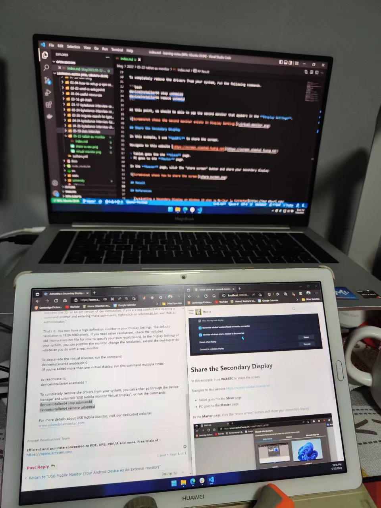
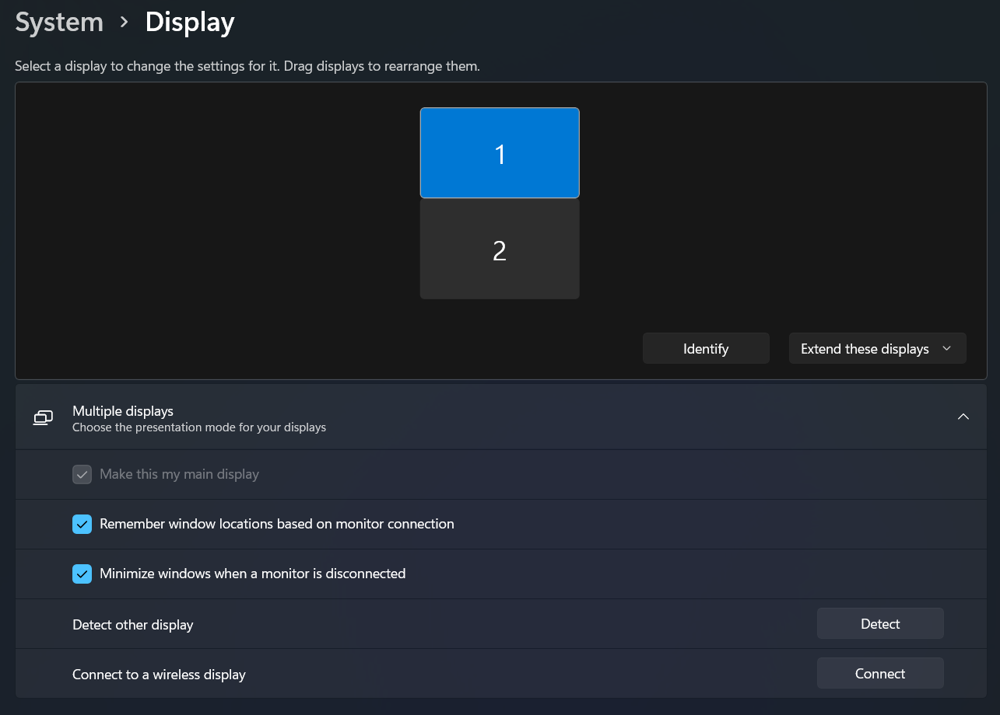
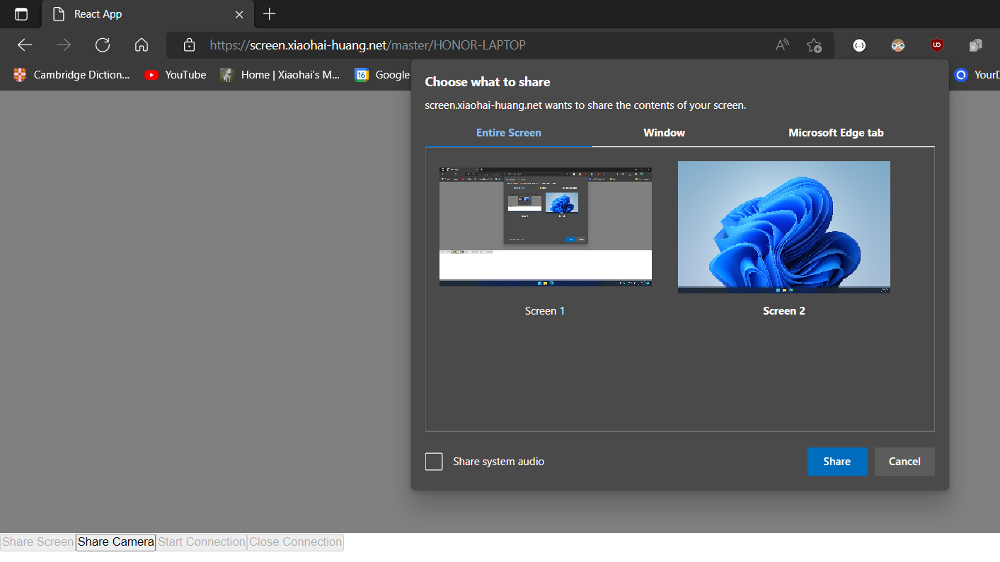

This blog shows how to turn a tablet into a secondary monitor in just 2 steps.

Here is what the final result would look like.



<!-- truncate -->

## Step 1: Activate a Secondary Display

Create a virtual monitor.

Download the virtual display driver from [https://github.com/xiaohai-huang/resources/blob/master/xiaohai.wiki/blog-data/usbmmidd_v2.zip](https://github.com/xiaohai-huang/resources/blob/master/xiaohai.wiki/blog-data/usbmmidd_v2.zip)

Use CMD to execute the following commands to create a virtual display. Note: Run as Administrator.

```bash title="install the virtual display driver"
deviceinstaller64 install usbmmidd.inf usbmmidd
```

```bash title="activate a virtual monitor"
deviceinstaller64 enableidd 1
```

```bash title="deactivate a virtual monitor"
deviceinstaller64 enableidd 0
```

At this point, we should be able to see the secondary monitor that appears in the **Display Settings**.



:::note

To completely remove the drivers from your system, run the following commands.

```bash title="remove the driver"
deviceinstaller64 stop usbmmidd
deviceinstaller64 remove usbmmid
```

:::

## Step2: Share the Secondary Display

In this step I will show you how to use **WebRTC** enabled web app to share the screen.

Navigate to this website [https://screen.xiaohai-huang.net](https://screen.xiaohai-huang.net)

- Tablet goes the the **Slave** page.
- PC goes to the **Master** page.

In the **Master** page, click the "share screen" button and share your secondary display.



## References

- [How To Create a Virtual Monitor - Windows [2022 New & Working - No Adapters/Hardware Needed]](https://www.youtube.com/watch?v=ybHKFZjSkVY)
- [Activating a Secondary Display on Windows 10 when no Monitor is Connected](https://www.amyuni.com/forum/viewtopic.php?t=3030)
- [screen-share app](https://github.com/xiaohai-huang/screen-share)
