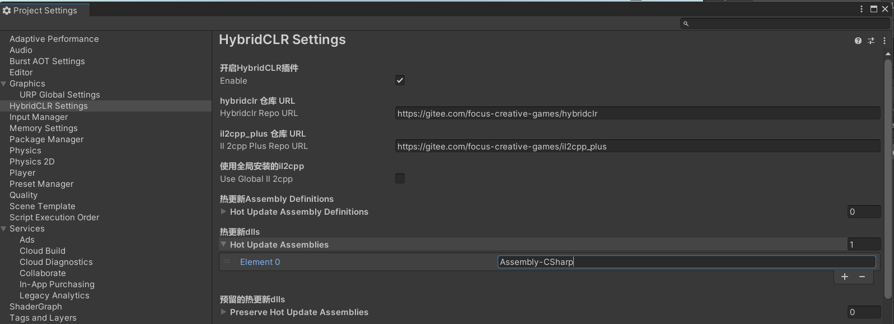
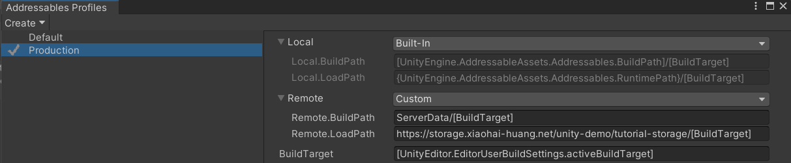

In this article, I am going to show you how to update your game code that is already __published__ using [__Addressables__](https://docs.unity3d.com/Packages/com.unity.addressables@1.21/manual/index.html) & [__HybridCLR__](https://github.com/focus-creative-games/hybridclr).

<!-- truncate -->

## Installations

Open __Package Manager__ and install the following 2 packages.

- __Addressables__ - In Unity Registry.
- __HybridCLR__ - Use `Add package from git URL...`  
    [https://gitee.com/focus-creative-games/hybridclr_unity.git](https://gitee.com/focus-creative-games/hybridclr_unity.git)

## Initialize HybridCLR

Open `HybridCLR/Installer...` from the menu bar to install and initialize HybridCLR.


## Project Configuration For HybridCLR

Aftering initialzing __[hybridclr_unity](https://github.com/focus-creative-games/hybridclr_unity)__, we need to split the project's assesmblies into 2 main categories and adjust some settings.

### Configure Player Settings

- Disable __`Use Incremental GC`__. HybridCLR does not support this feature at the moment.
- Set __`Scripting Backend`__ to `IL2CPP`.
- __`Api Compatiability Level`__ to `.Net Framework`.


### Split Assemblies

There are two categories of __Assemblies__.

- 🪨 AOT Assemblies (shipped with the app, __cannot__ be updated after publishing)
- 🏃‍♂️ Hot Update Assemblies (can be updated after publishing)⚡

In this example, I will create an AOT Assembly called __`Assembly-Entry.dll`__ using __assembly definition__. It simply loads the Home Screen of my app using `Addressables.LoadSceneAsync();`. The Home Screen will download the Hot Update Assemblies from the remote server and load them.

And I will use the default __`Assembly-CSharp.dll`__ for game logic and __`Assembly-Updater.dll`__ for updater as my Hot Update Assemblies. The published app will load these two assemblies dynamically in order to update the game. Note: I can add more assemblies as Hot Update Assemblies if necessary.

Here is how to do it in action.

1. Create a folder `Assets/Scripts/Entry` and create a __assembly definition__ "Assembly-Entry.asmdef".
1. Create a folder `Assets/Scripts/Home Screen` and create a __assembly definition__ "Assembly-Updater.asmdef".


:::info

By default, Unity compiles almost all of your game scripts into the predefined assembly, __`Assembly-CSharp.dll`__.

:::

### Configure HybridCLR

Open __`HybridCLR/Settings`__ and pay attention to 

- __`Hot Update Assembly Definitions`__
- __`Hot Update Assemblies`__

These two fields are equvalent. Do not add the same assembly twice.

In this example, I will add `Assembly-CSharp` and `Assembly-Updater` (without `.dll`) to __`Hot Update Assemblies`__.



:::caution

Do not add __`Assembly-Entry.dll`__, cuz it is shipped with the app and cannot be updated.

:::

## Scene & Addressables Setup

Create 3 Scenes:

1. Entry Scene (the only scene that is in the app, the only scene in __Build Settings__)
2. Home Screen Scene (used to download dlls and load dlls)
3. Game Play Scene (normal game play scene)


### Configure Addressable

#### Addressables Profile



Create an __Addressables Profile__ called __Production__. Change `Remote.LoadPath` to your URL (the place that stores your dlls and hot update assets). In my case, these hot update assets are stored in `https://storage.xiaohai-huang.net/unity-demo/tutorial-storage/StandaloneWindows64`


#### Addressables Group

Create two groups, __Scene Group__ and __Dll Group__.

- Add "Home Screen Scene" and "Game Play Scene" to the Addressable Group called "Scene Group".
- Add `xxx.dll.bytes` files under `Assets/Dlls` to the "Dll Group" and assign them labels as shown in the screenshot above. 

:::note

These `xxx.dll.bytes` will be generated when we compile the code using __`HybridCLR/Build/Copy Hot Update Dlls and Metadata for AOT Assemblies`__.

:::

### Entry Scene

In this scene, create an Empty Game Object and attach it with the following Script. 

The purpose of this script is to load the Home Screen Scene from remote server. And execute `LoadMetadataForAOTAssembly` to supply metadata for AOT (need this for generics to work).

The script should be part of the `Assembly-Entry.dll` as it will be shipped with the app, so it cannot be updated after you build the app.

```csharp title="Assets/Scripts/Entry/GameEntry.cs"
using HybridCLR;
using System.Data.SqlTypes;
using System.Reflection;
using System.Threading.Tasks;
using UnityEngine;
using UnityEngine.AddressableAssets;

public class GameEntry : MonoBehaviour
{
    public AssetLabelReference UpdaterDllLabelRef;
    public AssetLabelReference AOTMetadataDllLabelRef;

    public AssetReference HomeScreenSceneAssetRef;

    async void Start()
    {
        print("[GameEntry] Loading Metadata for AOT Dll...");
        await LoadMetadataForAOTAssemblies();

        print("[GameEntry] Loading Updater Dll...");
        var dll = await Addressables.LoadAssetAsync<TextAsset>(UpdaterDllLabelRef.labelString).Task;
        Assembly.Load(dll.bytes);


        print("[GameEntry] Loading Home Screen...");
        HomeScreenSceneAssetRef.LoadSceneAsync();
    }

    async Task LoadMetadataForAOTAssemblies()
    {
        var dlls = await Addressables.LoadAssetsAsync<TextAsset>(AOTMetadataDllLabelRef.labelString, null).Task;
        HomologousImageMode mode = HomologousImageMode.SuperSet;

        foreach (var dll in dlls)
        {
            LoadImageErrorCode err = RuntimeApi.LoadMetadataForAOTAssembly(dll.bytes, mode);
            print("[LoadMetadataForAOTAssemblies] Loading " + dll.name + err);
        }
    }
}
```

### Home Screen Scene

In this scene, create a Empty Game Object called "App Updater" and attach it with the following script.

This script is in __`Assembly-Updater.dll`__. So it is part of the Hot Update Assemblies.

```csharp title="Assets/Scripts/Home Screen/Updater.cs"
using TMPro;
using System.Reflection;
using System.Threading.Tasks;
using UnityEngine;
using UnityEngine.AddressableAssets;
using UnityEngine.UI;

public class Updater : MonoBehaviour
{
    public AssetLabelReference HotUpdateDllLabelRef;
    public Button PlayButton;

    async void Start()
    {

        print("[Updater] Loading Dlls");

        PlayButton.interactable = false;
        var text = PlayButton.GetComponentInChildren<TextMeshProUGUI>();
        text.text = "Loading...";
        await LoadDlls();
        text.text = "Play";
        PlayButton.onClick.AddListener(LoadGamePlayScene);
        PlayButton.interactable = true;
    }

    async Task LoadDlls()
    {
        await LoadHotUpdateAssemblies();
    }

    async Task LoadHotUpdateAssemblies()
    {
        var dlls = await Addressables.LoadAssetsAsync<TextAsset>(HotUpdateDllLabelRef.labelString, null).Task;
        foreach (var dll in dlls)
        {
            print("[LoadHotUpdateAssemblies] Loading " + dll.name);
            Assembly.Load(dll.bytes);
        }
    }
    void LoadGamePlayScene()
    {
        Addressables.LoadSceneAsync("Assets/Scenes/Game Play Scene.unity");
    }
}
```

### Game Play Scene

In this scene, you can do the normal unity stuff.

## Build Player

Create an editor command to compile Hot Update Assemblies and copy them to the desired location which will be later bundled by __Addressables__. This command will compile your dynamic code and copy dlls to `Assets/Dlls/Hot Update Dlls` and `Assets/Dlls/Metadata For AOT Dlls`.

```csharp title="Assets/Editor/Hot Update/CopyDllsAndClearAddressablesCacheCommand.cs"
using HybridCLR.Editor;
using HybridCLR.Editor.Commands;
using System.Collections;
using System.Collections.Generic;
using System.IO;
using UnityEditor;
using UnityEditor.AddressableAssets.Build;
using UnityEditor.AddressableAssets.Settings;
using UnityEditor.AddressableAssets;
using UnityEditor.Build.Pipeline.Utilities;
using UnityEngine;

public static class CopyDllsAndClearAddressablesCacheCommand 
{
    [MenuItem("HybridCLR/Build/Copy Hot Update Dlls and Metadata for AOT Assemblies")]
    private static void Execute()
    {
        BuildTarget target = EditorUserBuildSettings.activeBuildTarget;
        CompileDllCommand.CompileDll(target);

        CopyHotUpdateAssembliesToMyFolder(target);
        CopyMetadataForAOTAssembliesToFolder(target);
        ClearAddressablesOutput();
    }

    private static readonly string MY_HOT_UPDATE_ASSEMBLIES_FOLDER = "Assets/Dlls/Hot Update Dlls";
    private static void CopyHotUpdateAssembliesToMyFolder(BuildTarget target)
    {
        string hotfixDllSrcDir = SettingsUtil.GetHotUpdateDllsOutputDirByTarget(target);
        string hotfixAssembliesDstDir = MY_HOT_UPDATE_ASSEMBLIES_FOLDER;

        foreach (var dll in SettingsUtil.HotUpdateAssemblyFilesExcludePreserved)
        {
            string dllPath = $"{hotfixDllSrcDir}/{dll}";
            string dllBytesPath = $"{hotfixAssembliesDstDir}/{dll}.bytes";
            File.Copy(dllPath, dllBytesPath, true);
            Debug.Log($"[CopyHotUpdateAssembliesToMyFolder] copy hotfix dll {dllPath} -> {dllBytesPath}");
        }
    }

    private static readonly string METADATA_FOR_AOT_ASSEMBLIES_FOLDER = "Assets/Dlls/Metadata For AOT Dlls";
    private static void CopyMetadataForAOTAssembliesToFolder(BuildTarget target)
    {
        string aotAssembliesSrcDir = SettingsUtil.GetAssembliesPostIl2CppStripDir(target);
        string aotAssembliesDstDir = METADATA_FOR_AOT_ASSEMBLIES_FOLDER;

        foreach (var dll in SettingsUtil.AOTAssemblyNames)
        {
            string srcDllPath = $"{aotAssembliesSrcDir}/{dll}.dll";
            if (!File.Exists(srcDllPath))
            {
                Debug.LogError($"ab中添加AOT补充元数据dll:{srcDllPath} 时发生错误,文件不存在。裁剪后的AOT dll在BuildPlayer时才能生成，因此需要你先构建一次游戏App后再打包。");
                continue;
            }
            string dllBytesPath = $"{aotAssembliesDstDir}/{dll}.dll.bytes";
            File.Copy(srcDllPath, dllBytesPath, true);
            Debug.Log($"[CopyMetadataForAOTAssembliesToFolder] copy AOT dll {srcDllPath} -> {dllBytesPath}");
        }
    }

    private static void ClearAddressablesOutput()
    {
        var settings = AddressableAssetSettingsDefaultObject.Settings;
        var pathValue = settings.profileSettings.GetValueByName(settings.activeProfileId, "Remote.BuildPath");
        var path = settings.profileSettings.EvaluateString(settings.activeProfileId, pathValue);
        Debug.Log($"build path = {path} {Directory.Exists(path)}");
        if (Directory.Exists(path))
        {
            Directory.Delete(path, true);
            Debug.Log($"[ClearAddressablesOutput] Deleted {path}");
        }
        CleanBuildCache();
        Debug.Log($"[ClearAddressablesOutput] Clean Addressables Build Cache");

    }

    static void CleanBuildCache()
    {
        OnCleanAddressables(null);
        OnCleanSBP();
    }

    static void OnCleanAddressables(object builder)
    {
        AddressableAssetSettings.CleanPlayerContent(builder as IDataBuilder);
    }

    static void OnCleanSBP()
    {
        BuildCache.PurgeCache(true);
    }
}
```

### Full Player Build

For a full player build, you need to do the following steps:

1. Click `HybridCLR/Generate/All`.
2. Click `HybridCLR/Build/Copy Hot Update Dlls and Metadata for AOT Assemblies`. (Note: add these `xxx.dll.bytes` to the "Dll Group" in `Addressables Groups` tab if you have not done, see [add "xxx.dll.bytes" to Dll Group](#addressables-group))
3. In `Addressables Group` tab, click `Build/New Build/Default Build Script`.
4. Upload the folder `ServerData` at your project root to the remote storage.
5. Build your player using `File/Build And Run`.

### Hot Update

For updating code in your published app, you need to do the following steps:

1. Click `HybridCLR/Build/Copy Hot Update Dlls and Metadata for AOT Assemblies`.
2. In `Addressables Group` tab, click `Build/Update A Previous Build` and choose the target platform's `.bin` file generated by `Build/New Build/Default Build Script` when you do the full player build.
3. Upload the folder `ServerData` at your project root to the remote storage.

## References

- [HybridCLR Example Demo Project](https://github.com/focus-creative-games/hybridclr_trial)
- [HybridCLR Docs](https://focus-creative-games.github.io/hybridclr/install/#%E5%AE%89%E8%A3%85%E5%89%8D%E9%A2%84%E5%A4%87%E5%B7%A5%E4%BD%9C)