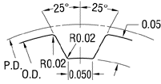
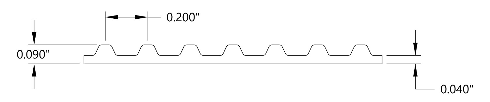

Need XL pulleys and belts for your mechanical or robotics project? While standard **aluminum** versions are common, 3D printing offers a cost-effective and customizable alternative.

However, designing accurate **XL** profile pulleys and belts for 3D printing in CAD like Fusion 360 isn't well-documented online. I've navigated this challenge and successfully created functional designs.

In this post, I'll share my Fusion 360 design process. Crucially, I'll show you how to derive the essential technical data - pitch diameter, outer diameter, and other specs - you need to design your own printable **XL** pulleys and belts for any project.

{/* truncate */}

## Tooth Profile

The following table summarizes the key specifications for **XL** pulleys and belts (measured in inches):

| Specification        | Value / Formula                       | Notes                                                    |
| :------------------- | :------------------------------------ | :------------------------------------------------------- |
| **Profile**          | XL                                    | Imperial Timing Belt Profile                             |
| **Pitch**            | $$0.2$$                               | Distance between adjacent tooth centers                  |
| **Number of Teeth**  | Variable ($$N$$)                      | Count of teeth on the specific pulley                    |
| **Pitch Diameter**   | $$\frac{N \times \text{Pitch}}{\pi}$$ | Effective diameter for belt engagement                   |
| **Outer Diameter**   | $$\text{Pitch Diameter} - 0.02$$      | It controls the **tip** of pulley & the **base** of belt |
| **Tooth Height**     | $$0.05$$                              | Height of the tooth profile                              |
| **Tooth Angle**      | $$50^\circ$$                          | Angle of the tooth sides                                 |
| **Tooth Tip Length** | $$0.05$$                              | Flat section at the top of the tooth                     |
| **Fillet Radius**    | $$0.02$$                              | Radius at the base (root) of the tooth profile           |

(Gear Tooth)

(Belt Tooth Profile)

## Video
