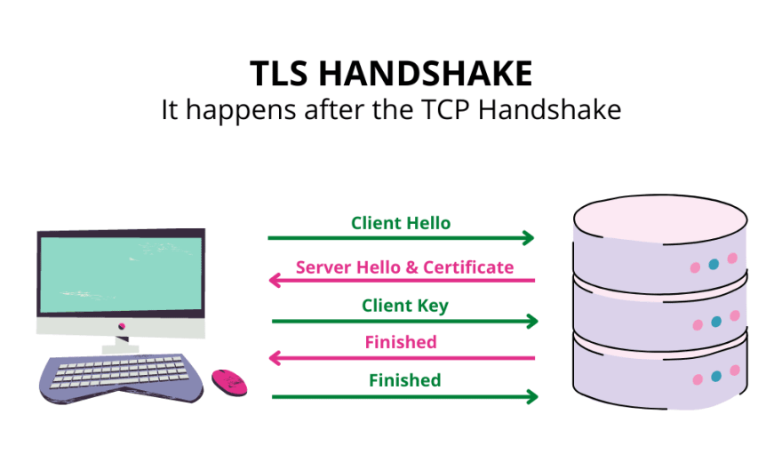
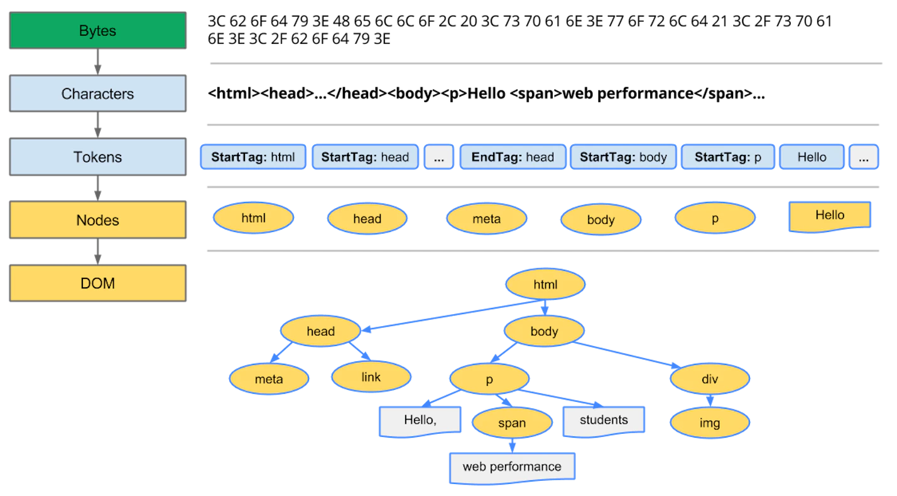
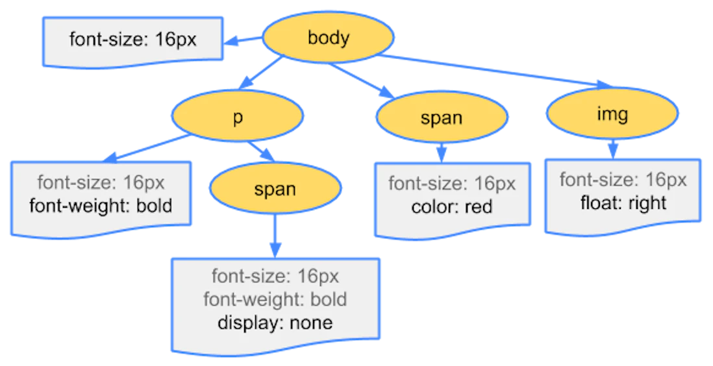
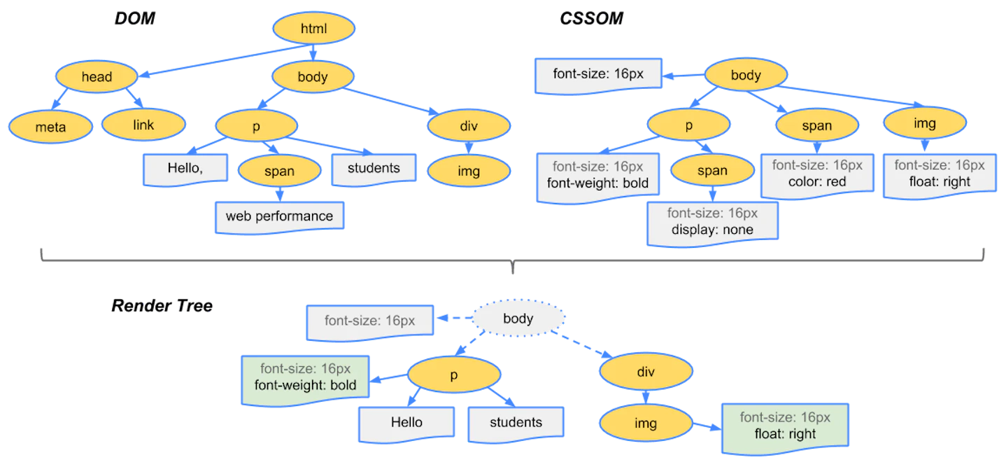
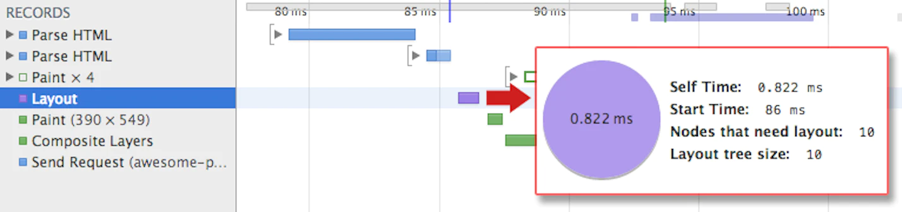

# How Browsers Work?

> Simple version: when we request a web page from a particular website, the browser retrieves the necessary content from a web server and then displays the page on our device.

1. Process HTML markup and build the [DOM](#dom) tree.
2. Process CSS markup and build the [CSSOM](#cssom) tree.
3. Combine the [DOM](#dom) and [CSSOM](#cssom) into a render tree.
4. Run layout on the render tree to compute the geometry of each node.
5. Paint the individual nodes to the screen.

## Navigation

_Navigation_ is the first step in loading a web page. It occurs whenever a user requests a page by entering a URL into the **address bar**, clicking a link, submitting a form, as well as other actions.

### DNS Lookup

The first step of navigating to a web page is to find where the **HTML page** is located. If you navigate to [https://xiaohai.wiki](https://xiaohai.wiki), the HTML page is located on the server with IP address of `75.2.60.5`. If you have never visited this site, a DNS lookup must happen.

### TCP Handshake

Once the web browser knows the IP address, it will try to set up a connection to the server via a [TCP three-way-handshake](/todos) (SYN, SYN-ACK, ACK).

### TLS Negotiation

If the website uses HTTPS, TLS handshakes should occur after the TCP connection has been opened via a [TCP three-way-handshake](/todos).



Steps of TLS handshake before 1.3:

1. **The 'client hello' message:** The client initiates the handshake by sending a **"hello"** message to the server. The message will include the following info:
   1. TLS version supported.
   2. Cipher suites supported.
   3. A string of random bytes known as the **"client random"**.
2. **The 'server hello' message:** In reply to the client **"hello"** message, the server sends a message containing:
   1. Server's **SSL certificate**.
   2. Server's chosen cipher suite.
   3. **"server random"**, another random string of bytes generated by the server.
3. **Authentication:** The client verifies the server's SSL certificate with the certificate authority (**CA**) that issued it. This ensures that the server is how it says it is.
4. **The premaster secret:** The client sends **one more** random string of bytes, the "premaster secret". The **premaster key** is **encrypted** with the public key and can only be **decrypted** with the private key by the server. (The client gets the _public key_ from the server's SSL certificate from step 2).
5. **Session keys created**: Both client and server generate **session keys** from:
   - client random
   - server random
   - premaster secret
6. **Client is ready**: The client sends a "finished" message encrypted with the session key from step 5.
7. **Server is ready**: The server sends a "finished" message encrypted with the session key from step 5.
8. **Secure symmetric encryption achieved:** The handshake is completed, and communication continues using the session keys.

:::info

**SSL**, or Secure Sockets Layer, was the original security protocol developed for HTTP. SSL was replaced by TLS, or Transport Layer Security, some time ago. SSL handshakes are now called TLS handshakes, although the "SSL" name is still in wide use.

:::

## Response

Once we have an established connection to a web server, the browser sends an HTTP `GET` request to the server. Once the server receives the request, it will reply with relevant response headers and the HTML.

## Object Model

Before the browser can render the page (`.html`), it needs to construct the [DOM](#dom) and [CSSOM](#cssom) trees. Then combine these two trees into a [render tree](#render-tree).

### DOM

How does a browser process a plain HTML page?



1. **Conversion:** Decode the _raw bytes_ of HTML into individual **characters** based on the encoding of the file (e.g. UTF-8).
2. **Tokenizing:** Convert **characters** into distinct **tokens** specified by the _HTML5 standard_. For example, `<html>` `<body>`.
3. **Lexing**: The emitted tokens are converted into "objects", which define their properties and rules. (convert tokens into **nodes**)
4. **DOM construction:** Link the created objects (**nodes**) in a tree data structure that can capture the parent-child relationships defined in the original markup.

:::info

The final output of this entire process is the **Document Object Model (DOM)** of the page, which the browser uses for all future processing of the page.

:::
The DOM tree captures the properties and relationships of the document markup, but it doesn't tell us how the element will look when rendered.

### CSSOM

When the browser is constructing the DOM of a page, it might encounter a `<link>` tag in the `<head></head>` referencing an external CSS stylesheet. The page might need this file to render the page, so it immediately send a request to fetch the `.css` file.

```css title="style.css"
body {
  font-size: 16px;
}
p {
  font-weight: bold;
}
span {
  color: red;
}
p span {
  display: none;
}
img {
  float: right;
}
```

We need to convert the fetched CSS rules into something that the browser can understand and work with. Therefore, we repeat the HTML process, but for CSS.


<p>
<center>Convert CSS bytes into characters -> tokens -> nodes.</center>
</p>



The above tree is called **CSS Object Model (CSSOM)**.

:::info
Why does the CSSOM have a tree structure?

**Ans:** Because when computing the final set of styles for any object on the page, the browser starts with the _most general rule_ applicable to that node and then recursively refines the computed styles by applying more specific rules. This behavior is called **"cascade down"**.
:::

:::caution

CSS is **render blocking**: the browser blocks page rendering until it receives and processes all of the CSS. CSS is render blocking because rules can be overwritten, so the content can't be rendered until the CSSOM is complete.

The CSS object model gets built as the CSS is parsed, but can't be used to build the **render tree** until it is completely parsed because styles that are going to be overwritten with later parsing should not be rendered to the screen.

:::

## Render Tree

The render tree is used to compute the layout of each visible element and serve as an input to the [paint](#painting) process that renders the pixels to screen.

DOM and CSSOM capture different aspects of the document: one describes the content, and the other describes the styles rules that need to be applied to the document. By merging these two trees, we can form the **render tree** and get the browser to render pixels on the screen.



To construct the render tree, the browser needs to do the following:

1. Begins at the root of the DOM tree and traverses each **visible** node.
2. For each **visible** node, apply the matching CSSOM rules.
3. Emit visible nodes with content and their computed styles.

:::info

What is a **visible** node?

- Some nodes are not visible (e.g. `<script>`, `<meta>`...) are omitted.
- Some nodes hidden via CSS are also omitted from the render tree. (`display: none;`).

:::

The final output is a render tree that contains both the _content_ and the _style_ information of all **visible content** on the screen.

Up to this point, we've calculated which nodes should be **visible** and their **computed styles**, but we have not calculated their **exact position** and **size** within the viewport of the device. This is done in the "[layout](#layout)" stage, also known as "reflow".

:::info

To find out how long the CSS processing takes we can inspect the **Performance** tab in DevTools and look for "Recalculate Style" event. It captures parsing and CSSOM tree construction, plus the recursive calculation of computed style all together.

:::

## Layout

To figure out the exact **size** and **position** of each object on the page, the browser begins at the root of the [render tree](#render-tree) and traverses it.

The output of the **layout** process is a "box model", which precisely captures the exact **position** and **size** of each element within the viewport (All relative measurements are converted to absolute pixels on the screen).



- The "Layout" event captures the [render tree construction](#render-tree), position, and size calculation.

Now that we know which nodes are visible, and their computed styles and geometry, we can pass this information to the final stage, which converts each node in the render tree to actual pixels on the screen. This step is often referred to as "[painting](#painting)" or "rasterizing".

:::info

Subsequent recalculations of node size and locations are called **reflows**.

:::

## Painting


- When "Layout" is complete, the browser issues "Paint Setup" and "Paint" events, which convert the render tree to pixels on the screen.

To ensure repainting can be done even faster than the initial paint, the drawing to the screen is generally broken down into several layers. If this occurs, then [compositing](#compositing) is required.

Painting can break the elements in the **layout tree** into layers. **Promoting** content into layers on the GPU (instead of the main thread on the CPU) improves **paint** and **repaint** performance.

Below are specific properties and elements that instantiate a layer:

- `<video>`, `<canvas>`
- Any element which has the CSS properties of `opacity`, a 3D `transform`, `will-change`...

## Compositing

When sections of the document are drawn in different layers, overlapping each other, compositing is necessary to ensure they are drawn to the screen in the _right order_ and the content is rendered correctly.

## References

- [How web browsers work](https://dev.to/arikaturika/how-web-browsers-work-part-1-with-illustrations-1nid)
- [MDN How browsers work](https://developer.mozilla.org/en-US/docs/Web/Performance/How_browsers_work#overview)
- [MDN Critical Rendering Path](https://developer.mozilla.org/en-US/docs/Web/Performance/Critical_rendering_path)
- [Render-tree Construction, Layout, and Paint. web.dev](https://web.dev/critical-rendering-path-render-tree-construction/)
- [How is HTTPS different from HTTP?](https://www.cloudflare.com/learning/ssl/what-is-https/)
- [TLS handshake](https://www.cloudflare.com/learning/ssl/what-happens-in-a-tls-handshake/)
- [Critical rendering path - Crash course on web performance (Fluent 2013)](https://www.youtube.com/watch?v=PkOBnYxqj3k)
