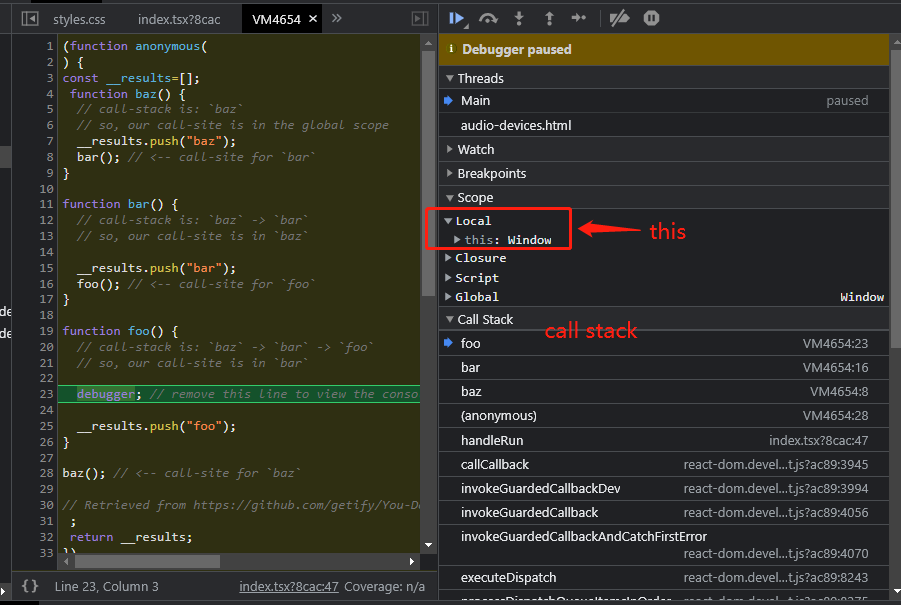
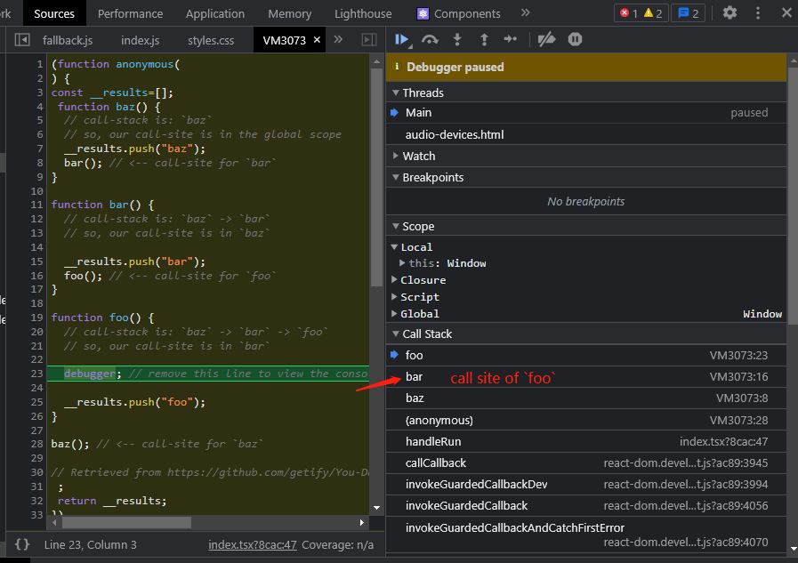
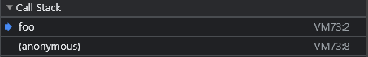

import JSEditor from "@src/components/js-live-code-editor";
import CodeBlock from "@theme/CodeBlock";
import firstExample from "!!raw-loader!./_scripts/01-this-first.js";
import implictBindingExample1 from "!!raw-loader!./_scripts/01-this-implict-binding-01.js";
import implictBindingExample2 from "!!raw-loader!./_scripts/01-this-implict-binding-02.js";
import explictBindingExample1 from "!!raw-loader!./_scripts/01-this-explict-binding-01.js";
import newBindingExample1 from "!!raw-loader!./_scripts/01-this-new-binding-01.js";
import orderExample1 from "!!raw-loader!./_scripts/01-this-order-01.js";
import arrowFunctionExample1 from "!!raw-loader!./_scripts/01-this-arrow-function-01.js";
import arrowFunctionExample2 from "!!raw-loader!./_scripts/01-this-arrow-function-02.js";
import arrowFunctionExample3 from "!!raw-loader!./_scripts/01-this-arrow-function-03.js";
import classExample1 from "!!raw-loader!./_scripts/01-this-class-01.js";

Useful resources:

- [Stack overflow](https://stackoverflow.com/a/3127440)
- [You Don't Know JS: this & Object Prototypes - 1st Edition (ch1 ~ ch2)](https://github.com/getify/You-Dont-Know-JS/blob/1st-ed/this%20&%20object%20prototypes/README.md#you-dont-know-js-this--object-prototypes)

## What is `this` ?

> `this` is a binding that is made when a function is invoked, what it references is determined by entirely by the **[call-site](#call-site)** where the function is called.
> When a function is invoked, an **execution context** is created which contains the following information:

[Execution context](/docs-todos)

- Where the function was called from (the [call stack](/docs-todos))
- How the function was invoked
- What parameters were passed
- `this`



One of the most important properties of [execution context](/docs-todos) is the `this` reference that will be used for the duration of that function call.

## How to determine call-site ? {#call-site}

[call-site](#call-site): The location in code where a function is called (not where it's declared).

Because [call stack](/docs-todos) is a stack of functions that have been called to get us to the current moment of execution. The call-site of a function is in the invocation _before_ the currently executing function. In other words, it is the second item from the top of [call stack](/docs-todos). see the the image below

<JSEditor title="call-site explanation" run={false}>
  {firstExample}
</JSEditor>

Insert a debugger at the code above



In this example, the [call-site](#call-site) of function `foo` (currently executing function), is in `bar`.

## 4 Rules {#rules}

How to determine where `this` will point during the **execution of a function** ?

1. Find the [call-site](#call-site)
2. Determine which of 4 rules applies.

These 4 rules are applied in this order:

1. Called with `new`? Use the **newly constructed object**.
2. Called with `call`, `apply` (or `bind`)? Use the specified object.
3. Called with a conext object in front of the call? Use that object. e.g. `person.sayName()`
4. Default: `strict mode` ? `undefined` : `globalThis`

### Default Binding {#default-binding}

If a function is called with a _plain, un-decorated function reference_, then _default binding_ applies.
The _default binding_ make `this` points at the global object.

```js title="standalone function invocation" {2,7}
function foo() {
  console.log(this.a);
}

var a = 2; // is declared in the global scope

foo(); // 2 -- call-site at this line
```

Follow the [instruction](#rules). The first step is to find the **call-site**



In this example, `foo()` is called with a _plain, un-decorated function reference_, so _default binding_ applies.

#### Strict mode behaviour

In [strict mode](/docs-todos), the global object is not eligible for the _default binding_. That means `this` will be set to `undefined`.

```js title='"use strict" in function definition (contents)' {2,8}
function foo() {
  "use strict";
  console.log(this.a);
}

var a = 2; // is declared in the global scope

foo(); // Uncaught TypeError: Cannot read properties of undefined (reading 'a')
```

One **important** detail to remember is that: the global object is **only** eligible for the _default binding_ if the contents of `foo()` are not running in `strict mode`. The `strict mode` in call-site of `foo()` is irrelevant.

```js title='"use strict" in call-site' {2,8-9}
function foo() {
  console.log(this.a);
}

var a = 2; // is declared in the global scope

(() => {
  "use strict";
  foo(); // 2
})();
```

### Implict Binding

When a function preceded by an `object` is called, the _implict binding_ rule says: that `object` should be used as the function call's `this` binding.

<JSEditor>{implictBindingExample1}</JSEditor>

Because `person` is the `this` for the `sayName()` call, therefore, `this.name` is synonymous with `person.name`.

Only the last object reference matters to the [call-site](#call-site).

<JSEditor>{implictBindingExample2}</JSEditor>

#### Implictly Lost {#implict-lost}

One common issue of implict binding is that it might lose its `this` binding. That usually means `this` falls back to the [_default binding_](#default-binding) which is either the global object or `undefined`, depending on `strict mode`.

```js title="Implictly lost - 01"
function sayAgeFunc() {
  console.log(`Hello, I'm ${this.age} years old.`);
}

const person = {
  age: 22,
  sayAge: sayAgeFunc,
};

var age = "global age!!!";

const sayAgeStandAlone = person.sayAge;

sayAgeStandAlone(); // Hello, I'm global age!!! years old.
```

In this example, the [call-site](#call-site) of `sayAgeStandAlone()` is a _plain, un-decorated call_, therefore the [_default binding_](#default-binding) applies.

```js title="Implictly lost - 02"
function sayNameFunc() {
  console.log(`Hello, my name is ${this.Name}.`);
}
function sayAgeFunc() {
  console.log(`Hello, I'm ${this.Age} years old!`);
}

function introduce(first, second) {
  first();
  second();
}

const person = {
  Name: "xiaohai",
  Age: 22,
  sayName: sayNameFunc,
  sayAge: sayAgeFunc,
};

var Name = "[[Global Name]]";
var Age = "[[Global Age]]";

person.sayName(); // Hello, my name is xiaohai.
person.sayAge(); // Hello, I'm 22 years old!

introduce(person.sayName, person.sayAge);
// Hello, my name is [[Global Name]].
// Hello, I'm [[Global Age]] years old!
```

:::danger

As you can see that, `this` is changed unexpectedly, we don't have control over how the function will be executed. That means that we have no way of controlling the [call-site](#call-site) to make function call's `this` to stick with the intended binding.

:::

### Explict Binding

`func.call()`, `func.apply()`, `func.bind()`

`func.call()`, `func.apply()` taks an object as the first parameter which will be used as `this`, and invoke the function. Because you are directly defining what you want the `this` to be, it is known as _explict binding_.

```js title="Explict binding - 01"
function sayNameFunc() {
  console.log(`Hello, my name is ${this.Name}.`);
}

const person = {
  Name: "xiaohai",
  sayName: sayNameFunc,
};

person.sayName(); // Hello, my name is xiaohai.
sayNameFunc.call(person); // Hello, my name is xiaohai.
```

Invoking `sayNameFunc` with _explict binding_ by `sayNameFunc.call(...)` enable us to bind its `this` to be `person`.

:::note

If a primitive value (`string`, `boolean`, or `number`) is passed as the first parameter `this` binding, the primitive value is wrapped in its **object-form** (`new String(...)`, `new Boolean(...)`, or `new Number(...)`, respectively). That behaviour is knwon as "boxing".

:::

#### Hard Binding

However, `func.call()`, `func.apply()` still doesn't solve the problem ([implict lost](#implict-lost)) "a function **losing** its intended `this` binding".

But a variation pattern around _explict binding_ can solve the problem.

<JSEditor>{explictBindingExample1}</JSEditor>

We can use ES5: `Function.prototype.bind` to achieve the same result shown above. Below is a simple version of `bind`.

```js
function bind(func, thisObject) {
  return function (...args) {
    // Don't forget to return the value computed by the func
    return func.call(thisObject, ...args);
  };
}
```

`func.bind(...)` returns a new function that will call the orginal function with `this` set as you specified.

:::info

In ES6, the function created by `bind(...)` has a `name` property that derived from the original target function. `newFunc = func.bind(...)`, `newFunc`'s `name` property should be `bound func`

:::

### `new` Binding {#new-binding}

When a function is invoked with `new` in front of it, the following things are done automatically.

1. a branch new object is created
2. the **newly constructed object** is `[[Prototype]]` linked (irrelevant)
3. the **newly constructed object** is set as the `this` binding for the function call
4. if there is no `return`, the function will return the **newly constructed object**. Otherwise, perform the normal return.

<JSEditor title="new binding example 1">{newBindingExample1}</JSEditor>

## Priority of Rules

What happend if the [call-site](#call-site) has multiple eligible rules? What order to apply these rules?

1. [new binding](#new-binding)
2. [explict binding](#explict-binding)
3. [implict binding](#implict-binding)
4. [default binding](#default-binding) has the lowerest priority among the 4.

### Explict vs Implict

```js title="explict > implict"
function sayNameFunc() {
  console.log(`Hello, my name is ${this.Name}.`);
}

const person = {
  Name: "xiaohai",
  sayName: sayNameFunc,
};

const person2 = {
  Name: "dan-dan",
};

person.sayName.call(person2);
// Hello, my name is Hello, my name is dan-dan.
```

### `new` vs Explict

<JSEditor title="new > explict">{orderExample1}</JSEditor>

## Binding Exceptions

If you pass `null` or `undefined` as the first argument to `call`, `apply`, or `bind`, the value you passed will be ignored, and instead the [default binding](#default-binding) rule applies.

```js title="pass null to call"
function sayNameFunc() {
  console.log(`Hello, my name is ${this.Name}.`);
}

const person = {
  Name: "xiaohai",
  sayName: sayNameFunc,
};

var Name = "[[Global Name]]";

person.sayName.call(null);
// Hello, my name is [[Global Name]].
```

## Lexical `this`

ES6 introduces **arrow-function** which doesn't follow the rules specified above.

> arrow-functions adopt the this binding from the enclosing (function or global) scope.

[arrow-function in object literal](https://stackoverflow.com/a/36717461)

<CodeBlock className="language-js" title="arrow-function in object literal">
  {arrowFunctionExample1}
</CodeBlock>

<CodeBlock className="language-js" title="polyfill for arrow-function">
  {arrowFunctionExample2}
</CodeBlock>

<JSEditor title="arrow-function's this cannot be changed after created">
  {arrowFunctionExample3}
</JSEditor>

Instance methods in `class` are just normal function. see below

<JSEditor title="instance method behaviour">{classExample1}</JSEditor>
