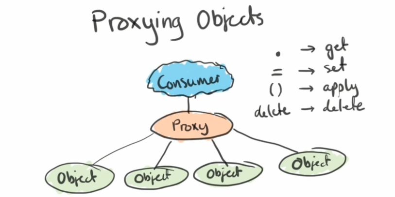
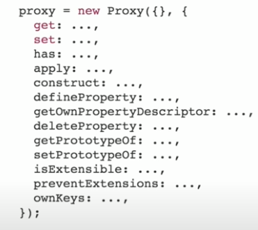
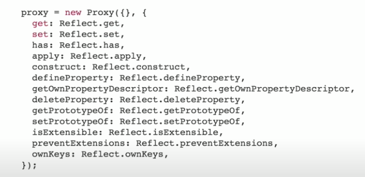

# Proxy

meta programming.

- operate while the code is running.
- enables powerful intercession.

It is similar to a reverse Proxy in a traditional server-client environment.


We are able to intercept, define, custom behavior for fundamental language operations. (e.g., "property lookup", "assignment", "enumeration", "function invocation", etc.).


:::warning

Proxies cannot be transpiled or polyfilled.

:::

## Syntax

`const proxy = new Proxy(target, handler)`

- **target** - can be any object. e.g., `{}`, `[]`, `function() {}`, or even another proxy `new Proxy(...)`.
- **handler** - used to define _traps_ aka., the custom behavior of the proxy.

:::note

proxy is transparent. No additional type is added to the `target`. If you use `typeof` operator on the proxy object, it will still return the original data type. No such a type called `Proxy`.

```js
const proxy = new Proxy(() => {}, {});

console.log(typeof proxy); // this will log function
console.log(proxy instanceof Proxy);
// Error: Function has non-object prototype 'undefined' in instanceof check
```

:::

### Handler Function / Trap {#handler-function}

Handler functions are sometimes called _traps_, because they trap calls to the underlying `target` object. They are functions that define the behavior for the corresponding [object internal method](https://developer.mozilla.org/en-US/docs/Web/JavaScript/Reference/Global_Objects/Proxy#object_internal_methods).




> It's important to realize that all interactions with an object eventually boils down to the invocation of one of these internal methods, and that they are all customizable through proxies.

#### `get()` {#get}

To customize the proxy, we can define functions on the handler object.

In this example, we provide an implementation of the `get(target, property, receiver)` handler, which intercepts calls to access properties in the `target`.

```js title="plain object"
const obj = {
  name: "xiaohai",
  language: "javascript",
};

const proxy = new Proxy(obj, {
  // highlight-start
  get(target, property, receiver) {
    return "defined by the proxy";
  },
  // highlight-end
});

console.log(proxy.name); // 'defined by the proxy'
console.log(proxy.language); // 'defined by the proxy'
```

#### `this`-recovering Proxy

A proxy is still another object with different identity. It operates between the wrapped object (`target`) and the outside. As such, the proxy does not have direct access to the original object's private properties for example.

```js
class Secret {
  #secret;
  constructor(secret) {
    this.#secret = secret;
  }
  get secret() {
    // highlight-next-line
    return this.#secret.replace(/\d+/, "[REDACTED]");
  }
}

const aSecret = new Secret("123456");
console.log(aSecret.secret); // [REDACTED]
// Looks like a no-op forwarding...
const proxy = new Proxy(aSecret, {});
console.log(proxy.secret); // TypeError: Cannot read private member #secret from an object whose class did not declare it
```

When the `get secret() {}` is invoked, the `this` value is the `proxy` variable instead of the original `secret` variable, so `this.#secret` will result in an error. To fix this, point `this` to the `secret`:

```js
const proxy = new Proxy(aSecret, {
  get(target, prop, receiver) {
    // highlight-next-line
    proxy === receiver; // true
    // By default, it looks like Reflect.get(target, prop, receiver)
    // which causes the value of `this` in `get secret()` to be `proxy`

    // highlight-start
    return Reflect.get(target, prop, target);
    // return target[prop];
    // highlight-end
  },
});
console.log(proxy.secret);
```

Redirects **methods**'s `this` value to the original object:

```js
const proxy = new Proxy(obj, {
  get(target, property, receiver) {
    // highlight-start
    // redirect `this` to the original object `target`
    const value = Reflect.get(target, property, target);
    // highlight-end

    if (value instanceof Function) {
      // highlight-start
      // redirect `this` to the original object `target`
      return (...args) => Reflect.apply(value, target, args);
      // highlight-end
    }
  },
});
```

#### `set()`

We can perform validations by overriding the `set(target, property, newValue)` handler.

```js
const validator = {
  set(obj, prop, value) {
    if (prop === "age") {
      if (!Number.isInteger(value)) {
        throw new TypeError("The age is not an integer");
      }
      if (value > 200) {
        throw new RangeError("The age seems invalid");
      }
    }

    // The default behavior to store the value
    obj[prop] = value;

    // Indicate success
    return true;
  },
};

const person = new Proxy({}, validator);

person.age = 100;
console.log(person.age); // 100
person.age = "young"; // Throws an exception
person.age = 300; // Throws an exception
```

### Revocable Proxy

The `Proxy.revocable()` method can create a revocable `Proxy` object.

This means that the proxy can be revoked via the function `revoke` and switches the proxy off. After switching off the proxy, any operation on the proxy leads to a `TypeError` (including _operations_ that are not defined in the `handler`).

```js
const revocable = Proxy.revocable(
  {},
  {
    get(target, name) {
      return `[[${name}]]`;
    },
  }
);

const proxy = revocable.proxy;
console.log(proxy.foo); // "[[foo]]"

revocable.revoke();

console.log(proxy.foo); // TypeError: Cannot perform 'get' on a proxy that has been revoked
proxy.foo = 1; // TypeError: Cannot perform 'set' on a proxy that has been revoked
console.log(typeof proxy); // "object", typeof doesn't trigger any trap
```

## Reflect API

Most methods in this module map one-to-one onto Proxy traps. [Proxy handlers](#handler-function) can use these methods to conveniently **forward operations**. The return type of the Reflect methods is guaranteed to be compatible with the return type of the Proxy traps.



### Default Forwarding Behavior for Proxy Traps

When using `Proxy` to wrap existing objects, it is very common to intercept an operation, do something, and then to "**do the default thing**".

The `Reflect` and `Proxy` APIs were _designed to work together_, such that for each `Proxy` trap, there exists a corresponding method on `Reflect` that "**does the default thing**". Hence, whenever you find yourself wanting to "**do the default thing**" inside a [Proxy handler](#handler-function), the correct thing to do is to always call the corresponding method in the `Reflect`:

```js
const obj = {
  name: "xiaohai",
  age: 29,
};
const proxy = new Proxy(obj, {
  get(target, property) {
    // do something
    // highlight-next-line
    console.log("!!getting ", property);

    // do the default thing
    // highlight-start
    return Reflect.get(...arguments);
    // return Reflect.get(target, property);
    // compatible with the return type of the trap.
    // highlight-end
  },
});

console.log(proxy.age);
// !!getting age
// 29
```

In addition to helping with forwarding default operations from the proxy handler to the `target`, `Reflect` also provides a few benefits.

### A Better `apply()` Function

Before `Reflect`, if we want to call a function with a given `this` and `arguments` (in an array format), we would need to use `Function.prototype.apply(...)`.

```js title="👴 old style"
Function.prototype.apply.call(Math.floor, undefined, [1.75]);
```

With `Reflect` this becomes less verbose and easier to understand:

```js title="😎 new style"
Reflect.apply(Math.floor, undefined, [1.75]);
```

:::info

Why use `Function.prototype.apply.call` instead of `func.apply`?

Ans: a function might define its own `apply` method.

In order to make sure that the built-in `apply` function is called, we should use `Function.prototype.apply.call(f, obj, args)`👴 or the newer `Reflect.apply(f, obj, args)`😎.

:::

### More Useful Return Values

> Many operations in `Reflect` are similar to ES5 operations defined on `Object`, such as `Reflect.getOwnPropertyDescriptor` and `Reflect.defineProperty`.

👴 `Object.defineProperty(obj, name, desc)` will either return `obj` when the property was successfully defined, or throw a `TypeError` otherwise.

😎 `Reflect.defineProperty(obj, name, desc)` simply returns a **boolean** that indicates whether or not the property was **successfully** defined.

This enables us to get rid of the `try-catch` block:

```js title="👴 old style"
try {
  Object.defineProperty(obj, name, desc);
  // property defined successfully
} catch (e) {
  // possible failure
  // (and might accidentally catch the wrong exception)
}
```

```js title="😎 new style"
if (Reflect.defineProperty(obj, name, desc)) {
  // success
} else {
  // failure
}
```

## References

- [The global `Reflect` object, its use cases and things to watch out for](https://www.stefanjudis.com/today-i-learned/the-global-reflect-object-its-use-cases-and-things-to-watch-out-for/)
- [What does the Reflect object do in JavaScript? | stackoverflow](https://stackoverflow.com/a/25585988)
- [Meta Programming | MDN](https://developer.mozilla.org/en-US/docs/Web/JavaScript/Guide/Meta_programming)
- [Proxy | MDN](https://developer.mozilla.org/en-US/docs/Web/JavaScript/Reference/Global_Objects/Proxy)
- [Eirik Vullum: JavaScript Metaprogramming - ES6 Proxy Use and Abuse | JSConf Budapest 2017](https://www.youtube.com/watch?v=_5X2aB_mNp4)
