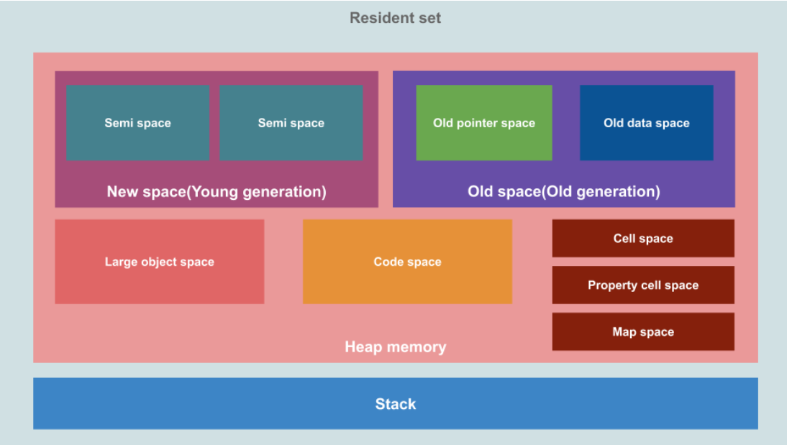
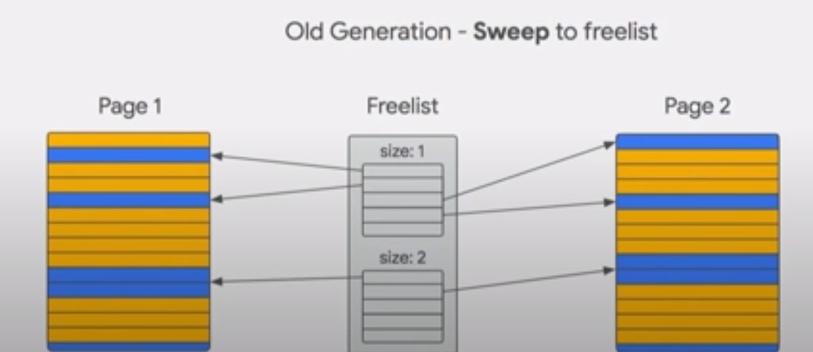

# Memory Management

Memory management happens in heap's [young generation](#young-generation) and [old generation](#old-generation).

## V8 Memory Structure



The resident set has two main components: heap memory and stack memory.

```js
const newVar = 23;
let myNumber = newVar;
myNumber += 1;
const myString = "abcd";
const myArray = [];
```

How does the memory allocation look like for the above code:


The static values like `number` and `string` are pushed directly into the **stack** memory space in order, while the object value is stored into **heap** memory. The stack only stores the memory address of the objects in the heap.

### 📚️ The Stack Memory

The stack is used for **static memory allocation** and it is a last in first out data structure.

- the process of storing and retrieving data from the stack is very fast as there is no lookup required, we can just store and retrieve data from the topmost block.
- any data that is stored on the stack has to be **finite and static** (the size of the data is known at compile-time).
- the execution data of the functions are stored as stack frames. Each frame is a block of space where the data required for that function is stored. For instance, every time a function declares a new variable, it is pushed onto the topmost block in the stack frame. Then every time a function exists, the topmost stack is popped off, thus all of the variables pushed onto the stack frame by that function are cleared.
- the size is limited.

The stack is automatically managed and is done so by the operating system rather than V8 itself. Hence we do not have to worry much about the stack.

:::note

However, **heap** on the other hand, is not automatically managed by the OS and it's the biggest memory space and holds dynamic data, it could grow exponentially causing our program to run out of memory over time.

It also becomes **fragmented** over time slowing down applications.

:::

### The Heap Memory

Heap is used for **dynamic memory allocation** and unlike stack, the program needs to look up the data in heap using **pointers** (memory address).

- It is slower than stack as the process of looking up data is more involved but it can store **more** data than the stack.
- This means data with **dynamic size** ban be stored here.
- Heap is **shared** among threads of an application.
- This is where you would encounter **out of memory** errors.

#### 🧒 Young Generation {#young-generation}

New space or **Young generation** is where new objects live and most of these objects are **short-lived**.

This space is small (up to 16MiB in V8) and has two **semi-space** ("nursery" and "intermediate"). And it is managed by the [Minor GC](#minor-gc-scavenger).

#### 👴 Old Generation {#old-generation}

Old space or **Old generation** is where objects that survived the "New space" for **two** minor GC cycles are moved to. This space is managed by the [Major GC](#major-gc-mark-sweep--mark-compact)

#### 🐘 Large Object Space

This is where objects which are **larger** than the size limits of other spaces live.

Large objects are **never** moved by the garbage collector.

#### 🧑‍💻 Code Space

This is where the **Just In Time (JIT)** compiler stores compiled code blocks.

#### 📃 Page

Each of these spaces is composed of a set of pages. A **Page** is a contiguous chunk of memory allocated from the operating system.

## Generational Heap Layout

The heap in V8 is split into different regions called **generations**.

- 🧒 Young Generation
  - nursery
  - intermediate
- 👴 Old Generation

Objects are first allocated into the **nursery**. If they survive the next GC, they remain in the young generation but are considered **intermediate**. If they survive another GC, they are moved into the **old generation**.


🤯 It copies objects which survive garbage collection. Copying objects is expensive💰️ at GC time. But we known that only a small percentage of objects survive a garbage collection, according to the "**The Generational Hypothesis**". By moving only the objects which survive, every other allocation becomes 'implicit' garbage. This means that we only pay a cost (for copying) proportional to **the number of surviving objects**, not the number of allocations.

:::info

📖 **The Generational Hypothesis**

☠️ Most objects die young.

In other words, most objects are allocated and then almost immediately become unreachable, from the perspective of the GC.

:::

## Garbage Collection

V8 manages heap memory by garbage collection. This means that it frees the memory used by unreachable (orphan) objects which are objects that are no longer referenced from the stack directly or indirectly (via a reference in another object), to claim space for new object creation.

The above is achieved by a garbage collector named "**Orinoco**" in V8. It is responsible for reclaiming the unused memory for reuse by the V8 process.

The **Orinoco** garbage collector are [generational](#generational-heap-layout). There are two generations and three different algorithms used for garbage collection.

### Minor GC (Scavenger)

The **Minor GC (Scavenger)** collects garbage in the young generation. **The Generational Hypothesis** tells us that newly allocated objects are very likely to die (short-lived) ☠️ and therefore need garbage collection.

V8 uses a 'semi-space' design for the young generation. This means that half of the total space is always empty (To-Space is always empty). During a scavenge, the initially-empty area is called 'To-Space'. The area we copy from is called 'From-Space'.

The phases are:

1. scanning **roots** for reachable objects (an additional set of roots which are the old-to-new references)
2. copying within the young generation
3. promoting to the old generation (optional)
4. updating pointers

The evacuation step moves all surviving objects to a contiguous chunk of memory in 'To-Space'. This has the advantage of completely removing fragmentation i.e., gaps left by dead objects.

💱 We then **switch the two spaces** i.e. 'To-Space' becomes 'From-Space' and vice-versa.

Once GC is completed, new memory allocations happen at the **next** free address in the new 'From-Space'. (Some addresses are occupied by objects that survived last GC).


We quickly run out space in the yong generation with this strategy alone. Objects that survive a second GC are evacuated into the **old generation**, rather than 'To-Space'.


The final step of scavenging is to **update the pointers** that reference the original objects, which have been moved (evacuated). Every copied object leaves a forwarding-address which is used to update the original pointer to point to the new location.

#### Parallel Scavenge

V8 uses **parallel scavenging** to distribute work across helper threads during young generation GC.

Each thread receives a number of pointers, which it follows, evacuating any live objects into 'To-Space'.


### Major GC (Mark-Sweep & Mark-Compact)


Major GC starts with **concurrent** marking. The helper threads are each given a number of pointers to follow. Concurrent marking happens entirely in the background while JavaScript is executing on the main thread.

:::info

Write barriers are used to keep track of **new** references between objects that JavaScript **creates** while the helpers are marking concurrently.

:::

When the concurrent marking is finished, or we reach the dynamic allocation limit, the main thread performs a quick **marking finalization step**. The main thread **pause** ⏸️ begins during this phrase. This represents the total pause time of the major GC.

During this step, the main thread scans the roots once again, to ensure that all live objects are marked. And then along with a number of helper threads, starts **parallel** compaction (conditionally) and pointer updating.

During the pause, the main thread starts **concurrent** sweeping tasks.

:::info Sweeping



🧹 **Sweeping** is a process where gaps in memory left by dead objects (🟦**blue**) are added (sweep🧹) to a data structure called a **free-list**.

Once **marking** has completed, the GC finds contiguous gaps left by unreachable objects and adds them to the appropriate free-list.

Free-lists are separated by the size of the memory chunk for quick lookup. The benefit is that in the future when we want to allocate memory, we just look at the free-list and find an appropriately sized chunk of memory.

:::

:::info Compaction

**Compaction**


This is like hard-disk degfragmentation.

After a GC cycle, it could leave various small empty spaces in the memory, and V8 may not be able to find a proper space to a big object as it expects to find a contiguous space instead of multiple small spaces. Therefore, it is necessary to compact the memory fragments together to generate some large contiguous space in the memory after GC.

It only compact some highly fragmented pages, and just perform sweeping on others, which does not copying surviving objects.

:::

## References

- [Orinoco: The new V8 Garbage Collector Peter Marshall](https://www.youtube.com/watch?v=Scxz6jVS4Ls)
- [Trash talk: the Orinoco garbage collector](https://v8.dev/blog/trash-talk)
- [Getting garbage collection for free](https://v8.dev/blog/free-garbage-collection)
- [🚀 Visualizing memory management in V8 Engine (JavaScript, NodeJS, Deno, WebAssembly)](https://deepu.tech/memory-management-in-v8)
