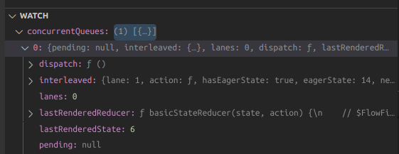

# React Hook

Hooks are stored as a linked list on the [fiber](./00-fiber.md#fibernode)'s `memoizedState` field.

## Source Code

- [ReactFiberHooks.new.js](https://github.com/facebook/react/blob/v18.2.0/packages/react-reconciler/src/ReactFiberHooks.new.js)
- [ReactHookEffectTags.js](https://github.com/facebook/react/blob/v18.2.0/packages/react-reconciler/src/ReactHookEffectTags.js)

### types

```ts title="ReactFiberHooks.new.js"
type Update<S, A> = {|
  lane: Lane,
  action: A,
  hasEagerState: boolean,
  eagerState: S | null,
  next: Update<S, A>,
|};

type UpdateQueue<S, A> = {|
  pending: Update<S, A> | null,
  lanes: Lanes,
  dispatch: (A => mixed) | null,
  lastRenderedReducer: ((S, A) => S) | null,
  lastRenderedState: S | null,
|};

type Hook = {|
  memoizedState: any,
  baseState: any,
  baseQueue: Update<any, any> | null,
  queue: any,
  next: Hook | null,
|};

type Effect = {|
  tag: HookFlags,
  create: () => (() => void) | void,
  destroy: (() => void) | void,
  deps: Array<mixed> | null,
  next: Effect,
|};

type FunctionComponentUpdateQueue = {|
  lastEffect: Effect | null,
  stores: Array<StoreConsistencyCheck<any>> | null,
|};

type BasicStateAction<S> = (S => S) | S;

type Dispatch<A> = A => void;
```

> source code: [react/packages/react-reconciler/src/ReactFiberHooks.new.js](https://github.com/facebook/react/blob/v18.2.0/packages/react-reconciler/src/ReactFiberHooks.new.js)

### `HookFlags`

`HookFlags`, `HookEffectTags`

```ts title="ReactHookEffectTags.js"
export type HookFlags = number;

export const NoFlags = /*   */ 0b0000;

// Represents whether effect should fire.
export const HasEffect = /* */ 0b0001;

// Represents the phase in which the effect (not the clean-up) fires.
export const Insertion = /*  */ 0b0010;
export const Layout = /*    */ 0b0100;
export const Passive = /*   */ 0b1000;
```

> source code: [react/packages/react-reconciler/src/ReactHookEffectTags.js](https://github.com/facebook/react/blob/v18.2.0/packages/react-reconciler/src/ReactHookEffectTags.js)

### `renderWithHooks`

```ts title="ReactFiberHooks.new.js"
// The current hook list is the list that belongs to the current fiber.
let currentHook: Hook | null = null;
// The work-in-progress hook list is a new list
// that will be added to the work-in progress fiber.
let workInProgressHook: Hook | null = null;

function renderWithHooks<Props, SecondArg>(
  current: Fiber | null,
  workInProgress: Fiber,
  Component: (p: Props, arg: SecondArg) => any,
  props: Props,
  secondArg: SecondArg,
  nextRenderLanes: Lanes
): any {
  workInProgress.memoizedState = null;
  workInProgress.updateQueue = null;
  workInProgress.lanes = NoLanes;

  const isMount = current === null || current.memoizedState === null;
  ReactCurrentDispatcher.current = isMount
    ? HooksDispatcherOnMount
    : HooksDispatcherOnUpdate;

  const children = Component(props, secondArg);

  // We can assume the previous dispatcher is always this one, since we set it
  // at the beginning of the render phase and there's no re-entrance.
  ReactCurrentDispatcher.current = ContextOnlyDispatcher;

  return children;
}
// renderWithHooks(current, workInProgress, Component)
//      updateFunctionComponent(current, workInProgress, Component)
//          beginWork(current, workInProgress)
```

> source code: [react/packages/react-reconciler/src/ReactFiberHooks.new.js](https://github.com/facebook/react/blob/v18.2.0/packages/react-reconciler/src/ReactFiberHooks.new.js#L374)

`renderWithHooks` renders a function component. Before calling the `Component(props)` function, it needs to determine which `Dispatcher` needs to be used depending on whether the component is during **mount** or **update**. `ReactCurrentDispatcher.current` is determined by `current === null || current.memoizedState === null`.

### `Dispatcher`

```ts
const HooksDispatcherOnMount: Dispatcher = {
  readContext,
  useCallback: mountCallback,
  useContext: readContext,
  useMemo: mountMemo,
  useReducer: mountReducer,
  useRef: mountRef,
  useState: mountState,
  ...
}

const HooksDispatcherOnUpdate: Dispatcher = {
  readContext,
  useCallback: updateCallback,
  useContext: readContext,
  useMemo: updateMemo,
  useReducer: updateReducer,
  useRef: updateRef,
  useState: updateState,
  ...
}

ReactCurrentDispatcher.current = isMount
    ? HooksDispatcherOnMount
    : HooksDispatcherOnUpdate;
```

## Mount

Below is an example component `Counter`.

```jsx {2-3}
function Counter() {
  const [num, setNum] = React.useState(6);
  const [enabled, setEnabled] = React.useState(false);

  return (
    <div>
      <p>The number is: {num}</p>
      <button>{enabled ? "ON" : "OFF"}</button>
    </div>
  );
}
// <Counter />
```

```js title="React.useState(initialState)" {4}
function useState(initialState) {
  // HooksDispatcherOnMount | HooksDispatcherOnUpdate
  var dispatcher = resolveDispatcher();
  return dispatcher.useState(initialState);
}
```

### `mountState`

```ts title="mountState(initialState)"
const HooksDispatcherOnMount: Dispatcher = {
  ...,
  useState: mountState,
  ...
};

function mountState<S>(
  initialState: (() => S) | S
): [S, Dispatch<BasicStateAction<S>>] {
  // Create a hook for the component
  const hook = mountWorkInProgressHook();
  if (typeof initialState === "function") {
    // $FlowFixMe: Flow doesn't like mixed types
    initialState = initialState();
  }
  hook.memoizedState = hook.baseState = initialState;
  const queue: UpdateQueue<S, BasicStateAction<S>> = {
    pending: null,
    lanes: NoLanes,
    dispatch: null,
    lastRenderedReducer: basicStateReducer,
    lastRenderedState: initialState,
  };
  hook.queue = queue;
  const dispatch: Dispatch<BasicStateAction<S>> = queue.dispatch =
    dispatchSetState.bind(null, currentlyRenderingFiber, queue);
  return [hook.memoizedState, dispatch];
}
```

1. Creates a `hook` object and populates

   - `hook.memoizedState`
   - `hook.baseState`
   - `hook.queue`

2. Creates an `UpdateQueue` for the `hook` object and populates the queue with the dispatch function (`dispatchSetState`).

   - `queue.dispatch`

3. Returns the `initialState` and `dispatchSetState`.

:::info

Why `setState` is _stable_ across different renders?

During an **update**, `queue.dispatch` will be **reused** in `updateState -> updateReducer` as the dispatch function.

```js
function updateReducer(reducer) {
  // omit irrelevant code
  const hook = updateWorkInProgressHook();
  const queue = hook.queue;
  const dispatch = queue.dispatch;
  return [hook.memoizedState, dispatch];
}
```

:::

### `mountWorkInProgressHook`

```ts
// Instantiate a hook for the component and
// stores the hook in `memoizedState` field of the component's fiber.
function mountWorkInProgressHook(): Hook {
  const hook: Hook = {
    memoizedState: null,

    baseState: null,
    baseQueue: null,
    queue: null,

    next: null,
  };

  if (workInProgressHook === null) {
    // This is the first hook in the list
    currentlyRenderingFiber.memoizedState = workInProgressHook = hook;
  } else {
    // Append to the end of the list
    workInProgressHook = workInProgressHook.next = hook;
  }
  return workInProgressHook;
}
```

`mountWorkInProgressHook` stores the hooks of a component as a linked list on its `memoizedState` field.

## Update

:::note

There are a few different ways to tell React to queue a **re-render**:

- Function components:
  - `useState`
  - `useReducer`
- Class components:
  - `this.setState()`
  - `this.forceUpdate()`
- Other:
  - Calling the ReactDOM top-level `root.render(<App />)` method **again**.
  - Updates triggered from the `useSyncExternalStore` hook.

<cite><a href="https://blog.isquaredsoftware.com/2020/05/blogged-answers-a-mostly-complete-guide-to-react-rendering-behavior/#queuing-renders">How Does React Handle Renders?
</a></cite>

:::

### `dispatchSetState`

An update can be triggered by `setState` | `dispatchSetState`.

```ts
// the arguments fiber and queue are fixed by `.bind`
// action is the value passed by setState
function dispatchSetState<S, A>(
  fiber: Fiber,
  queue: UpdateQueue<S, A>,
  action: A
) {
  const lane = requestUpdateLane(fiber); // if the function is invoked by click event, lane = 1

  const update: Update<S, A> = {
    lane,
    action, // value passed by setState, either an updater or a new state value
    hasEagerState: false,
    eagerState: null,
    next: null,
  };

  const root = enqueueConcurrentHookUpdate(fiber, queue, update, lane);

  if (root !== null) {
    var eventTime = requestEventTime();
    scheduleUpdateOnFiber(root, fiber, lane, eventTime);
    entangleTransitionUpdate(root, queue, lane);
  }
}
```

Firstly, `dispatchSetState` creates an `update` and enqueue it to the `concurrentQueues`.



Secondly, `scheduleUpdateOnFiber` triggers a re-render by scheduling a task using `ensureRootIsScheduled(root, eventTime)`.

During an update, when evaluating the `Counter()` function, the `dispatcher` will be `HooksDispatcherOnUpdate` which means that the `useState` will call `updateReducer(basicStateReducer, initialState);`.

And the **pending queue** of the `hook` returned by `updateWorkInProgressHook()` will have the new `update`. We can then use the `update` to compute the `newState` and return it to the component i.e. `[hook.memoizedState, dispatch]`

The source code of `updateReducer` can be found [here](https://github.com/facebook/react/blob/v18.2.0/packages/react-reconciler/src/ReactFiberHooks.new.js#L759).

### Concurrent Update Queue

```ts title="ReactFiberConcurrentUpdates.new.js"
import type {
  UpdateQueue as HookQueue,
  Update as HookUpdate,
} from "./ReactFiberHooks.new";

type ConcurrentUpdate = {
  next: ConcurrentUpdate;
  lane: Lane;
};

type ConcurrentQueue = {
  pending: ConcurrentUpdate | null;
};
const concurrentQueues: Array<any> = [];

function enqueueConcurrentHookUpdate<S, A>(
  fiber: Fiber,
  queue: HookQueue<S, A>,
  update: HookUpdate<S, A>,
  lane: Lane
): FiberRoot | null {
  const concurrentQueue: ConcurrentQueue = queue;
  const concurrentUpdate: ConcurrentUpdate = update;
  enqueueUpdate(fiber, concurrentQueue, concurrentUpdate, lane);
  return getRootForUpdatedFiber(fiber); // FiberRootNode
}

function enqueueUpdate(
  fiber: Fiber,
  queue: ConcurrentQueue | null,
  update: ConcurrentUpdate | null,
  lane: Lane
) {
  // Don't update the `childLanes` on the return path yet. If we already in
  // the middle of rendering, wait until after it has completed.
  concurrentQueues[concurrentQueuesIndex++] = fiber;
  concurrentQueues[concurrentQueuesIndex++] = queue;
  concurrentQueues[concurrentQueuesIndex++] = update;
  concurrentQueues[concurrentQueuesIndex++] = lane;

  concurrentlyUpdatedLanes = mergeLanes(concurrentlyUpdatedLanes, lane);

  // The fiber's `lane` field is used in some places to check if any work is
  // scheduled, to perform an eager bailout, so we need to update it immediately.
  // TODO: We should probably move this to the "shared" queue instead.
  fiber.lanes = mergeLanes(fiber.lanes, lane);
  const alternate = fiber.alternate;
  if (alternate !== null) {
    alternate.lanes = mergeLanes(alternate.lanes, lane);
  }
}
```

> source code: [react/packages/react-reconciler/src/ReactFiberConcurrentUpdates.new.js](https://github.com/facebook/react/blob/v18.2.0/packages/react-reconciler/src/ReactFiberConcurrentUpdates.new.js)

:::note

When do we make use of `concurrentQueues`?

Ans: We use `finishQueueingConcurrentUpdates` to add the `update` to the `hook.queue`'s pending list before the next render (in `prepareFreshStack` for HostRoot).

`finishQueueingConcurrentUpdates` also invokes `markUpdateLaneFromFiberToRoot(fiber, update, lane)` which updates the source fiber's `lanes` and walks the parent path to the root and update the `childLanes`.

<cite><a href="https://github.com/facebook/react/pull/24663">
Refactor of interleaved ("concurrent") update queue
#24663</a></cite>

:::
