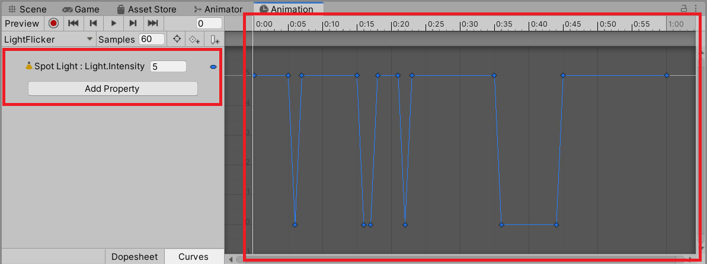
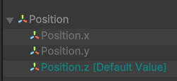

Animation data is stored as an asset called __Animation Clip__. An __Animation Clip__ can store any GameObject animation. This could be something relatively simple like the following:

- A character jump
- Flickering light
- cutscene animation

:::info

__Animation Clips__ are the fundamental building blocks of Unity's animation systems.

:::

## Values & Bindings

The data stored on an __Animation Clip__ is made up of two parts: values and bindings.

The Animation window is split into two main areas, one for each part of an Animation Clip, with the bindings on the left and the values on the right.

### Values

Values are the actual data that is stored in an Animation Clip. These values represent the changes in properties of a GameObject over time. Imagine an Animation Clip that animates a character jumping. The values would be the different positions of the character at different points in time.

### Bindings

Bindings are what connect the values in an Animation Clip to the properties of a GameObject. They specify which property of the GameObject should be animated by which value in the Animation Clip. For example, if you have an Animation Clip that animates the position of a character, the binding would specify that the position property of the character's Transform component should be animated by the values in the Animation Clip.

Together, values and bindings allow you to create complex animations by specifying how different properties of a GameObject should change over time.

## References

- [1.2 Core concepts: animation data](https://learn.unity.com/tutorial/lesson-1-2-animation-systems-core-concepts-animation-data)