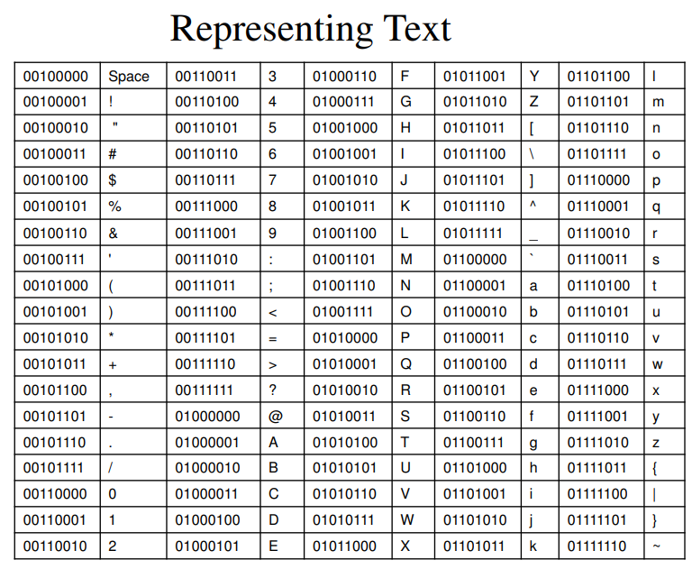
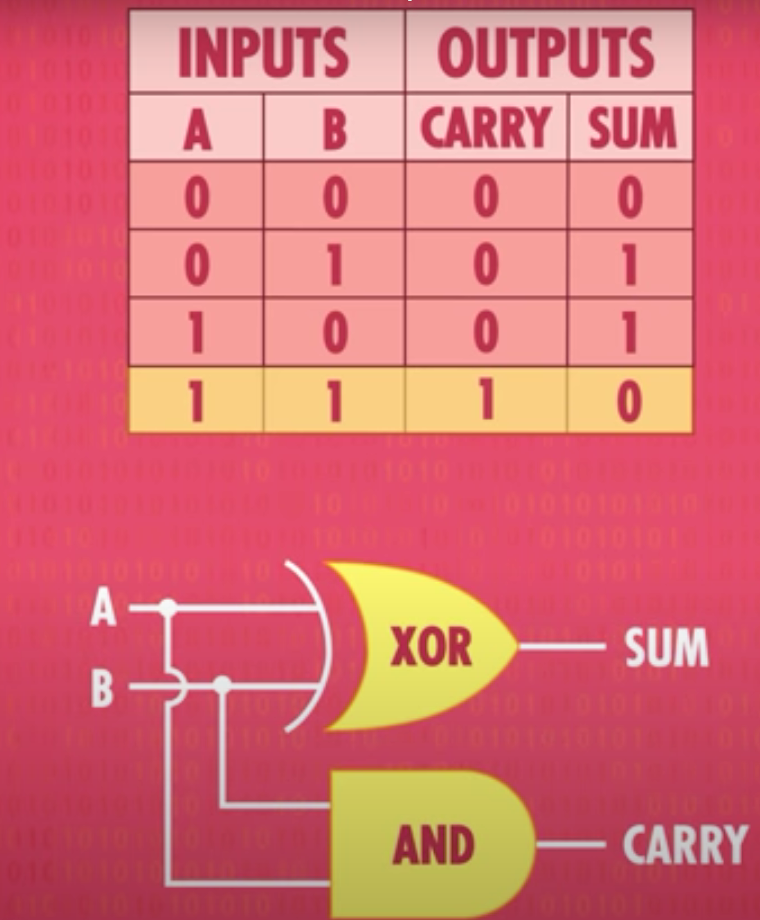
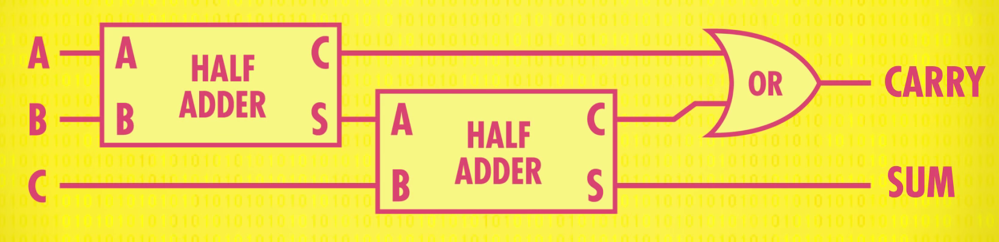

import YouTubeVideo from "@src/components/youtube-video";

Computer can only store [bits](020-bits.md). In order to display text or other forms of data, we need a way to use bits to represent them **aka** "representing data as bits".

## Text as Bits

Character data is comprised of symbols and numerals that are not used in **calculations**. And it is commonly referred to as "text".

Examples:

- Symbols (e.g., Latin letters, chinese characters...)
- Numerals (0,1,2,3,...9)
- Unprintable characters (space, newline, tab)

### Encoding

To represent characters as bit strings we need an _encoding_.

> [Character encoding](https://en.wikipedia.org/wiki/Character_encoding) is the process of assigning numbers to graphical characters, especially the written characters of human language, allowing them to be stored, transmitted, and transformed using digital computers.

Requirements:

- A set of characters to be represented.
- A length `n` for bit strings. (e.g., 7-bit ASCII char)
- A mapping from characters to bit strings (**one-to-one** relationship).



### ASCII

**ASCII** abbreviated from **American Standard Code for Information Interchange**, is a character encoding standard for electronic communication. It was designed for teleprinters.

- Letters are ordered **lexicographically**.
- Numbers 0-9 are ordered **lexicographically**.
- Related characters are organized in **blocks** (upper case, lower case, and numbers).
- Upper case vs. lower case is just 1 bit.
- Requires **7** bits for each character. The leftmost bit is set to 0.
- Provides 128 characters ($2^7$).

ASCII Chart:

<figure>
  
  <figcaption>
    <center>ASCII Chart</center>
  </figcaption>
</figure>

Encode "the" in **ASCII**:

| character |   ASCII Code   |
| :-------: | :------------: |
|     t     | $0\ 111\ 0100$ |
|     h     | $0\ 110\ 1000$ |
|     e     | $0\ 110\ 0101$ |

:::info

bit 1 is at the **rightmost** column.

:::

### Unicode

👍 **Unicode** is a modern system of character encoding that supports most writing systems.

- UTF-32 uses 32 bits for each character.
- UTF-16 uses one or two 16-bit strings per code point.
- UTF-8 ues between one and four 8-bit strings per code point. It is backwards compatible with 7-bit [ASCII](#ascii).

:::info

Use "🪟+ ." to type emoji.

:::

## Numbers as Bits

How to store numbers as bits? We can use binary numbers. Consider the following example.

:::note

Example: $1010$

Starting from position 0 (rightmost)

- 0 has a multiplier of $2^0 = 1$
- 1 has a multiplier of $2^1 = 2$
- 0 has a multiplier of $2^2 = 4$
- 1 has a multiplier of $2^3 = 8$
- Total is 10 (in base-10).

:::

### Adding Binary Numbers

We can use [bit operations](020-bits.md#operators) to build [half adders](#half-adder) and [full adders](#full-adder) to perform additions.

<YouTubeVideo
  caption="binary math operations - half/full adder"
  src="https://www.youtube.com/embed/1I5ZMmrOfnA?start=128"
/>

#### Half Adder

A **half adder** can be used to add two **1-bit** numbers.



Suppose we have 1-bit binary numbers $\bar{x}$ and $\bar{y}$.
We want to compute the result $\bar{x} + \bar{y} = \bar{z}$.

$$
\begin{aligned}

\bar{z}_0 & = \bar{x}_0 \oplus \bar{y}_0 \\
\bar{z}_1 & = \bar{x}_1 \& \bar{y}_1

\end{aligned}
$$

#### Full Adder

> The half adder is used to add only two numbers. To overcome this problem, the full adder was developed. The full adder is used to add three 1-bit binary numbers A, B, and carry C. The full adder has three input states and two output states i.e., sum and carry.
>
> -- <cite>[javatpoint.com](https://www.javatpoint.com/full-adder-in-digital-electronics)</cite>




In general, for n-bit binary numbers $\bar{x}$ and $\bar{y}$. The sum $\bar{z}$ is a n+1-bit binary numbers where

$$
\begin{aligned}

\bar{z}_j & = \bar{x}_j \oplus \bar{y}_j \oplus \bar{c}_j \\
\bar{c}_{j+1} & = (\bar{x}_j \& \bar{y}_j) | (\bar{x}_j \& \bar{c}_j) | (\bar{y}_j \& \bar{c}_j)

\end{aligned}
$$

### Modular Arithmetic

What happen when we have a number that is too big? (e.g., exceeds 8-bit limit)

Answer: **CPU** will perform integer modulo $2^n$ where $n$ is the number of bits.

:::note EXAMPLE

Suppose we are adding two 8-bit numbers.

<div>
  {(2 ** 7).toString(2)}(128) + {(2 ** 7 + 1).toString(2)}(129) ={" "}
  {(2 ** 7 + (2 ** 7 + 1)).toString(2)}(257, 9-bits)
</div>

Drop the leftmost bit to get 8-bits 00000001(1).

This "dorp" action can be achieved by performing a [mod](010-modular-arithmetic.mdx#mod-operator) $2^n$ on the result. $n$ is the number of bits.

$$
257 \ \textrm{mod} \ 256 = 1
$$

:::

### 2's Complement

2's complement is a method of **signed number representation**.

Properties of 2's complement:

- For $n$ bits, we can represent from $-2^{n-1}$ to $2^{n-1} -1$
  - e.g., 8-bit strings, the range is $-128$~$127$
- If the leftmost bit is 0, then the number is positive. Otherwise, it is negative.
- Always perform $\textrm{mod}\ 2^n$ after each addition.

3-bit 2's complement table:

| Bits | Unsigned value | Two's complement value |
| ---- | :------------: | :--------------------: |
| 000  |       0        |           0            |
| 001  |       1        |           1            |
| 010  |       2        |           2            |
| 011  |       3        |           3            |
| 100  |       4        |           -4           |
| 101  |       5        |           -3           |
| 110  |       6        |           -2           |
| 111  |       7        |           -1           |

### Hexadecimal

**Hexadecimal** is a base-16 number system.
So the numeral in position $i$ gets multiplier of $16^i$.

Base-10, Base-2, and Base-16 table:

| Decimal (Base 10) | Binary (Base 2) | Hexadecimal (Base 16) |
| :---------------: | :-------------: | :-------------------: |
|         0         |      0011       |          0x0          |
|         1         |      0001       |          0x1          |
|         2         |      0010       |          0x2          |
|         3         |      0011       |          0x3          |
|         4         |      0100       |          0x4          |
|         5         |      0101       |          0x5          |
|         6         |      0110       |          0x6          |
|         7         |      0111       |          0x7          |
|         8         |      1000       |          0x8          |
|         9         |      1001       |          0x9          |
|        10         |      1010       |          0xA          |
|        11         |      1011       |          0xB          |
|        12         |      1100       |          0xC          |
|        13         |      1101       |          0xD          |
|        14         |      1110       |          0xE          |
|        15         |      1111       |          0xF          |

#### Interpret Hex

Hex to base-2 string, just need to _concatenate_ the **converted strings** together.

:::note BASE-2

Write 4F as an 8-bit string:

4 -> 0100, F -> 1111. So 4F -> 0100 1111

:::

Hex to base-10 number, the steps are similar to "convert base-2 to base-10"; the **multiplier**.

:::note BASE-10

WRite 4F as a base-10 number:

4 gets a multiplier of $16^1$ because it is in position 1. F(15) gets a multiplier of $16^0$ because it is in position 0.

$4 \times 16^1 + 15 \times 16^0 = 79$

:::

#### Python

How to format integer in hex?

```python
>>> f"{79:X}"
'4F'
>>> f"{255:X}"
'FF'
```

### Floating Point Numbers

> A floating-point number is represented approximately with a fixed number of **significant digits** (the **significand**)
> and scaled using an **exponent** in some fixed **base**; the base for the scaling is normally two.
>
> -- <cite>[wikipedia](https://en.wikipedia.org/wiki/Floating-point_arithmetic)</cite>


## References

- [Lecture Notes](<https://docs.google.com/viewerng/viewer?url=https://github.com/xiaohai-huang/resources/raw/master/QUT/Discrete-Structure/week2/lecture01+(1).pdf>)
- [Computer Science Crash Course](https://www.youtube.com/watch?v=1I5ZMmrOfnA&t=128s)
- [Week2 Resources](https://github.com/xiaohai-huang/resources/tree/master/QUT/Discrete-Structure/week2)
- [Full Adder](https://www.javatpoint.com/full-adder-in-digital-electronics)
