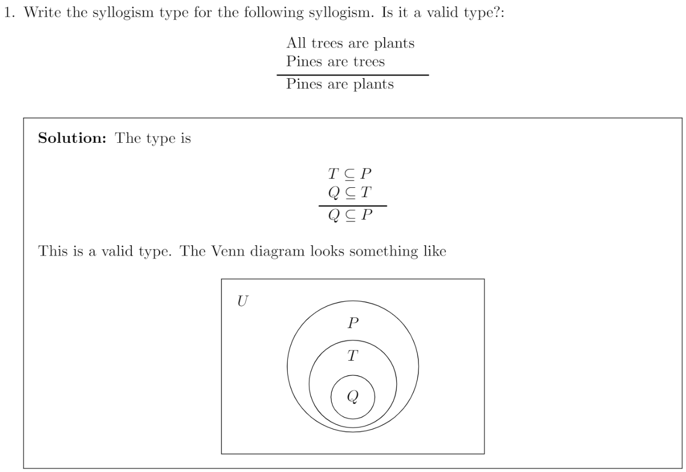

import WordCardList from "@src/components/WordCardList";

**Syllogisms** are a kind of _deductive reasoning_ about sets.
A simple syllogism definition is that it's a form of deductive reasoning where you arrive at a specific conclusion by examining premises or ideas.

Many Syllogisms contain 3 components:

1. Major premise
2. Minor premise
3. Conclusion

:::info

**Deductive reasoning** is a logical approach where you progress from general ideas to specific conclusions.

It's often contrasted with **inductive reasoning**,
where you start with specific observations and form general conclusions.

Deductive reasoning is also called deductive logic or top-down reasoning.

:::

## Examples

## Vocabulary

<WordCardList words={["Syllogisms", "deductive", "premises", "subtle"]} />

## References

- [Week4 Materials](https://github.com/xiaohai-huang/resources/tree/master/QUT/Discrete-Structure/week4)
