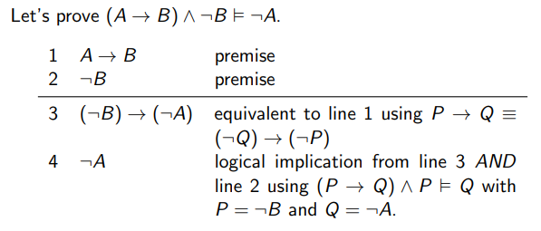

We can use [logical equivalences](030-propositional-logic.mdx#logical-equivalence) and [logical implications](050-logical-implication.mdx) to derive
new `true` [propositions](030-propositional-logic.mdx#proposition) from the given `true` propositions.

A _**proof**_ is a list of formulas. The proof starts with some premises,
and every other formula on the list must follow the **rules of proofs**:

- Logically equivalent to the formula above it.
- Logically implied by the formula above it.
- The $AND$ of some formulas above it.
- Logically implied by the $AND$ of some formulas above it.

:::note Example

Premises:

1. Socrates is mortal **or** Socrates is not human ($M \lor \lnot H$).
2. Socrates is human ($H$).

We can conclude:

3. Socrates is not human **or** Socrates is mortal (using $M \lor \lnot H \equiv \lnot H \lor M$). - This is logically equivalent to line 1.
4. Socrates is not not human ($H \equiv \lnot \lnot H$). - This is logically equivalent to line 2.
5. Socrates is mortal (logical implication).

Step 5 is logically implied by the $AND$ of some formulas above it.

Therefore the $AND$ of 3 and 4 is $(\lnot H \lor M) \land \lnot \lnot H \models M$.
This formula can be found in [logical implication - MORE EXAMPLES](050-logical-implication.mdx).

:::

## Proofs and Logical Implications

A _proof_ produces a new logical implication $P \models Q$ where

- $P$ is the $AND$ of all the premises.
- $Q$ is the last line of the proof.

:::tip

A _proof_ says that, assuming all the premises are `true`, the conclusion is also `true`.

:::

## Proof Examples

## References

- [Week5 Materials](https://github.com/xiaohai-huang/resources/tree/master/QUT/Discrete-Structure/week5)
