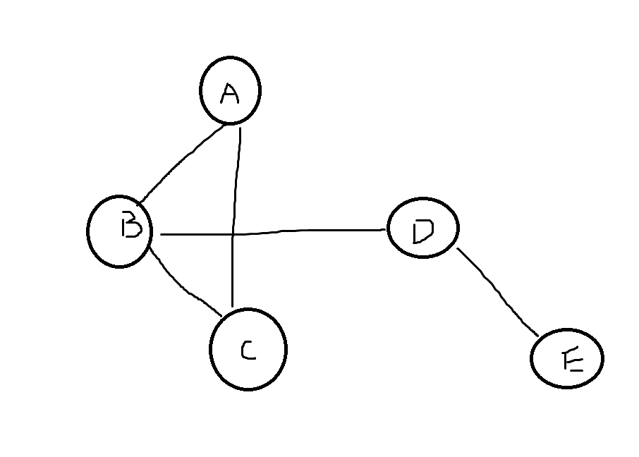

import neighborExample from "!!raw-loader!./_assets-07/neighbor.py";
import CodeBlock from "@theme/CodeBlock";

A graph is an [irreflexive](060-relations.mdx#irreflexive) and [symmetric](060-relations.mdx#symmetric) relation.

- A graph $G$ is a pair $(V,E)$
- The set $V$ is the **vertices** or **nodes** of $G$
- The set $E \subseteq V \times V$ is the **edges** of $G$
- For every $(u,v) \in E$ we have $(v,u) \in E$ - **symmetric**
- There are no edges $(v,v)$ - **irreflexive**

This type of graph is called _loop-free undirected_ graph, referring to _irreflexive_ and _symmetric_.

## Graph Visualization

We usually visualize graphs as a set of points (vertices) connected by line (edges).

## Graph Definitions

### Neighbors

If $(u,v) \in E$ then we say $u$ and $v$ are **adjacent**. We also say that $u$ and $v$ are **neighbors**.

:::tip

If there is an **edge** between two vertices then they are adjacent.

:::

The **neighborhood** of a vertex $u$ is the set of $u's$ neighbors.

$$
N_G(u) = \{v \in V: (u,v) \in E\}
$$

The **neighborhood** of a set of vertices $S \subseteq V$ is a set that contains all neighbors of vertices in $S$.

$$
N_G(S) = \{v \in V: (u,v) \in E \land u \in S \}
$$

<CodeBlock language="python">{neighborExample}</CodeBlock>

### Degrees

The degree of a vertex $u$ is the size of its [neighbors](#neighbors).

$$
d(u) = |N_G(u)|
$$

:::info

Every edge $(u,v)$ adds 1 to the _degree_ of $u$ and the _degree_ of $v$, so we have the **sum of degrees**:

$$
2|E| = \sum_{u \in V} d(u)
$$

:::

:::note

We count $(u,v)$ and $(v,u)$ together as a single edge.

:::

### Incident

If $e=(u,v) \in E$, we say $e$ is **incident** with `u` (and `v`).

## Graph Examples

- The set of computers in a network, where $u$ and $v$ are adjacent if they are connected physically (Ethernet, wifi).
- The set of cities in the world, $u$ and $v$ are adjacent if there is a direct flight.

## Handshaking Lemma

Since the sum of degrees is even, **there must be an even number of vertices with odd degree**.

## References

- [QUT Materials](https://github.com/xiaohai-huang/resources/tree/master/QUT/Discrete-Structure/week7)
