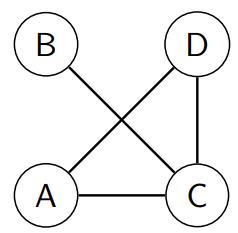
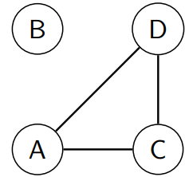

import distanceExample from "!!raw-loader!./_assets-07/distance_classes.py";
import CodeBlock from "@theme/CodeBlock";
import YouTubeVideo from "@src/components/youtube-video";
import WordCardList from "@src/components/WordCardList";

## Path

A **path** is a sequences of vertices $[v_1, v_2, v_3,\dots, v_j]$ such that:

- No vertex appears more than once.
- $v_k$ is **adjacent** to $v_{k+1}$. for each $k = 1 \dots j-1$.
- The _length_ of the path is $j-1$ which is the **number of edges**.

:::note Example

- $A,D,C,B$ is a path of length 3.
- $A,C$ is a path of length 1.
- $D,C,A$ is a path of length 2.

:::

## Cycle

A **cycle** is just like a _path_, but $v_1 = v_j$, so that it loops back on itself.

- The **length** of a cycle is $j-1$, which is the _number of edges_, and also the _number of vertices_.
- We don't care about the starting vertex of a cycle. So $A,B,C,A$ is the **same cycle** as $B,C,A,B$.
- We might not use the above notation (duplicate the start/end vertex) to represent a cycle.
  Instead we will use "cycle $A,B,C$". Note: this is different from path, path can be represented by "path $A,B,C$".

:::note Example

- $A,D,C,A$ is a cycle of length 3.

:::

## Connectedness

If there is a path from $u$ to $v$ for every $u,v \in V$, then we say that $G$ is **connected**. Otherwise, we say $G$ is **disconnected**.

:::note Example

The graph is **connected**.

:::

### Connected Component

If for every $u,v \in S \subseteq V$ there is a path between $u$ and $v$, and **there are no paths to any vertices outside $S$**.

Then we call $S$ is a **connected component** of $G$.

:::note Example

The graph is **disconnected**.

The **connected components** are $\{B\}$ and $\{A,C,D\}$

:::

## Distance

The **distance** between vertices $u$ and $v$ is the length of a **shortest path** from $u$ to $v$.

### Calculating Distances

Given a fixed vertex $u$, we define:

- $D_j$ to be the set of vertices that is $j$ **distance** from $u$. (explored)
- $V_j$ to contain the set of vertices that has **distance** at least $j$ from $u$. (unexplored)

$$
V_j=
\begin{cases}
    V                           & :j=0  \\
    V_{j-1} \setminus D_{j-1}   & :j>0
\end{cases}

$$

$$

D_j=
\begin{cases}
    \{u\}               & :j=0  \\
    N_G(V_j, D_{j-1})   & :j>0
\end{cases}
$$

The visualization of the graph can be found [here](070-graphs.mdx#graph-visualization).

<CodeBlock language="python" title="_assets-07/distance_classes.py">
  {distanceExample}
</CodeBlock>

## Bipartite Graph

If we are able to **separate**/partition vertices into two sets $(A,B)$ such that vertices within each set are not **adjacent**,
then we call $(A,B)$ a **bipartition** of $G$.

:::info Theorem

A graph $G$ is **bipartite** iff $G$ has no cycles of odd length.

:::

<YouTubeVideo
  src="https://www.youtube.com/embed/HqlUbSA9cEY"
  caption="What is a Bipartite Graph? | Graph Theory"
/>

## Vocabulary

<WordCardList words={["bipartite"]} />

## References

- [QUT Materials](https://github.com/xiaohai-huang/resources/tree/master/QUT/Discrete-Structure/week7)
