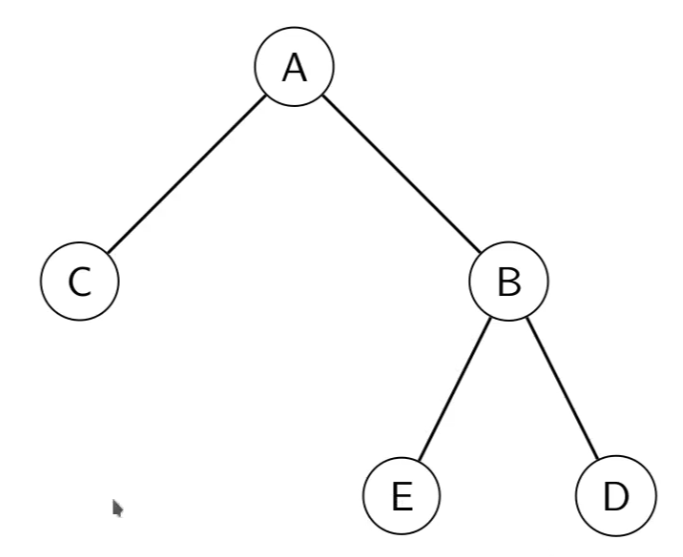

import WordCardList from "@src/components/WordCardList";

A connected graph without any cycles is called a **tree**.

- A tree always has $|V| - 1$ edges.
- There is always a **unique path** between any two vertices in a tree.

A graph (not necessarily connected) without any cycles is called a **forest**.
In such graph, each connected graph is a **tree**.

## Rooted Trees

In a tree we can specify a special vertex, called the **root**. Any vertex can be the root.

:::note Example

The root is chosen to be $A$.

- $B's$ ancestors is just $A$.
- $D's$ ancestors are $B$ and $A$.
- $A's$ children are $C$ and $B$.
- $B's$ descendants are $E$ and $D$.
- The leaves are $C$, $E$, and $D$.

:::

### Parent

The **parent** of a vertex is the first vertex in the unique path to the root.

We call the parent of `v`, $P(v)$
:::info

The **root** has no parent.

:::

### Ancestors

The **ancestors** of a vertex are its parent and its parent's parent, etc. All the way to the root.

We call the set of ancestors of a vertex `v`, $A(v)$.

- If `v` is the root, then $A(v)=\empty$
- If `v` is not the root, then $A(v)=\{P(v)\} \cup A(P(v))$

### Children

The **children** of a vertex are all its neighbors except its parent.

### Descendants

The **descendants** of a vertex is all its children, all its children's children, etc.

We call the set of _children_ of a vertex `v`, $C(v)$ and the set of _descendants_ $D(v)$.

- If the vertex is the root then $C(v)=N_G(v)$, otherwise $C(v)=N_G(v) \setminus P(v)$
- The descendants are given by:
  $$
  D(v) = C(v) \cup_{u \in C(v)} D(u)
  $$

:::info

Why is there no base case?

It exists, it just built in to the notation. If $C(v)=\empty$ then the big union will disappear.

:::

### Leaf

A vertex without **children** is called a **leaf**.

## Subgraph

### Induced Subgraph

## Subtree

## Spanning Tree

### Use Cases

- In networking, we often identiy a spanning tree of the network and only send packets along the edge of the spanning tree.
  This prevents packets from going around the network in a cycle.
- The graph of the shortest paths from a vertex will form a rooted spanning tree.

## Vocabulary

<WordCardList words={["intrinsic", "descendants"]} />
