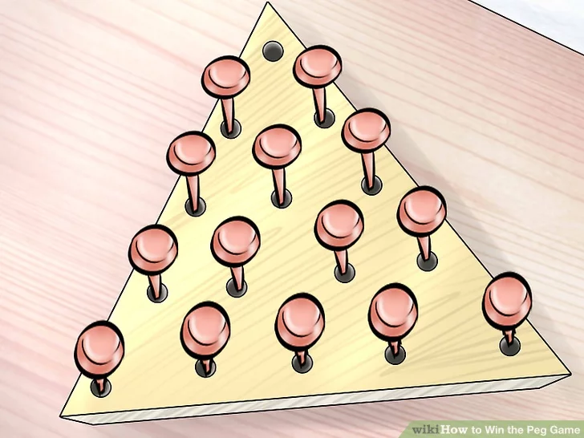
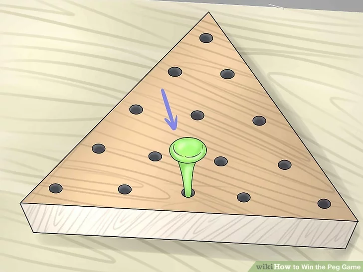

# CAB203 Project: Pegs

Baorong Huang: n10172912

## Introduction

<!-- Using your own words, describe the problem in plain language. This should include
enough information from the topic description above to understand the rest of your report, but can
exclude specific examples, or other information that is not relevant -->

The classic _Peg Game_ consists of a small wooden triangle board with 15 holes in it and 14 pegs.



The game begins with one empty hole, the player can jump a peg over another peg. The goal of the game is to jump the pegs to
end up with one peg left in the game, like so:



In this report we consider a variation of the _Peg Game_: _One-Line Peg Game_.
It differs from the classic game in that the game board is a line of regularly spaced holes rather than a triangle board.
And The number of holes can vary. The game begins with some of the holes occupied by pegs, and some holes empty.
The goal of the _One-Line Peg Game_ is, given a starting arrangement of pegs, find a sequence of jumps that
results in the board with only one peg left and all other holes empty, like so: `ooXooo` or determine that there is no such sequence of jumps.

## Problem

<!-- Use mathematical language, concepts and notation from the unit to describe the problem.
You should make references to mathematical problems discussed in the unit, for example finding a
shortest path in a graph. Describe what an instance of the problem is and how it relates to these
mathematical problems -->

We begin by describing the game rigorously. An arrangement of pegs on the board is called a _state_ of the game.
We will represent a _game state_ as a n-tuple of `boolean` variables $x = (x_0,x_1,\dots, x_{n-1})$. Note that indices start from 0 for consistency with the later implementation in Python.
Each $x_i$ holds a `True` or `False` value to indicate if the hole is occupied by a peg (`True`) of empty(`False`) in the position $i$ on the board.

According to this notation, a example _state_ is given by:

$$
\text{XoXX} \mapsto [T,F,T,T]
$$

The _solved state_ is given by:

$$
\text{ooXo} \mapsto [F,F,T,F]
$$

The _solved state_ will be called $x_{goal}$ and the initial state will be $x_{initial}$.

Another data structure that can be used to represent the _game state_ is `string`, a string of `X` and `o`.
However, it consumes more memory and computing power.
In python, you will need 8 bits to represent a hole if it is encoded as `X` or `o`.
If the hole is encoded as a boolean value, then it only takes 1 bit to represent a hole.
In addition, a tuple of boolean values makes it easier to implement the solution.

We now describe the legal peg jumps.
A player can jump a peg over an adjacent peg into an empty hole.
The peg which was jumped over is removed.
The player can jump left or right, but move outside of the line is not allowed.

Examining the arrangement of the $x_i$'s above we can summarize which possible jumps are available as follows.

For each peg at position $i$:

- The peg can jump left if there is a peg at position $i-1$ and there is an empty hole at position $i-1-1$
- The peg can jump right if there is a peg at position $i+1$ and there is an empty hole at position $i+1+1$

Now that we have described the game mechanics we can discuss the problem.
Let $G=(V,E)$ be a graph with $V$ the set of _game state_.Two _game states_ $u$ and $v$ are adjacent in $G$
if there is a legal peg jump that changes $u$ to $v$.
Note that we always remove the peg that is jumped over, we cannot find a legal jump that can go back to the previous _state_.
Hence $G$ is directed.

The _One-Line Peg Game_ can be summarized as follows: find a shortest path from $x_{initial}$ to $x_{goal}$.

## Solution

<!-- Describe, using mathematical terms and notation, how to find a solution for a given instance
of the problem. Make reference to solution methods discussed in the unit, for example breadth first
traversal. Describe how the solution to the mathematical problem relates to the solution to the original
problem. -->

When all actions have the same cost, an appropriate strategy is **breadth-first search**,
in which the root node/vertex is expanded first, then all the successors of the root node are expanded next, then their successors (Russell et al., 2021, p. 94).
And it always finds a solution with a smallest number of actions,
since when it is generating nodes/vertices at _distance class_ $d$,
it has already generated all the nodes/vertices at _distance class_ $d-1$.
Therefore, if one of them were a solution, it would have been found.

For solving the puzzle, we will calculate $G$ dynamically.
There are many possible _game states_ of this game.
While this is still small enough to fit within the memory of modern computers, we will generally not need to visit all of them.
Therefore, we will speed up the process and save memory by only expanding the frontier/neighbors as we take actions.
We will not pre-compute the graph.
This is achieved by taking a _game state_ and apply all legal actions to it to generate its possible new _game states_ as we traverse.

The breadth first search algorithm will produce a sequence of _game states_/vertices. However, the solution requires the sequence of actions.
To obtain that, I use `Node`s to remember the actions, parent state and current state.

`Node`:

- state
- parent
- action

With these preliminaries in place, we can state the solution to _One-Line Peg Game_. Given the initial game state $x_{initial}$ find a path

$$
x_{initial} = v_1, v_2, \dots, v_n = x_{goal}
$$

Since every vertex is a `Node`, the sequence of jumps is
the path from the initial node to the goal node which can be obtained by recursively traversing the parent of the goal node and reverse it.

If there is no such path, then the breadth first search will indicate so.

## Implementation

<!-- Describe your implementation in Python. Be sure to mention any of these that
apply:
rationale for choices of data structures,
necessary transformations of data,
how you use functions
from external libraries like graphs.py or digraphs.py.
Please note that this section should be about
programming considerations,
not on the algorithm that you choose (which belongs in the Solution
section.) -->

A `Problem` class is created to model a problem. Later on,
I will create a sub-class called `PegsProblem` which inherits from the `Problem` class
as _One-Line Peg Game_ is a special type of `Problem` and inheritance makes sense in this scenario .

```python
class Problem:
   def __init__(self, initial):
      self.initial = initial
   def actions(self, state):
      """Return the actions that can be executed in the given state."""
   def result(self, state, action):
      """Return the state that results from executing the given action in the given state."""
   def goal_test(self, state) -> bool:
      """Test if the state is a goal."""
```

After that, I define a `Node` class that can be used to create
nodes to store information about the _game state_ and the parent
and the action which can transform the parent state to the current state.
In addition, I also define two important methods to discover neighbors.

```python
class Node:
   def __init__(self, state, parent, action):
      self.state = state
      self.parent = parent
      self.action = action

   def child_node(self, problem, action):
      next_state = problem.result(self.state, action)
      return Node(next_state, self, action)

   def expand(self, problem):
      return [self.child_node(problem, action)
             for action in problem.actions(self.state)]
```

`child_node` is used to generate the child node of the current node after performing an action.

`expand` will take an instance of `Problem` to generate all the neighbors of the current node.

Below is the implementation of the BFS. Note that: because the problem is a **directed graph** it is impossible to have neighbors that we have already seen,
I could remove the `if expression` when extending the frontier. But I decide to keep it to make it more versatile.

```python title="BFS"
# Uninformed Search algorithm
def graph_search(problem, frontier):
   frontier.append(Node(problem.initial))
   explored = set()
   while frontier:
      node = frontier.pop()
      if problem.goal_test(node.state):
         return node
      explored.add(node.state)

      frontier.extend(child for child in node.expand(problem)
                     if child.state not in explored
                     and child not in frontier)

def breadth_first_graph_search(problem) -> Node:
    "Graph search version of BFS."
    return graph_search(problem, FIFOQueue())
```

The remaining code are specific to _One-Line Peg Game_. The specific logic is located within `PegsProblem` class.

Game _states_ are represented as tuples of booleans since we need them to be hashable to allow us to compare if two nodes are equal.

`actions` takes a _state_ and return a list of legal jumps that can be performed in the current state.
Legal jumps have already been defined in [Problem](#problem) section.

`result` is a method for applying jumps and returns the state after applying the jump.

`goal_test` tests if there is only one `True` value in the _state_.
This is used to do an **early goal test**, checking if a node is the solution as soon as it is generated.

The main function is `pegSolution` which takes an initial state. It first instantiate an instance of `PegsProblem`,
then use `breadth_first_graph_search(puzzle)` to find the goal node.
With the goal node found, we can find all the ancestors of the goal node to construct a path to the initial state,
and then generate a list of actions, i.e. the edges connected each node.

```python
   def path(self):
      "Return a list of nodes forming the path from the root to this node."
      node, path_back = self, []
      while node:
         path_back.append(node)
         node = node.parent
      return list(reversed(path_back))
```

## References

Russell, Stuart, and Peter Norvig. Artificial Intelligence: a Modern Approach, EBook, Global Edition, Pearson Education, Limited, 2021. ProQuest Ebook Central, _Uninformed Search Strategies_ (p.94) http://ebookcentral.proquest.com/lib/qut/detail.action?docID=6563563

## Note

The quality of the exported PDF is not very good. The Python code within Code Blocks are not images. The HTML version of this document
can be viewed via the link below:

[https://xiaohai.wiki/university/cab203-discrete-structure/project-pegs](https://xiaohai.wiki/university/cab203-discrete-structure/project-pegs)
