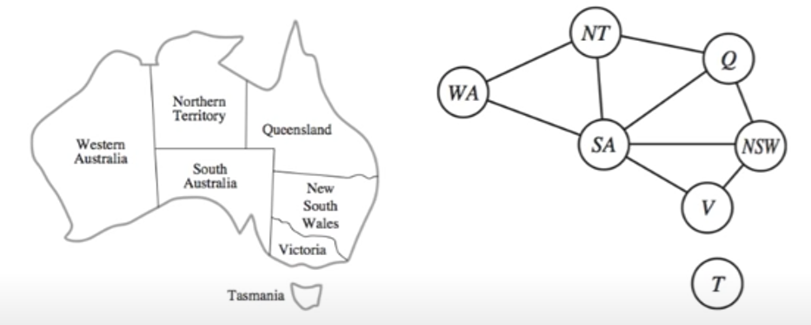

- Color each region using either `red`, `green`, or `blue`.
- No adjacent region can have the same color.

## Formulate the Problem X, D, C

According to the definition of CSP. We can define **variables** to be the regions:

$$
\chi= \{SA, NSW, NT, Q, WA,V ,T\}
$$

The **domain** of each variable is the set $D=\{red,green,blue\}$.

The **constraints** require neighboring regions to have distinct colors. There are 9 constraints:

$$
C = \{ SA \not = WA, SA \not = NT, SA \not = Q, SA \not = NSW, SA \not = V, \\
 WA \not = NT, NT \not = Q, Q \not = NSW, NSW \not = V  \}
$$

Here we are using abbreviations; $SA \not = WA$ is a shortcut for \<(SA,WA), $SA \not = WA$\>, where $SA \not = WA$ can be fully enumerated as

$$
\{(red,green), (red, blue), (green, red), (green, blue), (blue,red), (blue, green) \}
$$

## Constraint Graph

The CSP can be visualized as a **constraint graph**, as shown at the beginning of this page.

- The **nodes** of the graph correspond to **variables** of the problem.
- An **edge** connects any two variables that participate in a **constraint**.
