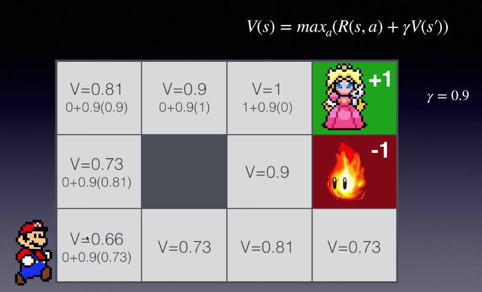
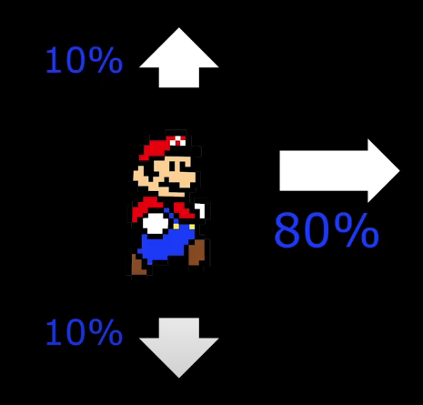

import YouTubeVideo from "@src/components/youtube-video";

# Bellman Equation

The page consists of two sections.

- [Bellman Equation Basics](#bellman-equation-basics)
- [Bellman Equation Advanced](#bellman-equation-advanced)

## Bellman Equation Basics

<YouTubeVideo
  src="https://www.youtube.com/embed/14BfO5lMiuk"
  caption="An introduction to the Bellman Equations for Reinforcement Learning"
/>

### Important Bellman Concepts

- **STATE**: a numeric representation of what the agent is observing at a particular point of time in the environment. (e.g., raw pixels on the screen)
- **ACTION**: the input the agent provides to the environment, which is calculated by applying a policy to the current state. (e.g., control buttons pressed, joystick)
- **REWARD**: a feedback signal from the environment reflecting how well the agent is performing the goals of the game. (e.g., coins collected, enemies killed)

### Goal of Reinforcement Learning

Given the current state we are in, choose the **optimal** action which will maximize the long-term expected reward
provided by the environment.

### What Question Does the Bellman Equation Answer?

Given the _state_ I'm in, assuming I take the best possible action now and **each subsequent step**, what long-term reward can I expect?

What is the **VALUE** of the **STATE**?

:::info

It helps us evaluate the _expected reward_ relative to the advantage or disadvantage of each state.

:::

### Bellman Equation

For deterministic environments.

$$
V(s) = \max_a(R(s,a) + \gamma V(s\prime))
$$

- $s$ a given state.
- $V(s)$ the **VALUE** of a given state.
- $\max_a$ means that all the actions available in the state we are in, we pick the **action** which is going to maximize the value.
- $R(s, a)$ is the reward of the **optimal action** in state $s$.
- $\gamma$ is the discount factor.
- $s\prime$ is the state after performing the action $a$.

:::info

At each step, we need to know what the optimal action is.

:::

:::tip

Gamma $\gamma$

- Successful values range between 0.9 and 0.99.
- A lower value encourages **short-term** thinking.
- A higher value emphasizes **long-term** rewards.

:::

### Example

At $V=1$, $R(s,a)=1$ means we can get a reward of 1 if we take the _action_ in _state_ because it can get us to the green cell. $V(s\prime)=0$ because $s\prime$ is the **terminal state** and there is no value associated with it.

## Bellman Equation Advanced

For stochastic environment.

### Markov Decision Process

State -> Action

We're in a state we choose an action, and now there are several possible $s\prime$ states we could end up being in based on random probability.

Each possible state transition from an action has an exact probability and all the probabilities add up to 1.

:::info

The probability of future transitions only depends on the **present** and the past doesn't matter.

:::

### New Bellman Equation

For stochastic environment.

1. Loop through every possible state that we can transition to after taking a specific action.
2. Multiply the **VALUE** of that state by its probability of occurring.
3. Sum them all together.

$$
V(s) = \max_a(R(s,a) + \gamma \sum_{s\prime} {P(s,a,s\prime) V(s\prime)})
$$

$\sum_{s\prime}$ means that we are looping all the $s\prime$ that the optimal action could possibly lead us to.
