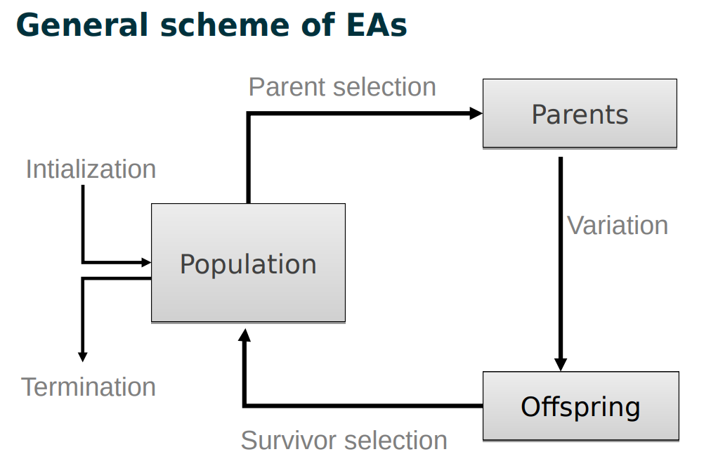
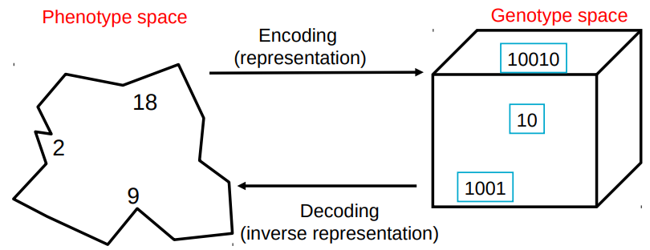
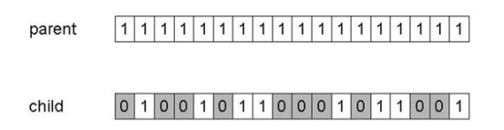
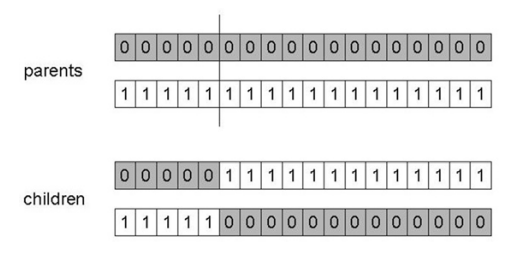
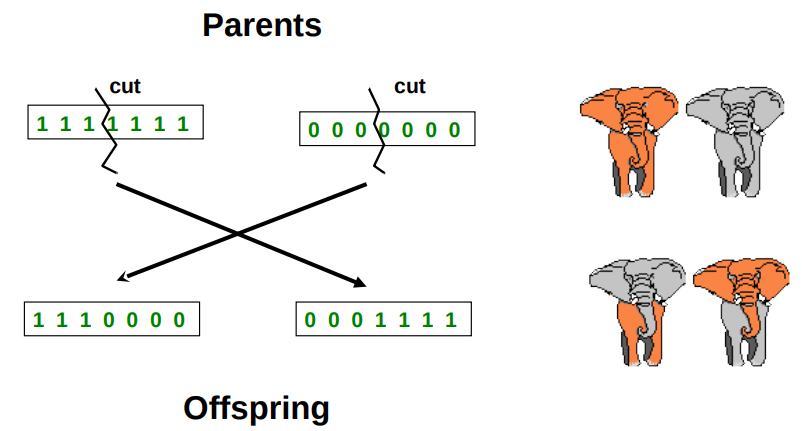

# Intro to Evolutionary Computing

Main EA(evolutionary algorithm) components

## Two Pillars of Evolution

There are two competing forces

**Increasing** population diversity by genetic operators

- mutation
- recombination

Push towards **novelty**

---

**Decreasing** population diversity by selection

- of parents
- of survivors

Push towards **quality**

## Representation

**Phenotype**: object in original problem context.

**Genotype**: code to denote that object (chromosome, "digital DNA")

Two mappings:

- Encoding: phenotype => genotype (not necessary one to one)
- Decoding: genotype => phenotype (must be one to one)

Most common representation of genomes:

- Binary
- Integer
- Real-Valued or Floating-Point
- Tree
- Permutation

:::note Example

Represent integer values by their binary code.

:::

## Fitness Function

A.k.a _evaluation_ function, _quality_ function or _objective_ function.

Represents the task to solve, the **retirements** to adapt to. (the environment)

Enables selection (provides basis for comparison)

Assigns a single **real-valued fitness** to each _phenotype_. The more discrimination (different values) the better because the fitness value is used as basis for _selection_.

## Population

Holds the candidate solutions of the problem as individuals ([genotypes](#representation)).

A population is a multi-set of individuals, i.e. repetitions are possible.

:::caution

- Population is the **basic unit** of evolution, i.e. the population is evolving, not the individuals.
- Selection operators act on population level.
- Variation operators act on individual level.

:::

:::info

**Diversity** of a population refers to the number of different fitnesses / phenotypes / genotypes present.

:::

## Selection Mechanism

Identifies individuals:

- to become parents
- to survive

Selection operators act on the population level.

One of the [two pillars](#two-pillars-of-evolution), which pushes population towards higher _fitness_.

High quality solutions more likely to be selected than low quality but not guaranteed, event worst in the current population can have non-zero probability of being selected.

:::tip

Selector operators only use fitness and so are independent of **representation**. But variation operators need to match the representation.

:::

## Variation Operators

Variation operators act on the individual level.

Variation operators are used to generate new candidate solutions.

- [Mutation operators](#mutation)
- Recombination operators
- Crossover

Most EAs use both. Variation operators must match the given representation.

:::caution

Type of a variation operators depends on chosen representation.

:::

### Mutation

Mutation acts on one genotype and output another. It causes small, random variance.

:::note Binary Representation

Mutation can cause variable effect (gray color).

:::

### Crossover

:::note 1-Point Crossover

1. Choose a random point on the two parents
2. Split parents at this crossover point
3. Create children by exchanging genes

Drawbacks:

- More likely to keep together genes that are near each other
- Can never keep together genes from opposite ends of string
- This is known as **Positional Bias**

:::

:::note N-Point Crossover

1. Choose n random crossover points
2. Split along those points
3. Clue parts, alternating between parents

still some positional bias

:::

### Crossover OR Mutation

In general, it is good to have both.

- Mutation-Only-EA is possible.
- Crossover-Only-EA would not work.

**Crossover** is _explorative_, it makes a big jump to an area somewhere "in between" two (parent) areas.

**Mutation** is exploitative, it creates random _small_ diversions, thereby staying near the parent.

:::tip

Only **crossover** can combine information from two parents.

Only **mutation** can introduce **new** information.

:::

### Recombination

Recombination merges information from parents into offspring.

Choice of what information to merge is stochastic.

:::info

Most offspring may be worse, or the same as the parents.

Hope is that some are better by combining elements of genotypes that lead to good traits.

:::

## Initialization / Termination

**Initialization** usually done at random.

- Need to ensure even spread and mixture of possible values.
- Use problem-specific heuristics, to "seed" the population

**Termination** condition checked every generation.

- Reaching pre-defined fitness
- Reaching maximum allowed number of generations
- Reaching minimum level of diversity. (too many similar _elite_)
- Reach some specified number of generations without fitness improvement. (tolerance)
