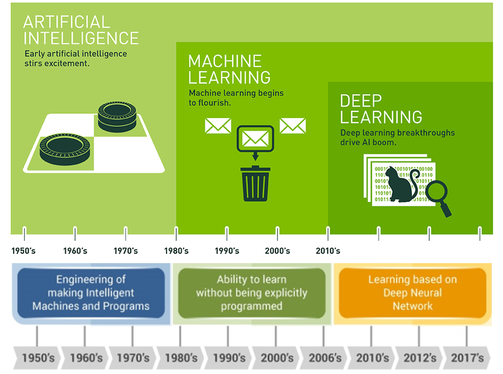

import WordCardList from "@src/components/WordCardList";

We are trying to explain why we consider Artifitial Intelligence to be a useful subject to study. And explain what exactly it is.

## What is AI?

Researchers have proposed 4 main different versions of AI.

1. Some have defined intelligence in terms of **fidelity** to human performance. (does the AI act like a human?) They pursuit human-like intelligence.
2. rationality or doing the "right thing".
3. Is a property of internal thought _processes_ and _reasoning_.
4. Others focus on intelligent behavior, an external characterization.

### Acting Humanly: The Turing Test Approach

The **Turing test**, proposed by **Alan Turing** (1950), is about a computer passes the test if a human [interrogator](https://dictionary.cambridge.org/dictionary/english/interrogator), after posing some written questions, cannot tell wheather the written response come from a person or from a computer.

In order to pass the **total Turing test**, which requires physical interaction with objects and people in the real world, the computer would need the following capabilities.

- **natural langugage processing** to communicate in a human language;
- **knowledge representation** to store what it knows or hears;
- **automated reasoning** to answer questions and to draw new conclusions;
- **machine learning** to adapt to new circumstances and to detect/discover patterns;
- **computer vision** and **speech recognition** to perceive the world;
- **robotics** to manipulate objects and move around.

### Thinking Humanly: The Cognitive Modeling Approach

In order to make a program think like a human, we must know how humans think. We can learn how humans think in three ways:

- **[introspection](https://dictionary.cambridge.org/dictionary/english/introspection)** - trying to catch our own thoughts as they go by;
- **[psychological](https://dictionary.cambridge.org/dictionary/english/psychological) experiments** - observing a person;
- **brain imaging** - observing the brain.

Once we gather a sufficiently precise theory of the mind, it becomse possible to express the theory as a computer program.

### Acting Rationally: The Rational Agent Approach

An **agent** operate autonomously, perceive the environment, adapt to change, and create and pursue goals.
A **rational agent** is required to achieve best outcome or, best **expected outcome**
if there is uncertainty (supported by probability theory and [machine learning](/university/cab420-machine-learning/machine-learning-basics#what-is-machine-learning)).

AI has focused on the study and construction of **agents** that _do the rigth thing_. The right thing refers to the objective we provide to the agent.
We call this the **standard model**.

### Benefitial Machines

The **standard model** is inadequate. Because it might cause **value alignment problem**.
In short, the machines are pursuing _their_ objectives rather than our objectives.

Take a _chess agent_ as an example. We provide the objective that we want the agent to "win the game".
In some cases, it might attempt to increase its chances of wining by blackmailing its opponent or making noises during its opponent's thiniking time.

**Solution**: If we cannot the transfer objectives perfectly to the machine, we can create a formulation that the machine is pursuing our objectives, but uncertain what they are.
Because when a agent doesn't know the complete objectives, it has an incentive to act cautiously, to ask questions, to learn more about our preferences through observation.

## The Foundations of Artifitial Intelligence

1. Philosophy
   - How does the mind arise from a physical brain?
   - Where does knowledge come from?
   - How does knowledge lead to action?
2. Mathematics
3. Economics
4. Neuroscience
   - How do brains process information?
5. Psychology
   - How do humans and animals think and act?
6. Computer engineering
   - How can we build an efficient computer?
7. Control theory and cybernetics
8. Linguistics
   - How does language relate to thought?

## The History of Artifitial Intelligence

## References

- Chapter 1, page.19. Russell, Stuart, and Peter Norvig. Artificial Intelligence: a Modern Approach, EBook, Global Edition, Pearson Education, Limited, 2021. ProQuest Ebook Central, https://ebookcentral.proquest.com/lib/qut/detail.action?docID=6563563.

## Appendix

Word List

<WordCardList words={["interrogator", "introspection", "psychological", 
            "cognitive", "rigorous", "erudition", "pervasive", "inception", "defer", "cybernetics"]} />

