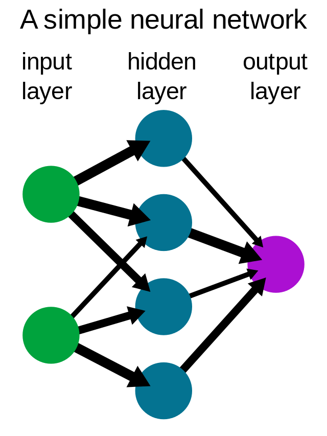

## What is Machine Learning?

> Machine learning is a branch of artifitial intelligence (AI) and computer science which focuses on the use of data and algorithms to imitate the way that humans learn, gradually improving its accuracy.

## Types of Machine Learning

### Supervised

Task Driven (Regression/Classification)

We have lablled data - we know that the answer should be

Examples:

1. Object tracking
2. Image classification

### Unsupervised

Data Driven (Clustering)
No labelling - knowledge discovery

Examples:

- Detect abnormal behaviours

### Semi-Supervised

Only some (usually a small amount of data) is lablled

- Half way between supervised and unsupervised learning
- Learn from lablled and unlablled data

### Reinforcement

Algorithms learn to react to an environment

Learn through interactive environment

Examples:

- Robot
- AlphGo

## Data Splitting for Machine Learning

### Training

It is the set of data that is used to train and make the model learn the hidden features/patterns in the data.

:::note

The training set should have a diversified set of inputs so that the model is trained in all scenarios and can predict any unseen data sample that may appear in the future.

:::

### Validation

The validation set is a set of data, separate from the training set, that is used to validate our model performance during training

The model is trained on the training set, and, simultaneously, the model evaluation is performed on the validation set after every epoch.

### Testing

The test set is a separate set of data used to test the model after completing the training.

It answers the question of "How well does the model perform?"

### Holdout Validation

The data set is separated into two sets, called the training set and the testing set.

### Cross-Fold Validation

Pick up a number `k` which stands for the number of groups that the data set is going to be split into. If k=10, it would be called 10-fold cross-validation.

The general procedure is as follows:

1. Shuffle the dataset randomly.
2. Split the dataset into `k` groups.
3. For each unique group:
   1. Pick one group as a test set
   2. Take the remaining groups as a traning set
   3. Fit the model on the training set and evaluate the model on the selected test set (from step i).
   4. Record the evaluation score and discard the model

[StatQuest Explanation](https://www.youtube.com/watch?v=fSytzGwwBVw&t=78s)

## Neural Networks

A computer system modelled on the human brain and nervous system - Builit on simple, stacked operations

Typically have high number of parameters & lots of interconnections

Data **propagates** through the networks

- Input -> Intermediate Layers -> Output
- Similar to how we think the brain works

### History

Initial reasearch started in 1940's and 50's

Deep Learning

- Emerged in the late 2000's
- Win ImageNet competition in 2012 with "AlexNet"
- The dominant machine learning method across most domains

### How Much Depth?

- AlexNet, 8 layers
- VGG10, 19 layers
- ResNet, 50 to 152 layers

:::note

Benefits diminish as we get deeper. i.e. going from 3 to 15 layers gives a huge **gain**, however, going from 100 to 500 doesn't add much

:::

### More Deep is More Better?

More depth gives

- Pros:
  - Ability to learn higher level features -> a richer representation
  - More parameters -> more representative power
- Cons:
  - More parameters -> harder to learn & more likely to overfit
  - More layers -> further for gradients to propagate
  - Harder to fit **networks** in memeory
    - Need specialist hardware, and very long times to train

### Deep Learning Pipeline

Common Pipeline:

1. Pre-processing
   - Resizing, filtering, noise reduction
   - Input images (usually) need to be the same size
2. Deep Learning
   - Pass raw data to network
   - Let the network learn its own representation and make the decision in one pass

:::note

How do we remove the human-driven feature extraction process?

**Answer:** It is being done in the network. The layers at the begining of deep networks can perform feature extractions, then the later layers learn the classification (or other tasks)

:::

### Deep Learning: Pros and Cons

#### Pros

- Easy to extend model to multiple tasks, or **adapt** to new tasks (utilize _image models_ in audio domain - sound wave image)
- No feature engineering

#### Cons

- Models are huge compared to "traditional" approaches

  - **Millions** vs **Hundereds** of parameters
  - Requires more data, runtime, and memory
  - Models are harder to interpret
    - Explainable AI. Why did my model make this decision? Too many parameters

- Get rid of feature engineering, but introduce network engineering
  - Choose hyper parameters - what layers, how many, what parameters, etc.
  - Can be very **slow** to iterate over these decisions.
  - May not be possible to determine a truly "optimal" decision.

## References

- [The Train, Validation, and Test Sets: How to Split Your Machine Learning Data](https://www.v7labs.com/blog/train-validation-test-set)
- [Cross Validation](https://www.cs.cmu.edu/~schneide/tut5/node42.html)
- [Cross Validation - StatQuest Explanation](https://www.youtube.com/watch?v=fSytzGwwBVw&t=78s)
