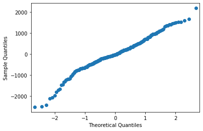
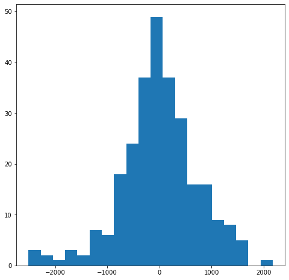
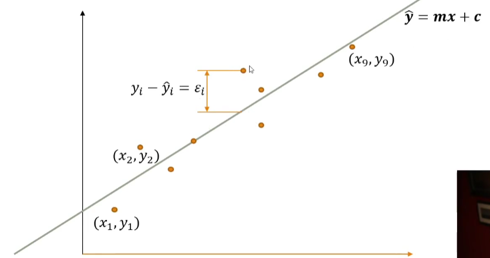
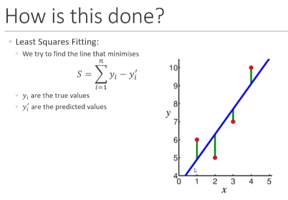
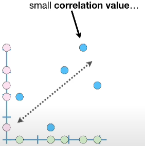
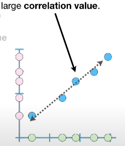
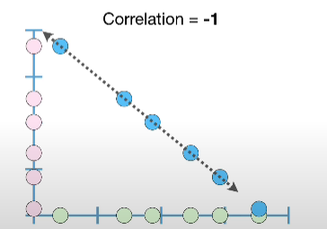
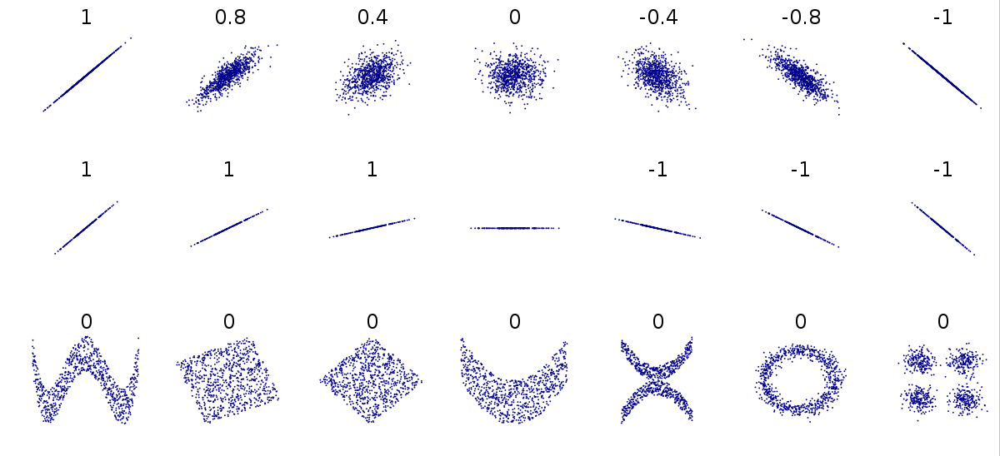
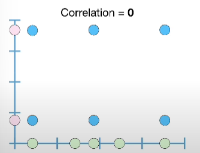

import Link from "@docusaurus/Link";
import YouTubeVideo from "@src/components/youtube-video";

## Definition

Often we want to find a relationship between two variables to:

- Predict behaviour
- Explore relationships

The simplest way to achieve this is to assume a linear relationship

:::info

Assumptions:

- Predictors are **independent** (not correlated)
- Residuals form a gaussian/normal distribution (bell curve)

On a qq-plot, that means they should form a straight line, for a histogram it means we should see a normal (bell) curve.

```python
# plot qq-plot
statsmodels.api.qqplot(model.resid)
print(model.resid)
```



```python
# plot histogram
fig = plt.figure(figsize=[8, 8])
ax = fig.add_subplot(1, 1, 1)
ax.hist(model.resid, 20)
```


:::

$$
y = \beta_0 +\beta_{1x}
$$

`offset` + `coefficient` x `variable`

## Minimise the Error

Try my best to estimate $\beta_0$ and $\beta_1$ given a set of observations, $y = (y_1,\ldots,y_n)$ and $x=(x_1,\ldots,x_n)$, so they can give the best $y$ given $x$

:::caution

In practice, our data is rarely on a straight line

:::



Point $i$ in our regression line is given by

$$
y_i = mx_i + c +\epsilon_i
$$

$\hat{y_i}$ is the predicted value, $y_i$ is the ground truth (observed) value. The difference between $\hat{y_i}$ and $y_i$ is called the **error** (residual) ~ $\epsilon_i$. We assume the **residual** is normally distributed around **0**

The goal is to find the values of $c$ and $m$ that minimise the sum of the square of the **errors**

$$
\sum^n_{i=1}\epsilon_i^2=\sum^n_{i=1}(y_i-\hat{y_i})^2=\sum^n_{i=1}(y_i - (mx_i + c))^2
$$



:::note

Minimum requirement: the number of training samples should be much larger than the number of terms we are trying to estimate

:::

## Correlation

Definition: It describes the degree (ranges from -1 ~ 1) to which two variables move in coordination with one another. If two variables move in the same direction, then those variables are said to have a positive **correlation**. If they move in opposite directions, then they have a negative **correlation**. It controls the strength and direction of the relationship.

$$
Covariance = \frac{\sum (x- \bar{x})(y - \bar{y})}{n-1}
$$

$$
Correlation = \frac{Covariance(x, y)}{\sqrt{Variance(x)\sqrt{Variance(y)}}}
$$

We can quantify the strength of the relationship with **correlation**. The sign (+/-) represents the direction of the relationship.

- -1, as one value increases the other decreases
- 0, no **linear relationship**, statically independent. It can still have **other types** of relationship.
- +1, increase and decrease together







:::note

When the relationship cannot be represented with a straight line (linear relationship), **correlation = 0**.



:::

:::danger

The correlation of a horizontal line is undefined. Because the variance is undefined or 0.

:::

video sources:

1. [Covariance](https://www.youtube.com/watch?v=qtaqvPAeEJY) - a computational step stone for calculating **correlation**.
2. [Correlation](https://www.youtube.com/watch?v=xZ_z8KWkhXE)

<YouTubeVideo
  src="https://www.youtube.com/embed/qtaqvPAeEJY?start=437"
  caption="covariance"
/>

### Why Do We Care?

1. If there is a linear relationship, we want to make sure the `x` is correlated with the result `y`.
2. Want our predictors to be uncorrelated with each other, since each preditor models a different aspect of the overall relationship. If they are correlated, we can end up with redundancy in the model.

<details>
  <summary>
    Why do we want our preditors to be uncorrelated with each other?
  </summary>
  <div>
    In the{" "}
    <Link to="https://github.com/xiaohai-huang/cab420-workspace/blob/master/work/week1/CAB420_Regression_Example_1_Linear_Regression.ipynb">
      "number of cyclists"
    </Link>{" "}
    case study, one of the linear regression model contains <code>temp</code> ,
    and <code>atemp</code> as parameters, they are correlated, and thus the
    relationship between that variable and the response is (to some extent)
    captured twice in the model. That causes the `p-value` to be less important.
  </div>
</details>
