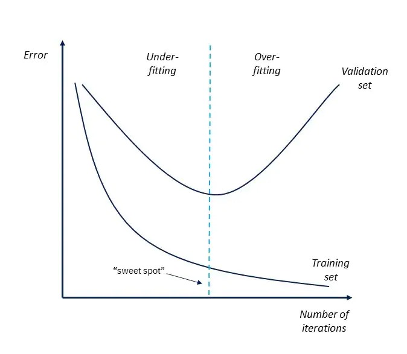

import YouTubeVideo from "@src/components/youtube-video";

## What is Overfitting

It occurs when a model fits exactly to its training data. This implies that the model is trying too hard to capture the "noise" in the training data.

:::note
Why does **overfitting** occur?

- Train for **too long** on training data
- The model is **too complex**

The model might start to learn the "noise", or irrelevant information, within the dataset.

:::

:::info

**Noise** refers to the data points that don't really represent the true properties of your data, but **random chance**.

:::

## How to Detect Overfitting and Underfitting

<YouTubeVideo
  src="https://www.youtube.com/embed/SjQyLhQIXSM"
  caption="Bias/Variance"
/>

**Overfitting** happens when the models capture and describe random noise in the training data set, as well as the underlying pattern in the data.
In other words, the training data has **low error rate** and the validation data has a **higher error rate**.

**Underfitting** describes when a model is unable to capture the "true" underlying pattern of the data set (i.e., the model fits the data poorly).

## How to Avoid Overfitting

### Early Stopping

This method seeks to pause training before the model starts learning the "noise".
One major concern is that it might stop the training process too soon, leading to the opposite problem **underfitting**.
Therefore, we need to find the "sweet spot" between underfitting and overfitting.

### Train with More Data

Expanding the training set to include more data.
This provides more opportunities for the model to learn the dominant relationship between **input** and **output** variables.

[Data Augmentation](https://www.youtube.com/watch?v=JI8saFjK84o) can be used to obtain more data.

<YouTubeVideo
  src="https://www.youtube.com/embed/JI8saFjK84o"
  caption="Data Augmentation"
/>

### Feature Selection

When you build a model, you will have a number of [parameters/features](012-multiple-linear-regression.mdx) that are used
to predict a given outcome. However, some of these features can be redundant to others. (**too complex**)

**Feature selection** is the process of eliminating the irrelevant or redundant features that are included in the model
while keeping the important ones.
It can help to simplify the model to establish the dominant trend in the data.

:::info

How to determine which [parameters/features](012-multiple-linear-regression.mdx) to remove?

- Use [correlation](011-simple-linear-regression.mdx#why-do-we-care)
- use [`p-value`](012-multiple-linear-regression.mdx#p-value)

:::

### Regularization

If overfitting occurs when the model is too complex, we can try to reduce the number of [parameters/features](012-multiple-linear-regression.mdx) of the model.

**[Regularization](022-regularization.mdx)** can be used to remove features/parameters from the model
when the model has **a significant number** of features/parameters. It applies **penalty** to the features with large coefficients,
which limit the amount of the variance in the model.

## References

- [Overfitting - IBM](https://www.ibm.com/cloud/learn/overfitting)
- [Bias/Variance (C2W1L02) - Andrew Ng](https://www.youtube.com/watch?v=SjQyLhQIXSM)
