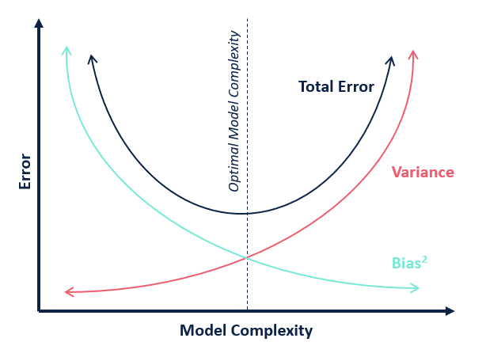

import YouTubeVideo from "@src/components/youtube-video";

<YouTubeVideo
  src="https://www.youtube.com/embed/SjQyLhQIXSM"
  caption="Bias/Variance"
/>

### Bias

> - **Bias** is the difference between a model's estimated values and the “true” values for a variable.
> - **Bias** can be thought of as errors caused by incorrect assumptions in the learning algorithm.
> - **Bias** can also be introduced through the training data, if the training data is not representative of the population it was drawn from.

Model with **high bias** pays very little attention to the training data and oversimplifies the model.
It always produces high error on training and test data. In addition, it can lead to [underfitting](020-overfitting.mdx#how-to-detect-overfitting-and-underfitting) (the model fits the data poorly).

### Variance

> Variance can be described as the error caused by sensitivity to small variances in the training data set.

Model with **high variance** pays a lot of attention to training data (even "noise") so
does not **generalize** well on the unseen data. This is associated with [overfitting](020-overfitting.mdx).

### Bias-Variance Tradeoff

Decreasing bias will increase variance, and decreasing variance will increase bias.

The goal is to use an iterative process to find the balance between the two that minimize the overall error.

## References

- [Bias Versus Variance](https://community.alteryx.com/t5/Data-Science/Bias-Versus-Variance/ba-p/351862)
- [Bias/Variance (C2W1L02) - Andrew Ng](https://www.youtube.com/watch?v=SjQyLhQIXSM)
