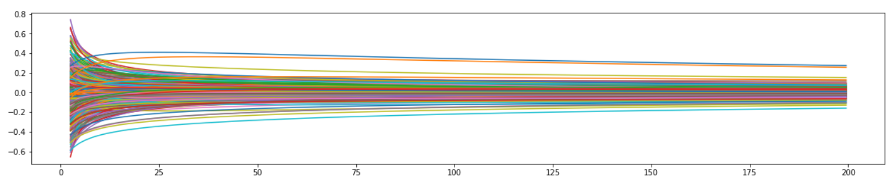
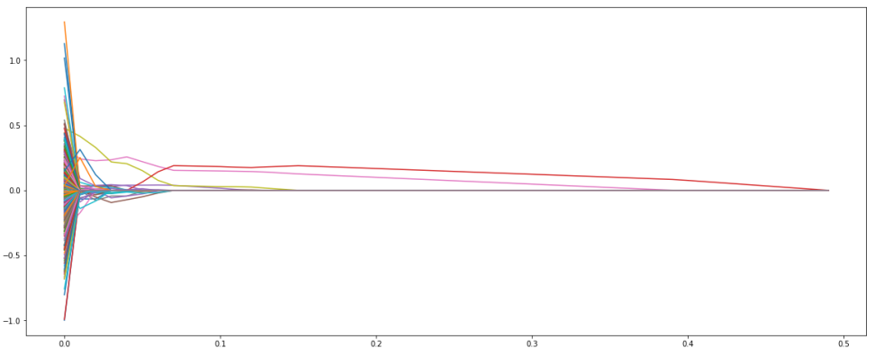

> **Regularization** is a strategy used to build better-performing models by reducing the odds of [overfitting](020-overfitting.mdx),
> or when your model does such a good job of matching your training data that it performs **badly** on new data.
> In other words, regularization is a way to help your model generalize better by preventing it from becoming too complex.

Reduce the **magnitude** and/or **the number of parameters** to reduce model complexity.

One way to regularize a linear regression is to add a constraint to the loss function:

$$
\sum^n_{i = 1} {\epsilon^2 + \lambda P }
$$

$\lambda$ is a **hyperparameter** that controls the influence of our penalty.

:::info

**Regularization** seeks to penalize complex models

- A small change in input should lead to a small change in output value.
- Model complexity often leads to overfitting.

:::

There are three main types of constraints: [Ridge](#ridge-regression-l2) (L2), [Lasso](#lasso-regression-l1) (L1), and [Elastic Net](#elastic-net).

## Ridge Regression (L2)

**Ridge regression** is also called **L2 regularization**. It adds a constraint that is the sum of the squared coefficients.

$$
\sum^{M}_{i = 1} {\left(  y_i - \sum^P_{j = 1} {w_j \times x_{ij}} \right)^2} +
\lambda\sum^P_{j = 1} {||w_j||_2}
$$

The second term is also known as **shrinkage penalty**.

- $\lambda = 0$, this penalty term has no effect and ridge regression produces the same coefficients
  as least squares.
- As $\lambda \to \infty$, the shrinkage penalty becomes more influential,
  the coefficients will **approach 0**.

### Trace Plot



### Python

Use sklearn's [Ridge Regression](https://scikit-learn.org/stable/modules/generated/sklearn.linear_model.Ridge.html).

```python
from sklearn.linear_model import Ridge
import numpy as np
n_samples, n_features = 10, 5
rng = np.random.RandomState(0)
y = rng.randn(n_samples)
X = rng.randn(n_samples, n_features)
clf = Ridge(alpha=100.0) # alpha controls the strength of the penalty
clf.fit(X, y)
```

## Lasso Regression (L1)

**Lasso regression** is also called **L1 regularization**. It also adds a constraint that is the sum of absolute coefficients.

$$
\sum^{M}_{i = 1} {\left(  y_i - \sum^P_{j = 1} {w_j \times x_{ij}} \right)^2} +
\lambda\sum^P_{j = 1} {||w_j||_1}
$$

It forces some of the coefficients to be **zero** and results a simpler model.
Therefore it can be used to perform [feature selection](020-overfitting.mdx#feature-selection).

### Trace Plot



### Python

Use sklearn's [Lasso Regression](https://scikit-learn.org/stable/modules/generated/sklearn.linear_model.Ridge.html).

```python
from sklearn.linear_model import Lasso
clf = Lasso(alpha=0.1) # alpha controls the strength of the penalty
clf.fit(X = [
                [0, 0],
                [1, 1],
                [2, 2]
            ],

        y = [0, 1, 2])

print(clf.coef_)

print(clf.intercept_)
```

## Elastic Net

> Elastic Net is the combination of the **L1 regularization** and **L2 regularization**.
> It can both shrink the coefficients as well as eliminate some of the insignificant coefficients.

## Standardization

The values are transformed so their mean is 0, and their standard deviation is 1.

$$
x = \frac{x - \mu}{\sigma}


$$

```python
def standardize(data):
  """ Standardize/Normalize data to have zero mean and unit variance

  Args:
    data (np.array):
      data we want to standardize

    Returns:
      Standardized data, mean of data, standard deviation of data
  """
  mu = np.mean(data, axis=0) # rows - top to bottom
  sigma = np.std(data, axis=0) # rows - top to bottom
  scaled = (data - mu) / sigma
  return scaled, mu, sigma
```

:::info

Why **standardization**?

1. For a given dataset, dimensions are usually in different scales.
   With regularization penalty, some dimensions might be penalized heavier than other dimensions.
2. Easier to visualize.

:::

## References

- [QUT Resources](https://github.com/xiaohai-huang/cab420-workspace/tree/master/work/machine-learning/week2)
- [Introduction to Ridge Regression - statology](https://www.statology.org/ridge-regression/)
- [Introduction to Lasso Regression - statology](https://www.statology.org/lasso-regression/)
- [The classical linear regression model is good. Why do we need regularization?](https://medium.com/@zxr.nju/the-classical-linear-regression-model-is-good-why-do-we-need-regularization-c89dba10c8eb)
- [Why Regularization Reduces Overfitting (C2W1L05)](https://www.youtube.com/watch?v=NyG-7nRpsW8)
- [Regularization (C2W1L04)](https://www.youtube.com/watch?v=6g0t3Phly2M)
