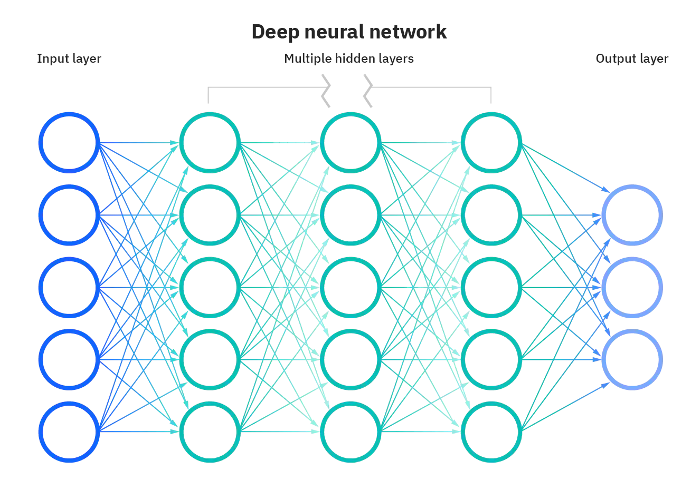
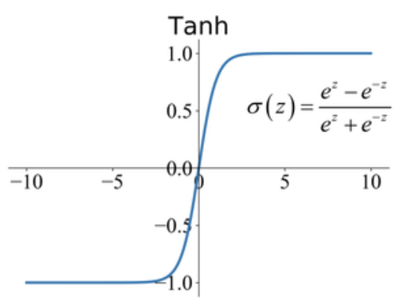

import YouTubeVideo from "@src/components/youtube-video";
import WordCardList from "@src/components/WordCardList";

Neural networks reflect the behavior of the human brain,
allowing computer programs to recognize patterns and solve common problems in the fields of AI, machine learning, and deep learning.

Artificial neural networks (ANNs) are comprised of a node layers, containing an **input layer**, one or more **hidden layers**, and an **output layer**.

## Fully Connected Layers

Every neuron in one layer is connected to every neuron in the next layer.
This is achieved by a large **matrix multiplication**.

Two main steps:

- Linear step: $z = w^T x + b$
- Activation step: $a = \sigma{(z)}$

:::info
$w$ has the same shape as $x$. Therefore, transposing $w$ is necessary.
:::

<YouTubeVideo
  src="https://www.youtube.com/embed/hjrYrynGWGA"
  caption="Logistic Regression"
/>

<YouTubeVideo
  src="https://www.youtube.com/embed/rMOdrD61IoU?start=24"
  caption="Fully Connected Neural Network"
/>

<YouTubeVideo
  src="https://www.youtube.com/embed/yslMo3hSbqE"
  caption="Matrix Dimensions"
/>

## Convolutional Layers

The 2D convolution operation:

1. Start with a **kernel**, which is simply a small matrix of weights;
2. The **kernel** "slides" over the 2D input data, performing an elementwise multiplication
   with the part of the input the kernel is currently on.
3. Summing up the results into a single output pixel.

<figure>
  

    
  

  <figcaption align="center">
    
standard convolution

  </figcaption>
</figure>

:::info

Convolutions over **volumes**/**channels** and **multiple** filters:

<YouTubeVideo
  src="https://www.youtube.com/embed/KTB_OFoAQcc"
  caption="Convolutions Over Volumes"
/>

:::

:::note

Hyperparameters to tune in a convolutional layer:

- **[Stride](https://youtu.be/tQYZaDn_kSg)**: apply filters at every pixel or skip some?
- **[Padding](#padding)**.
- Number of filters.

Parameters to learn in a convolutional layer:

- Each filter could be [X x Y x C] in size.
  - C stands for different channels.
- Each filter comes with 1 **bias** value.

:::

### Padding

<figure>
  

    
  

  <figcaption align="center">
    
same padding

  </figcaption>
</figure>

### Pooling Layers

> **Pooling Operations** are used to pool features together,
> often downsampling the feature map to a **smaller** size (aka. reduce dimensionality).
> They can also induce favorable properties such as translation invariance in image classification,
> as well as bring together information from different parts of a network in tasks like object detection (e.g. pooling different scales).
>
> &mdash; [paperswithcode.com](https://paperswithcode.com/methods/category/pooling-operation)

Hyperparameters:

- $f$: filter size.
- $s$: stride.
- **type**: [max](#max-pooling) or [average](#average-pooling) pooling.

:::note

No parameters to learn.

:::

<YouTubeVideo
  src="https://www.youtube.com/embed/8oOgPUO-TBY"
  caption="Pooling Layers"
/>

#### Max Pooling

<figure>
  

    
  

  <figcaption align="center">
    
max pooling

  </figcaption>
</figure>

#### Average Pooling

<figure>
  

    
  

  <figcaption align="center">
    
average pooling

  </figcaption>
</figure>

## Activation Functions

It introduces non-linearties, which is helpful for learning complex patterns.

### ReLU

> **Rectified Linear Unit**, or **ReLU**, is a type of activation function that is linear in the positive dimension,
> but **zero** in the negative dimension.
> The kink in the function is the source of the non-linearity.
>
> &mdash; [paperswithcode.com](https://paperswithcode.com/method/relu)

$$
f(x) = max(0, x)
$$

### Leaky ReLU

> **Leaky Rectified Linear Unit**, or **Leaky ReLU**, is a type of activation function based on a [ReLU](#relu),
> but it has a small slope for negative values instead of a flat slope.
> The slope coefficient is **determined before training**,
> i.e. it is not learnt during training. This type of activation function is popular in tasks where we we may suffer from sparse gradients, for example training generative adversarial networks.
>
> &mdash; [paperswithcode.com](https://paperswithcode.com/method/leaky-relu)

### Sigmoid Activation

The output range: `[-1, 1]`.

$$
\sigma(z) = \frac{1}{! + e^{-z}}
$$

### Tanh Activation

> Historically, the **tanh** function became preferred over the [sigmoid](#sigmoid-activation) function as it gave better performance for multi-layer neural networks.
> But it did not solve the vanishing gradient problem that [sigmoid](#sigmoid-activation) suffered,
> which was tackled more effectively with the introduction of [ReLU](#relu) activations.
>
> &mdash; [paperswithcode.com](https://paperswithcode.com/method/tanh-activation)

### SoftMax Activation

<YouTubeVideo
  src="https://www.youtube.com/embed/LLux1SW--oM"
  caption="SoftMax"
/>

## References

- [Neural Networks - IBM](https://www.ibm.com/cloud/learn/neural-networks)
- [Neural Networks and Deep Learning (Course 1 of the Deep Learning Specialization) - Andrew Ng](https://www.youtube.com/playlist?list=PLkDaE6sCZn6Ec-XTbcX1uRg2_u4xOEky0)
- [Convolutional Neural Networks (Course 4 of the Deep Learning Specialization) - Andrew Ng](https://www.youtube.com/playlist?list=PLkDaE6sCZn6Gl29AoE31iwdVwSG-KnDzF)
- [Intuitively Understanding Convolutions for Deep Learning - towardsdatascience](https://towardsdatascience.com/intuitively-understanding-convolutions-for-deep-learning-1f6f42faee1)
- [Pooling Operations - paperswithcode.com](https://paperswithcode.com/methods/category/pooling-operation)
- [Activation Functions - paperswithcode.com](https://paperswithcode.com/methods/category/activation-functions)

## Vocabulary

<WordCardList words={["induce", "favorable", "invariance"]} />
