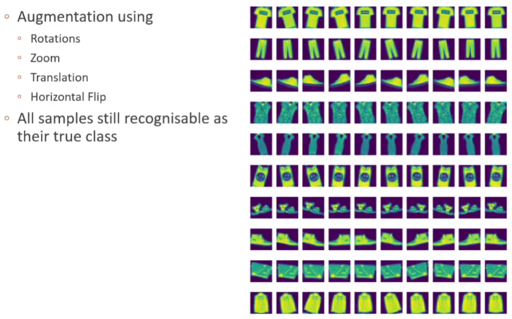

Creates a new dataset by applying simple transforms to the data you have.

Simple transforms may include:

- Rescaling of the image
- Rotations
- Horizontal/Vertical flips
- Adding noise or small color shifts
- Translations

## Motivations

DCNNs need lots of data. Sometimes this is hard

- Data capture can be expensive.
- Annotation is also expensive.

Data variety is key to avoid **overfitting**. In addition, different data simples can appear very similar.

## Guidelines

- Augmentation should not change the meaning of an image.
- Characters may change meaning if flipped. (e.g., **n** vs **u**)

Inspect the augmentation results before proceeding.

- If they make sense to you, then it is a good start.
- If they have changed so much that you cannot tell things apart, you have gone too far.

:::note

Data augmentation offers a way to get more from limited data. While this can be really powerful, care must be taken to ensure that generated data is still realistic and that it doesn't in some way alter what the ground truth should be. The simplest way to help ensure this is just to inspect the data, and check that your transform is doing what you expect.

:::

## Keras Example

Include augmentation directly in the model, we need to:

1. Remove the input layer from the old model.
2. Crate a new input player, which we will pass to the augmentation function.
3. Pass the output of the augmentation to the rest of the model.

```python
data_augmentation = keras.Sequential([
  layers.experimental.preprocessing.RandomFlip("horizontal"),
  layers.experimental.preprocessing.RandomRotation(0.05),
  layers.experimental.preprocessing.RandomZoom(0.025),
  layers.experimental.preprocessing.RandomTranslation(height_factor=(-0.025, 0.025), width_factor=(-0.025, 0.025))
])

fig = plt.figure(figsize=[20, 25])
for i in range(10):
    for j in range(10):
        ax = fig.add_subplot(10, 10, i*10 + (j + 1))
        augmented_image = data_augmentation(tf.expand_dims(x_train[i,:,:,:],0))
        plt.imshow(augmented_image[0])
        plt.axis("off")
```

```python
# load model
model = keras.models.load_model('../models/vgg_2stage_MNIST_small.h5')
# remove first layer, i.e. the input
model.layers.pop(0)
# create a new input
input_layer = keras.Input(shape=(28, 28, 1, ), name='img')
# pass the input to our augmenter
augmented = data_augmentation(input_layer)
# pass the augmented input to the rest of the model
output = model(augmented)
```

```python
new_model = keras.Model(inputs=input_layer, outputs=output)
new_model.summary()
```

```bash
Model: "model_1"
_________________________________________________________________
 Layer (type)                Output Shape              Param #
=================================================================
 img (InputLayer)            [(None, 28, 28, 1)]       0

 sequential (Sequential)     (None, 28, 28, 1)         0

 simple_vgg (Functional)     (None, 10)                810914

=================================================================
Total params: 810,914
Trainable params: 810,354
Non-trainable params: 560
_________________________________________________________________
```



## References

- [QUT Example](https://github.com/xiaohai-huang/cab420-workspace/blob/master/work/machine-learning/week5/CAB420_DCNNs_Example_6_Fine_Tuning_and_Data_Augmentation.ipynb)
