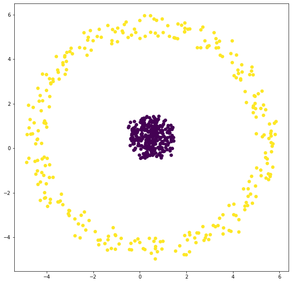
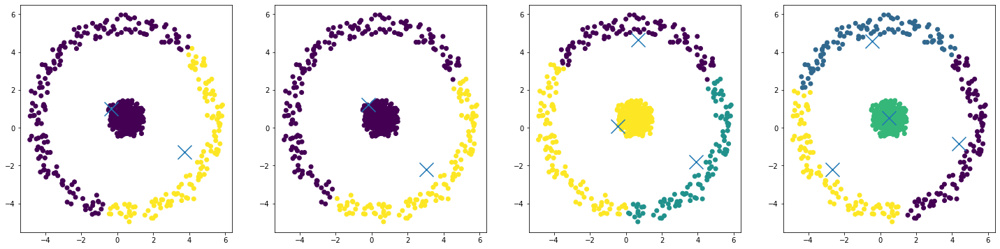

import YouTubeVideo from "@src/components/youtube-video";

# K-Means

K-means clustering algorithm.

- Input: K and set of points $x_1, \dots, x_n$.
- Place **centroids** $c_1, \dots, c_K$ at **random** locations.
- Repeat the following until convergence:
  - For each point $x_i$:
    - Find the nearest **centroid** $c_j$. (argmin $D(x_i, c_j)$)
    - Assign the point $x_i$ to cluster $j$.
  - For each **cluster** $j = 1 \dots K$:
    - New **centroid** $c_j =$ the mean of all points in cluster $j$.
- Stop when none of the cluster assignments change.

Time complexity: O(#iterations \* #clusters \* #instances \* #dimensions)

<YouTubeVideo
  src="https://www.youtube.com/embed/_aWzGGNrcic?start=263"
  caption="K-means clustering: how it works"
/>

## Randomness

The initial cluster centers are random.

This means:

- Different runs may give us different results.
- Differences will become more pronounced with:
  - Bigger, more complex datasets
  - Fewer iterations
  - More clusters

## Cluster Shape

- K-Means extracts spherical clusters (circular in a 2D case).
- Clusters cannot overlap.
  - K-Means uses **hard assignment**, a point either belongs to a cluster, or does not.
- Clusters will typically all have similar shapes and sizes.

:::note Example

Use K-Means algorithm to cluster the following dataset.



```python
fig = plt.figure(figsize=[25, 6])
ax = fig.add_subplot(1, 4, 1)
kmeans = KMeans(n_clusters=2).fit(X)
ax.scatter(X[:,0], X[:,1], c=kmeans.labels_);
ax.scatter(kmeans.cluster_centers_[:,0], kmeans.cluster_centers_[:,1], marker='x', s=400)

kmeans = KMeans(n_clusters=2).fit(X)
ax = fig.add_subplot(1, 4, 2)
ax.scatter(X[:,0], X[:,1], c=kmeans.labels_);
ax.scatter(kmeans.cluster_centers_[:,0], kmeans.cluster_centers_[:,1], marker='x', s=400)

kmeans = KMeans(n_clusters=3).fit(X)
ax = fig.add_subplot(1, 4, 3)
ax.scatter(X[:,0], X[:,1], c=kmeans.labels_);
ax.scatter(kmeans.cluster_centers_[:,0], kmeans.cluster_centers_[:,1], marker='x', s=400)

kmeans = KMeans(n_clusters=4).fit(X)
ax = fig.add_subplot(1, 4, 4)
ax.scatter(X[:,0], X[:,1], c=kmeans.labels_);
ax.scatter(kmeans.cluster_centers_[:,0], kmeans.cluster_centers_[:,1], marker='x', s=400)
```



What we get is:

- As we increase the number of clusters, we can separate the center circle from the outer circle,
  but we end up breaking our outer cluster into smaller and smaller pieces.
- This behavior is a result of some underlying properties of K-Means:
  - Clusters are **circular**.
  - Clusters **cannot overlap**.

:::

## Distance Metrics

We can cluster any type of data. We just need to define a way to calculate the distance between points.

Common Metrics:

- Euclidean distance (L1)
- Manhattan distance (L2)
- Cosine distance (angle between points)
- Hamming Distance (for binary data)

Distance Metrics can have a big influence on data.

## Scaling and Standardization

If a dimension of our data has a large scale, the results of our clustering may be completely dominated by that scale.

In that case, the data must be scaled to ensure that no one variable controls the clustering.

This is done through normalization of data:

- **Scaling**: change the minimum data point to 0 and maximum to 1
- **Standardization**: change the mean to zero and standard deviation t o1.

## Python

```python
kmeans = KMeans(n_clusters=2).fit(X)
```

Two main things we get from K-Means are:

- The cluster assignment for each point.
- The cluster center.

```python
print(kmeans.labels_)
print(kmeans.cluster_centers_)
```

## References

- [Week8 Materials](https://github.com/xiaohai-huang/cab420-workspace/tree/master/work/machine-learning/week8)
