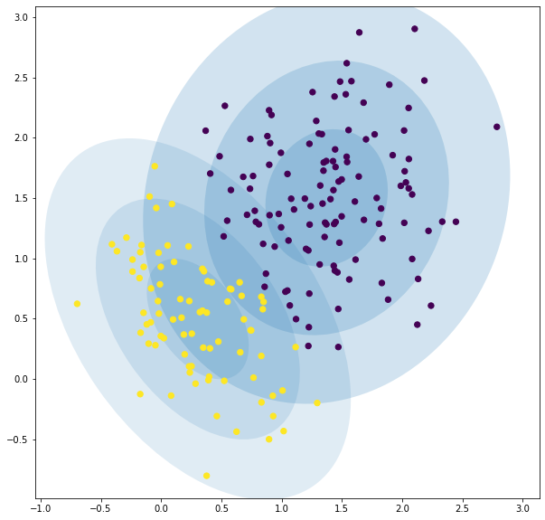

# Gaussian Mixture Models (GMMs)

GMM extends k-means, such that rather than having hard cluster boundary,
we now have a set of distributions, and we can capture _uncertainty_.
For example, we'll be able to tell when a point is close to being part of two different classes.

- A GMM will attempt to fit a set of Gaussian distributions to the data, and each Gaussian will capture one cluster (or component) of the data.
- GMMs build upon K-means, using K-means for **initialization** before using **Expectation Maximization** to fit the model.

:::info

Unlike K-means, GMMs can capture different **shaped clusters**, and clusters **can overlap**.

It can also measure how much a point belongs to multiple cluster centres and how likely a point is to arise from the distribution.
This has excellent applications for outlier/anomaly detection.

:::

## Advantages

- Soft decisions
- Likelihood

The big advantage of a GMM over k-means is that we get the **soft decisions**.
K-means will assign a point to a cluster, and won't give any indication if there were multiple centres that could have fit that cluster.

Secondly, a GMM will give us the **likelihood of a point** for each Gaussian,
so we get a better idea of where the point lies, and how close it is to multiple cluster centres.

:::info

In machine learning, we want to avoid **hard decisions** for as long as possible.

K-means and it's assignment of points to a cluster can be seen as a **hard decision**. After we assign a point to a cluster, we _lose_ any other information about where that point lies.

A GMM helps **overcome** this. Now we can do a **soft assignment**,
and help carry forward the uncertainty about which cluster a point belongs to until we get further into our analysis.

:::

## Python

```python
from sklearn.mixture import GaussianMixture
gmm = GaussianMixture(n_components=2)
gmm.fit(X)
```

We can get:

- the **means** of the components, i.e. the centers of each cluster.
- the **weights** of the components, i.e. the relative size of each cluster.
- the **covariances** of each cluster, this gives us the shape of the clusters.

```python
print(gmm.means_)
print(gmm.weights_)
print(gmm.covariances_)
```

When assign points to clusters, we don't make a _hard decision_. Rather we get the **likelihood** of the point arising from each component.

```python
print(gmm.predict_proba([[0.3,0.3]]))
print(gmm.predict_proba([[2.0,2.0]]))
# below indicates that the first point belongs to the second class,
# the second point belongs to the first class
[[0.0064498 0.9935502]]
[[0.99719157 0.00280843]]
```

We can visualize this soft decision.



What we see here is that the two components **overlap**, so we have regions that points can belong to both clusters.

## References

- [Week8 Materials](https://github.com/xiaohai-huang/cab420-workspace/tree/master/work/machine-learning/week8)
