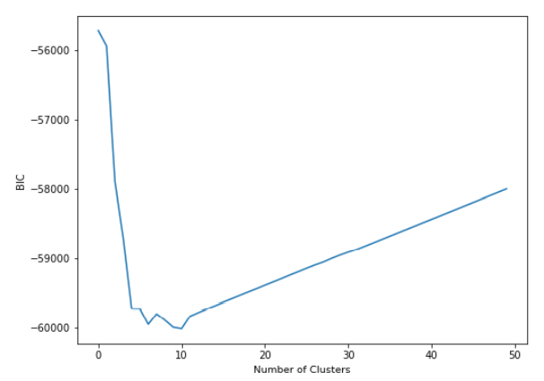

# How Many Clusters?

K-means and GMMs need us to specify a number of clusters. However specifying the number of clusters can require prior knowledge of the data, or other exploration.

## Bayesian Information Criterion

**BIC** captures how informative a model is while also considering complexity.

## K-Means: Selection of K

The BIC and it's approximation often returns quite large numbers of clusters, particularly for K-means. As such for K-means the **elbow** of the reconstruction curve is a well established heuristic to select the number of cluster

### Reconstruction Error

We need a way to measure the error in the system. With K-means, our cost function is the distance between the cluster centres and those points assigned to them.


We can see our cost quickly drops and converges towards 0. The more clusters we add, the lower this will go. Because we are creating smaller and smaller groups, each cluster will become more compact, until we get to a point where we have as many clusters as points and each point is its own cluster center.

However, we can select the number of clusters based on the location of the "**elbow**" in the graph. In our case this is around 5-6 clusters.

- Prior to "elbow" point, we get a large drop for each extra cluster we add.
- However, after this point, we see that gain start to drop, so it's effectively not worth adding another cluster to the data.

```python title="Compute reconstruction errors"
'''
inertia_ :float

Sum of squared distances of samples to their closest cluster center.
'''
recon_error = []
for i in range (50):
    kmeans = KMeans(n_clusters=(i+1), random_state=4).fit(data)
    recon_error.append(kmeans.inertia_)

fig = plt.figure(figsize=[8, 6])
ax = fig.add_subplot(1, 1, 1)
ax.plot(recon_error)
ax.set_xlabel('Number of Clusters')
ax.set_ylabel('Reconstruction Error');
```

### Approximate BIC

We can add a penalty for model complexity to help overcome the limitations of the "elbow method".

[Reconstruction error](#reconstruction-error) plus a term for **model complexity**.

Minimum of curve is the best value of $K$

:::info

This is based on the idea that we'd like make our model more complex only if that model leads to a substantial improvement.

:::


According to the graph above, we can pick ~200 as $K$. However, this approach is somewhat sensitive to scale of data (this impacts reconstruction error).

:::note

The value of $K$ is very different.

:::

```python title="Compute BIC for K-Means"
def compute_approximate_bic(kmeans,X):

    k = numpy.shape(kmeans.cluster_centers_)[0]*(numpy.shape(kmeans.cluster_centers_)[1] + 1)
    m = len(X)

    approx_bic = m*numpy.log(kmeans.inertia_ / m) + k*numpy.log(m)
    return approx_bic

bic = []
for i in range (400):
    kmeans = KMeans(n_clusters=(i+1), random_state=4).fit(data)
    bic.append(compute_approximate_bic(kmeans, numpy.array(data)))

fig = plt.figure(figsize=[8, 6])
ax = fig.add_subplot(1, 1, 1)
ax.plot(bic)
ax.set_xlabel('Number of Clusters')
ax.set_ylabel('Approximate BIC');
```

## GMM: Selection of K

We can use Bayesian Information Criterion (BIC) to determine the number of clusters with a GMM.

BIC: combination of model complexity and error

Minimum curve is the best value of $K$.



According to the graph above, we can pick 10 as $K$.

```python title="Compute BIC for GMMs"
bics = []
for i in range (50):
    gmm = GaussianMixture(i+1, random_state=4)
    gmm.fit(data)
    bics.append(gmm.bic(data))

fig = plt.figure(figsize=[8, 6])
ax = fig.add_subplot(1, 1, 1)
ax.plot(bics)
ax.set_xlabel('Number of Clusters')
ax.set_ylabel('BIC');
```

## Why is K different each time?

K-Means vs GMMs

- GMMs have more [parameters](082-gmms.mdx#python) (means,weights, and covariances), so complexity penalties are larger for the same $K$.

Reconstruction cost is dependent on data scale

- Data that has a very small range will have smaller reconstruction costs.
- Can lead to big differences between looking at reconstruction curve "elbow" and approximate BIC minimum.

## What Happens When K is Wrong?

Two possible errors:

- Over-clustering
  - True clusters are split into multiple sub-clusters, i.e. we have too many clusters
- Under-clustering
  - True clusters are merged into a single cluster, i.e. not enough clusters.

## References

- [QUT Materials](https://github.com/xiaohai-huang/cab420-workspace/blob/master/work/machine-learning/week8/CAB420_Clustering_Example_3_How_Many_Clusters.ipynb)
