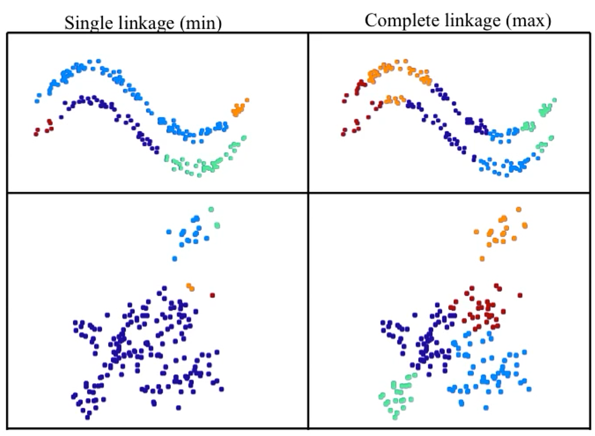
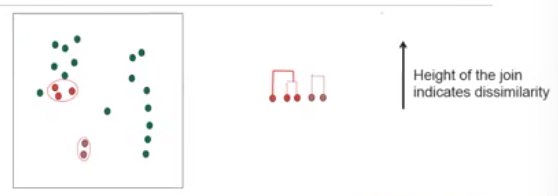

import YouTubeVideo from "@src/components/youtube-video";

# Hierarchical Agglomerative Clustering

Hierarchical clustering is a method used when we do not know "**K**".
It builds a tree (dendrogram) that captured the distance between all points. We can then 'truncate' that tree at a level of our choosing, to get clusters.

## HAC Process

We start from

- Every point is its own cluster
- Calculate the distance (default: Euclidean) between every cluster

Then we

- Merge the two closest clusters
- Update distance based on some **criteria** (linkage method)
- Repeat until we have only one cluster, i.e. all points are grouped together

<YouTubeVideo
  caption="StatQuest: Hierarchical Clustering"
  src="https://www.youtube.com/embed/7xHsRkOdVwo"
/>

## Linkage Methods

Here are three linkage methods:

1. Maximum (complete)
2. Minimum (single)
3. Average

All linkage methods are used to create clustering tree-diagrams, known as **dendrograms**.

:::note

The choice of linkage can have a great impact on the clustering result.

:::

### Linkage Methods: Complete

It is also known as **farthest neighbor** linkage.

The distance between two clusters is defined as the **longest distance** between two points in each cluster.

:::note Example

Three clusters: [(1), (4), (20)]

1. Assign (1) and (4) to the same cluster.
2. Calculate the distance between cluster [(1), (4)] and [(20)]
   - According to the **farthest neighbor linkage**, `d=20-1`

:::

### Linkage Methods: Single

It is also known as **nearest neighbor** linkage.

The distance between two clusters is defined as the **smallest distance** between two points in each cluster.

### Linkage Methods: Average

The distance between two clusters is defined as the average distance between each point in one cluster to every point in the other cluster.

## Dendrogram

The height of the dendrogram indicates the order in which clusters are formed in HAC.

The height of the **join** indicates how similar points are (i.e. the distance).

### Dendrogram to Clusters

We can obtain clusters by doing either:

- Truncate the dendrogram at a given **number of clusters**.
- Truncate the dendrogram at a **threshold**.

:::tip

Use prior knowledge to determine these parameters.

:::

## Drawbacks and Limitations

Advantage: easy to implement.

Disadvantages:

- Linkage methods can be sensitive to outliers.
- The **computation** can take a long time to process.
- Cannot easily add a new point to **HAC**.
- Clustering in HAC **cannot be undone**.

## References

- [QUT Week9 Materials](https://github.com/xiaohai-huang/cab420-workspace/tree/master/work/machine-learning/week9)
