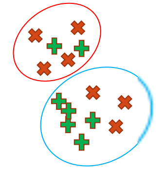

# Evaluating Clustering Performance

How do we know when our clustering is correct? Or when one solution is better than another? To do this we need a way to evaluate the accuracy of our clustering methods.

We are going to consider:

- Purity
- Completeness
- V-Measure

:::caution

Why don't we use ground truth clusters to evaluate the performance?

- Not always possible to obtain such data.
- May only be possible for a subset of data.

:::

We can consider there to be two types of errors in clustering:

1. Points for multiple identities being grouped into one cluster. (**purity**)
2. Points for a single identity being split into multiple clusters. (**completeness**)

## Purity

Purity is how "pure" a cluster is. Essentially, given the dominant class of a predicted cluster it measures how much "other stuff" is in that cluster. Ideally, we'd like our purity to be 100% (each cluster only contains one class)

$$
p_n = \underset{d \in D}{\max}\frac{|d \in n|}{|n|}
$$

- $p_n$ is the purity of the **predicted** cluster $n$.
- $d$ is a ground truth cluster from clusters $D$, which has the most elements in $n$ (predicted cluster).

:::info

We can get one purity value per **predicted** cluster.

:::

:::note Example



Consider the graph above.

- $n$ is the first predicted cluster.
- The predicted cluster has 6 elements so $|n|=6$.
- $d$ is the ground truth red cluster, because the dominant class of the first predicted cluster is **red**.
  - In other words, $red$ has the most elements in the predicted cluster.
- According to the definition of $d$ above, $|d \in n|$ stands for the number of red elements in the first predicted cluster, which is 4.

Purity: $\frac{|d \in n|}{|n|}=\frac{4}{6}$

:::

### Python

```python title="Compute Purity"
from sklearn.metrics import homogeneity_score
purity = homogeneity_score(y, kmeans.labels_)
print(purity)
# 0.7514854021988338
```

### Respond to K Changes

- ⤵️When we **under-cluster** (fewer clusters than the true number, e.g. K=2) our purity will drop off as instances of different classes are forced together.
- ⤴️When we **over-cluster** (more clusters than the true number) our purity will increase. Each ground truth cluster is now split into more and more small groups, it is easier to separate instances as we have more groups, so we have a higher purity.

## Completeness

If we have 20 instances of a class in the data, we'd like all of those to be in a single predicted cluster.

$$
c_d = \underset{n \in N}{\max}\frac{|d \in n|}{|d|}
$$

- $c_d$ is the completeness of the ground truth cluster $d$.
- $d$ refers to the ground truth cluster.
- $n$ refers to the predicted cluster, which has the largest number of elements from the ground truth cluster $d$.

:::info

One completeness value per ground truth cluster.

:::

:::note Example


Consider the red crosses $d$ above and compute $c_{red}$

- $d$ refers to the ground truth **red** cluster.
- $n$ refers to the predicted cluster, which is the red circle at the top.
- $d \in n$ refers to the red elements in the predicted cluster (red circle).

Completeness: $c_{red} = \underset{n \in N}{\max} \frac{|red \in n|}{|red|}=\frac{4}{7}$

:::

### Python

```python title="Compute Completeness"
from sklearn.metrics import completeness_score
completeness = completeness_score(y, kmeans.labels_)
print(completeness)
# 0.7649861514489815
```

### Respond to K Changes

- ⤴️When we under-cluster our completeness will **increase** as instances of different classes are forced together.
- ⤵️When we over-cluster our completeness will drop off. Each ground truth cluster is now split into more and more small groups, forcing completeness down.

## V-Measure

Harmonic mean of [purity](#purity) and [completeness](#completeness) averaged over all clusters.

Basically, this is trying to combine the two measures into one single value, like this:

$$
V=\frac{2pc}{p+c}
$$

### Python

```python title="Compute V-Measure"
from sklearn.metrics import v_measure_score
vmeasure = v_measure_score(y, kmeans.labels_)
print(vmeasure)
# 0.7581756800057784
```

## References

- [QUT Week9 Materials](https://github.com/xiaohai-huang/cab420-workspace/tree/master/work/machine-learning/week9)
