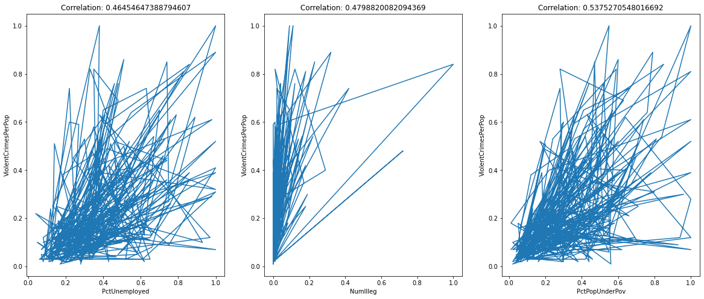
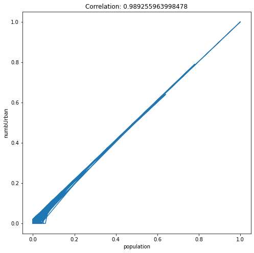
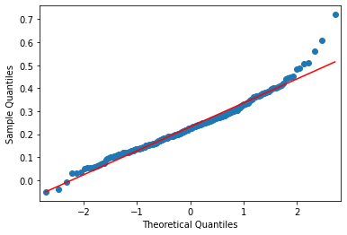
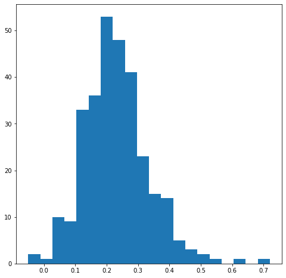
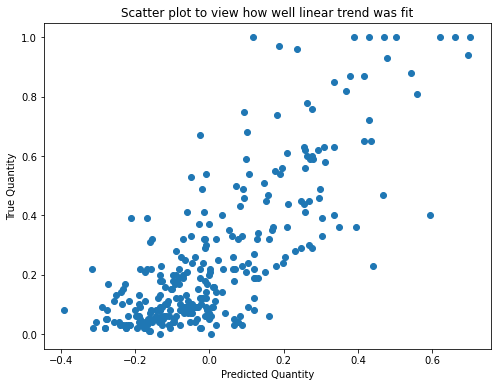
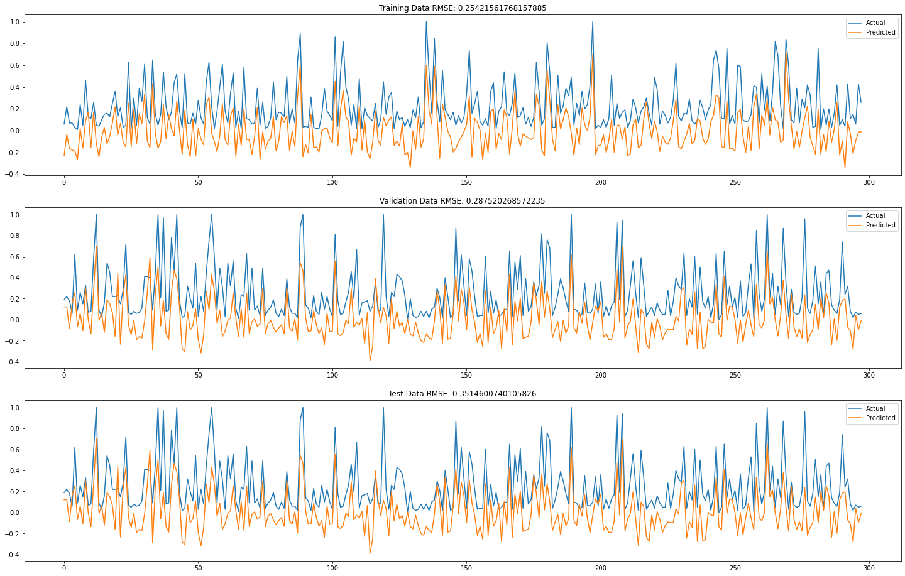
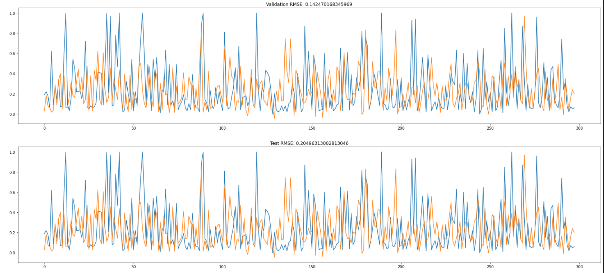
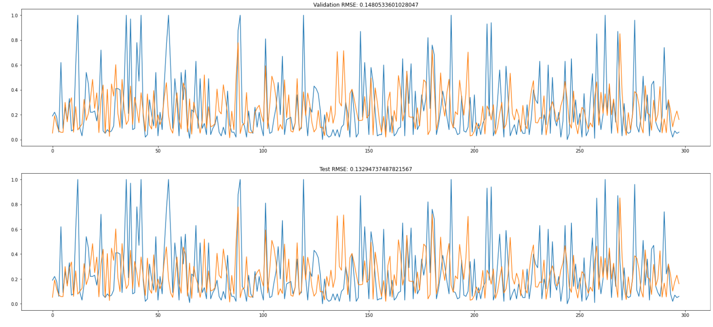
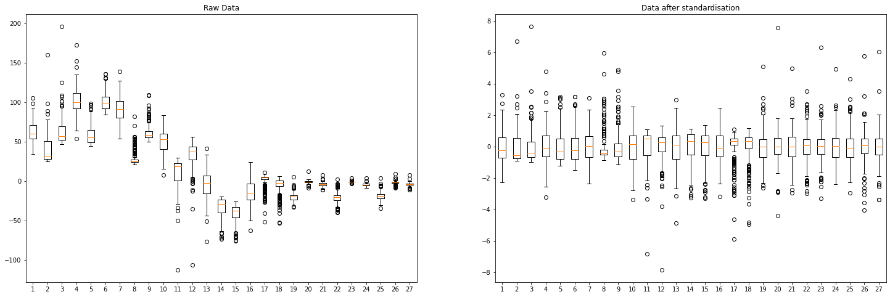
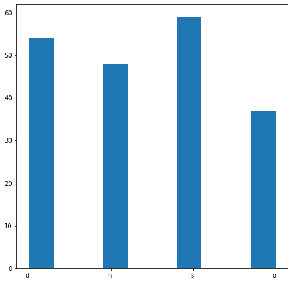

# Assignment 1A

- Name: Baorong Huang
- Student Number: n10172912

Score: 5/8

[feedback](https://github.com/xiaohai-huang/cab420-workspace/blob/master/work/machine-learning/a1/assignment%201A.pdf)

## Problem 1. Regression

The purpose of the data is to explore the link between the various socio-economic factors and crime.

### Data Characteristics

#### Data Split

The split of train, validation and test set is not ideal. Normally we want them to be roughly 70/15/15.

#### Variable Range


Let's explore the distribution of the training data by drawing A boxplot over input variables. By analyzing the plot above, we can see that all the variables have
the same range 0~1. But they have different mean and standard deviation.

#### Correlation



Some variables are correlated with the response `ViolentCrimesPerPop`. For example, `PctUnemployed`, `NumIlleg`, and `PctPopUnderPov`. And these values are far away from
0, which indicates that there is a linear association between the response variable and the input variables.



In linear regression, predictors are expected to be **uncorrelated** with each other, since each predictor models a different aspect of the overall relationship. If they are correlated, we can end up with redundancy in the model.

Consider the graph above, it is clear that `population` and `numbUrban` are correlated and the correlation is 0.98, and thus the relationship between these two variables and the response (`ViolentCrimesPerPop`) will be (to some extent) captured twice in a linear regression model. In addition, it would also cause the `p-value` to be less important.

### Pre-processing

#### Standardization

Because regularized linear regression models like `Ridge` and `Lasso` will be trained later. And to help regularization to penalize all weights equally. Standardization will be performed as one pre-processing step.

The standardization is achieved by $\hat{x} = \frac{x - \mu}{\sigma}$.

- $\hat{x}$ is the standardized result.
- $x$ is the original data.
- $\mu$ is the mean of the data.
- $\sigma$ is the standard deviation of the data.

Here is the python code that standardizes the input data including train, validation, and test set.

```python
from sklearn.preprocessing import StandardScaler
scaler = StandardScaler()
scaler.fit(X_train)

s_X_train =pd.DataFrame(scaler.transform(X_train), columns=X_train.columns, index=X_train.index)
s_X_val =pd.DataFrame(scaler.transform(X_val), columns=X_val.columns, index=X_val.index)
s_X_test =pd.DataFrame(scaler.transform(X_test), columns=X_test.columns, index=X_test.index)

```


The above graph shows the data distribution after standardization. All variables have a mean of 0, and a standard deviation of 1. This enables regularized regression treat variables equally.

### Linear Model

#### Model Development

Below is the python code for training a **linear regression model** to predict the number of violent crimes per captia from the socio-economic data.

```python
import statsmodels.api as sm

# s_X_train the standardized data
linear_model = sm.OLS(Y_train, s_X_train).fit()

# Draw a qqplot for residuals.
statsmodels.api.qqplot(linear_model.resid, line="s")
```





Residuals form a gaussian/normal distribution. Consider the qq-plot above, it forms straight line. And for the histogram, it is represented as a bell curve.



The scatter plot shows that the model fits the training data in a certain degree.

#### Analysis of Results

```bash
                                 OLS Regression Results
================================================================================
Dep. Variable:     ViolentCrimesPerPop   R-squared (uncentered):           0.346
Model:                             OLS   Adj. R-squared (uncentered):      0.016
Method:                  Least Squares   F-statistic:                      1.048
Date:                 Mon, 25 Apr 2022   Prob (F-statistic):               0.386
Time:                         06:42:53   Log-Likelihood:                 -14.711
No. Observations:                  298   AIC:                              229.4
Df Residuals:                      198   BIC:                              599.1
Df Model:                          100
Covariance Type:             nonrobust
=================================================================================
```

**R-squared** of the linear model is 0.346. This indicates that the model can explain a certain amount of pattern in the training data.

```bash
                           coef    std err          t      P>|t|
-----------------------------------------------------------------
population               0.0988      0.313      0.315      0.753
householdsize           -0.0767      0.119     -0.646      0.519
racepctblack             0.0102      0.098      0.104      0.917
racePctWhite            -0.0260      0.095     -0.274      0.784
racePctAsian            -0.0185      0.050     -0.371      0.711
racePctHisp             -0.0982      0.097     -1.012      0.313
agePct12t21             -0.0398      0.127     -0.313      0.755
agePct12t29              0.1069      0.174      0.614      0.540
agePct16t24             -0.0256      0.214     -0.120      0.905
agePct65up               0.0216      0.125      0.173      0.863
numbUrban               -0.0957      0.304     -0.314      0.753
...
```

Many predictors have a high p-value. This means that those predictors are not significant.

One possible reason is that some predictors are correlated with other predictor. see [correlation section](#correlation) above.
Therefore, the relationship between that variable and the response is captured twice in the model.



The **RMSE** for the training set is 0.25. And the **RMSE** for the validation set is 0.28. The model has a reasonable low value of RMSE, the smaller the better. In addition, the **RMSE** for the validation set is also small. This indicates that there is no sign of **overfitting** in this model.

Analyze the performance on test set: the **RMSE** for test set is 0.35. The performance might increase if we simplify the model by removing less significant terms.

### Ridge Regression Model

#### Model Development & Hyper-parameter Selection


Initially, I train a series of Ridge regression model with the lambda given by `np.arange(0, 100, 0.01)` on validation set and discovered that the best lambda is 16.6 which result in a validation RMSE of 0.142.

In order to get a better result, I then I start another search using `np.arange(0, 30, 0.005)` as the lambda list. Finally, the best lambda is 16.599 and the validation RMSE is 0.142. This is similar to the result of the first training.

#### Analysis of Results

##### Validity


The Q-Q plot of the model's residual form a straight line. This means that the residuals are normally distributed which meet the assumption of linear model. So the model is valid.

##### Accuracy



The **RMSE** for validation set is 0.14. And the **RMSE** for the test set is 0.2. This indicates that the Ridge model fit the data quite well and can generalize well on unseen data.

### LASSO Regression Model

#### Model Development & Hyper-parameter Selection


Initially, I trained LASSO model with different lambda given by `np.arange(0, 0.5, 0.01)` on the validation set and discovered the best lambda is 0.01 with RMSE of 0.148. And after this point, the **RMSE** goes up in graph. So I expect the best lambda will exist near the point.

I start another search using `np.arange(0, 0.2, 0.0001)` as the lambda list. Finally, the best lambda is 0.001 and has RMSE of 0.1431.

#### Analysis of Results

##### Validity


The Q-Q plot of the model's residual form a straight line. This means that the residuals are normally distributed which meet the assumption of linear model. So the model is valid.

##### Accuracy


L1 regularization forces some of the coefficients to be **zero** and results a simpler model. It can help reduce the impact caused by the correlation between predictors.



The **RMSE** for the validation set is 0.14. And the **RMSE** for the test set is 0.13. This indicates that the LASSO model fit the data quite well and can generalize well on unseen data.

### Comparison of Models

- Linear Model: test set RMSE is 0.35
- Ridge Regression Model: test set RMSE 0.2
- LASSO Regression Model: test set RMSE 0.13

By comparing the RMSE on test set, it is clear that LASSO regression model performs best.

## Problem 2. Classification

### Data Characteristics

#### Different Range



Given the box plot above, it is clear that variables are in different scales.

#### Class Imbalance



The histogram shows that class "o" has the smallest number of samples in training set and it is significant smaller than other classes, which might cause class imbalance. While class "s" has the largest number of samples.

### Pre-processing

#### Standardization

Because input variables are in different scales. Standardization is applied to make sure input data have the same mean and standard deviation.

### K-Nearest Neighbors Classifier

#### Model Developer & Hyper-parameter Selection

A randomized search is performed to search for optimal hyper-parameters.

- Number of neighbors: `n_neighbors`.
- weights: ['uniform', 'distance']

Use sk-learn's `RandomizedSearchCV(knn, params)` to search for hyper-parameters. Obtain the hyper-parameters from `RandomizedSearchCV` and evaluate it on validation set to improve `accuracy` $A = \frac{TP+TN}{N}$ as well as $F1$ score.

#### Analysis of Results


From above we can see that:

- The model is quite accurate (~83%)
- The model cannot classify "h" and "o" very well. Because in the training set, class "h" and "o" have the smallest number of samples. (class imbalance).

### Random Forest

#### Model Developer & Hyper-parameter Selection

Use the Halving Grid Search method to search for optimal hyper-parameters. It will start by evaluating all systems on a small sample of data. It will then take only the best half of the systems and evaluate them on a larger sample. (lecture notebook) After obtaining the best hyper-parameter, I then evaluate it on validation set to improve **accuracy** as well as $F1$ score.

```python
rf = RandomForestClassifier(random_state=42)
param_grid = {'max_depth': [2, 4, None], 'min_samples_split': [5, 10], 'n_estimators' : [25, 50, 100]}
halving_search = HalvingGridSearchCV(rf, param_grid, random_state=0).fit(X_train, Y_train)

```

#### Analysis of Results


```bash
              precision    recall  f1-score   support

          d        0.86      0.71      0.78        52
          h        0.84      0.70      0.76        23
          o        0.59      0.67      0.62        15
          s        0.81      0.93      0.87        74

    accuracy                           0.80       164
   macro avg       0.78      0.75      0.76       164
weighted avg       0.81      0.80      0.80       164
```

From above we can see that :

- The model is doing a great job on training set. However, it cannot classify "d", "h", and "o" very well in test set.
- Class "o" has the lowest precision, recall, and f1-score. This might due to the fact that it has the smallest number of samples.

### Support Vector Machines

#### Model Developer & Hyper-parameter Selection

Use a grid search to search over the hyper-parameter space for SVM:

- Values of C
- Different kernels
- Kernel parameters

In my example, 3 grids are created and passed to sk-learn's `GridSearchCV()` to search for the optimal hyper-parameters.

```python
param_grid = [
  {'C': [0.1, 1, 10, 100, 1000], 'kernel': ['linear']},
  {'C': [0.1, 1, 10, 100, 1000], 'gamma': [0.1, 0.01, 0.001, 0.0001], 'kernel': ['rbf']},
  {'C': [0.1, 1, 10, 100, 1000], 'degree': [3, 4, 5, 6], 'kernel': ['poly']},
 ]
svm = SVC()
grid_search = GridSearchCV(svm, param_grid)
grid_search.fit(X_train, Y_train)
```

After finding the best hyper-parameters using a grid search. I then create a model using the hyper-parameter and evaluate it on **validation set**. Finally, tune the parameters in the `param_grid` to improve validation set **accuracy** $A = \frac{TP+TN}{N}$ as well as $F1$ score.

#### Analysis of Results


From the above we can see:

- The SVM model is quite accurate (85%)
- The model is not great at classifying class "o" and "s".

### Comparisons of Models

- K-Nearest Neighbors Classifier: Test Accuracy: 0.83
- Random Forest Classifier: Test Accuracy: 0.8 (only good at one class).
- SVM: Test Accuracy: 0.85

These three models are all bad at classifying class "o". The SVM classifier is the best model.

## Appendix

- Jupyter Notebook for Q1 [https://github.com/xiaohai-huang/cab420-workspace/blob/master/work/machine-learning/a1/Q1/q1.ipynb](https://github.com/xiaohai-huang/cab420-workspace/blob/master/work/machine-learning/a1/Q1/q1.ipynb)
- Jupyter Notebook for Q2 [https://github.com/xiaohai-huang/cab420-workspace/blob/master/work/machine-learning/a1/Q2/q2.ipynb](https://github.com/xiaohai-huang/cab420-workspace/blob/master/work/machine-learning/a1/Q2/q2.ipynb)
