- Name: Baorong Huang
- Student Number: n10172912

## Problem 1. Training and Adapting Deep Networks

### Discussion of Data Characteristics

#### Data Split

The split of train and test set is not ideal. In the testing set, there are 10, 000 samples total distributed across the 10 classes, however, the training set only contains 1, 000 samples total distributed across the 10 classes. Normally, we want the number of training data to be grater than testing data.

#### Class Imbalance

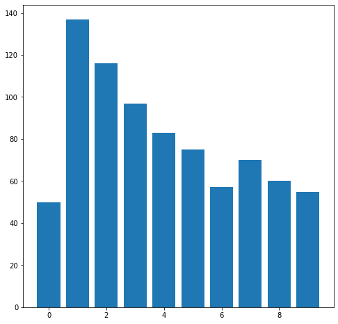

The distribution of classes in the training data is imbalance. The histogram shows that number **1** has the largest number of samples in training set and it is significant larger than other classes, which might cause class imbalance. While number **0** has the smallest number of samples.

#### Variable Range

| stats | value         |
| ----- | ------------- |
| count | 627200.000000 |
| mean  | 0.465273      |
| std   | 0.223933      |
| min   | 0.007160      |
| 25%   | 0.287787      |
| 50%   | 0.455336      |
| 75%   | 0.618567      |
| max   | 1.000000      |

Let's explore the distribution of the training data (**X**) by computing its descriptive statistics. By analyzing the table above, we can see that input variables are located in the range 0~1 and have a mean of 0.46. This indicates that the input images have been normalized between 0 and 1.

#### Input Images

`train_X.shape == (1000, 32, 32, 3)`

The training and testing images are 32x32x3 colorful images. However, the architecture of the DCNNs used in this assignment is `vgg_3stage_MNIST_bigger`, which requires size of input to be 28x28x1 grayscale images. Therefore, the input images have to be pre-processed before feeding into the neural network.

### Pre-processing

`vgg_3stage_MNIST_bigger` is selected as the architecture of DCNNs. The input layer of this model requires the data to be the shape of 28x28x1. In order to satisfy the width and height of this input layer. The training and testing data need to be resize and this can be done by calling `resize(train_X, (28, 28))`. Secondly, since it only requires one color channel, the input images also need to be converted into grayscale images `convert_to_grayscale()`.

### Model Development and Design

#### Network Design

```python title="vgg_3stage_MNIST_bigger"
inputs = keras.Input(shape=(28, 28, 1, ), name='img')
x = vgg_net(inputs, [16, 32, 64], [1024, 256], 0.2, 0.2)
output = layers.Dense(10)(x)
model_cnn = keras.Model(inputs=inputs, outputs=output, name='simple_vgg')
model_cnn.compile(loss=keras.losses.SparseCategoricalCrossentropy(from_logits=True),
              optimizer=keras.optimizers.RMSprop(),
              metrics=['accuracy'])
# NOTE: these are code not images. I don't why they are not selectable in PDF.
```

This sections covers the design of the network.

The plot of the architecture of the network is attached in the [appendix](#q1-network-architecture).

The network consists of 3 convolution blocks with 20% spatial dropout rate and 2 fully connected block with 20% dropout rate.

For these 3 convolution blocks, each block will firstly performs **two** 2D convolutions, each with 3x3 kernels and the number of filters drawn from `[16, 32, 64]`. Then followed by **BatchNormalisation** + **ReLU** and 20% of spatial dropout. Finally, a 2x2 max-pooling layer except the last block with 64 filters.

For these 2 fully connected blocks, each block contains a fully connected layer of size drawn from `[1024, 256]`, followed by a batch-norm + ReLU and a dropout layer with 20% drop out rate.

#### Data Augmentation

```python
datagen = ImageDataGenerator(
                            # rotate between -5, +5 degrees
                            rotation_range=5,
                            # horizontal shift by +/- 5% of the image width
                            width_shift_range=0.05,
                            # vertical shift by +/- 5% of the image width
                            height_shift_range=0.05,
                            # range for zooming
                            zoom_range=0.1,
                            # what value to place in new pixels, given the nature of our data
                            # we'll set this to a constant value of 0
                            fill_mode='constant', cval=0)
```

DCNNs need lots of data to train. In this problem, we only have 1000 training examples, which is insufficient. And this is likely to cause **overfitting**. Data augmentation can be used to overcome this issue as it offers a way to get more from limited data.

A few transforms are applied to the training data:

- Rotate between -5 and 5 degrees
- Horizontal shift by +/- 5% of the image width
- Vertical shift by +/- 5% of the image width
- Zoom in/out 5% of the image

Below are the augmented images. After the inspection, it is clearly that all samples still recognizable as their true class.

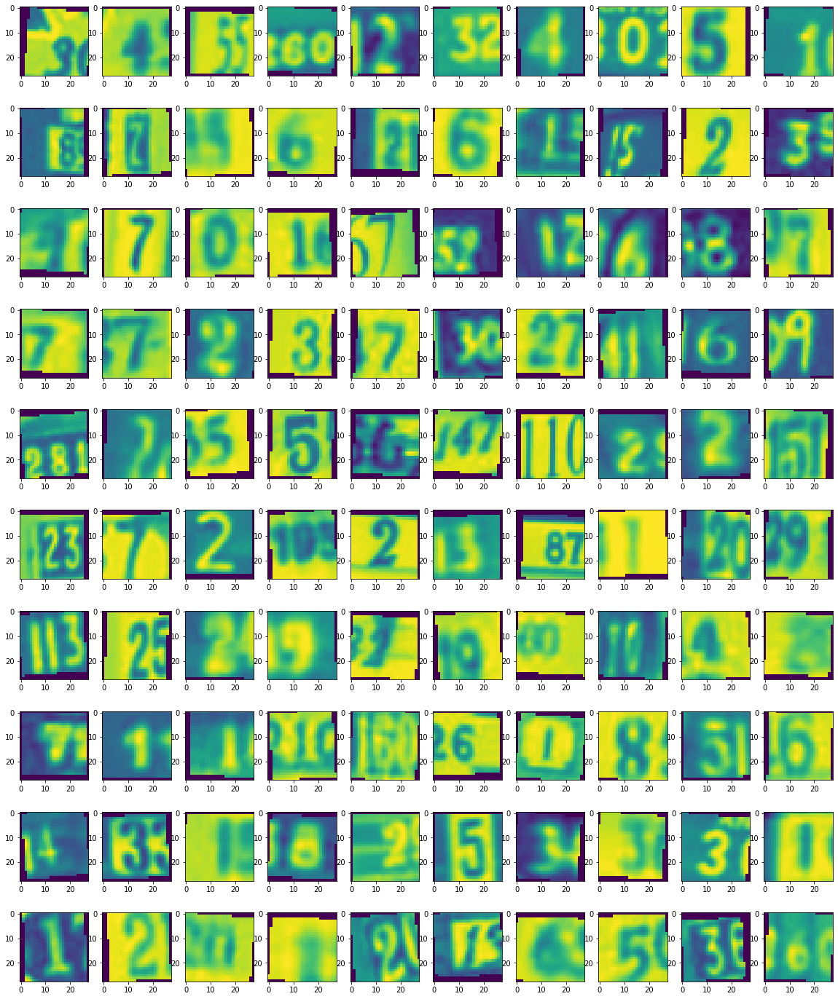

#### Data Used to Pre-train the Network


The MNIST database of handwritten digits (see above image) is used to train the selected pre-trained network. These data are very similar to the provided SVHN dataset. Because SVHN is like a real world MNIST and the output classes are the same (10 classes).

The first few layers of the network, which has been trained on MNIST might learn some meaningful representations of the numbers/digits. This is helpful since the number of training examples is limited, and we can freeze first few layers and fine-tune the last few layers to adapt to the SVHN dataset.

### Discussion of Computational Considerations

See [vgg_3stage_MNIST_bigger network architecture](#q1-network-architecture) in appendix. Total params: 3,554,618

If the system has a small memory, I would design a model with less fully connected layers. Because fully connected layers require much more parameters than convolution layers, which require more computation instead.

If I have a **GPU** enabled runtime environment, I would design a model that contain more convolution blocks as it allowed for richer and richer representations until a sufficient number of layers is reached. In addition, GPU can load a huge chunk of matrices data into memory due to the high memory bandwidth, and do fast parallel processing with its thousands of cores, this can significantly reduce the time to train the model and to make inference. Below shows that the **GPU runtime** took 33s, 203s, and 18s to train model 2a, 2b, 2c respectively. And the average time to make a inference is 1.5s which is faster than the time took to make a inference using the SVM model that does not require parallel computing.

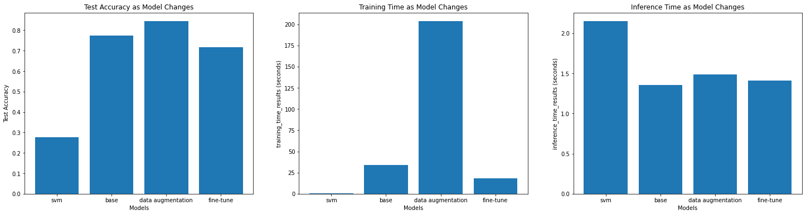

If I have a runtime environment with **CPU** only, I would design a model that contain less convolution blocks. The reason is that CPU is good for linear and complex calculations, but not for simpler and multiple calculations (**convolution blocks**) that require parallel computing. Below shows that the **CPU-Only runtime** took significantly longer to train and test the model. It took roughly 16s to make a inference, which is not acceptable in a production environment.

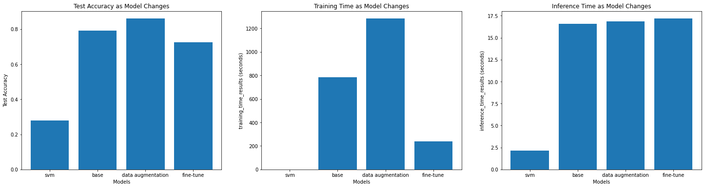

### Analysis of Results


#### Performance

By observing the graph "Test Accuracy as Model Changes" above, what we see is:

- The SVM model has the lowest test accuracy 0.2906. And the model is **overfitting**, because its training accuracy is 0.64 and test accuracy is 0.2906.
  - The basic **linear kernel** might not be appropriate for this image classification task.
  - The training dataset is **imbalanced**, an SVM classifier trained on an imbalanced dataset often produces models which are biased towards the majority class and have low performance on the minority.
- The second DCNN model using the data augmentation achieved the best result with test accuracy 0.84. Because data augmentation can generate more images for the network to train, it reduces the chance of overfitting and helps the model generalize well on unseen data.
- Among these 3 DCNNs, the last model using fine-tuning achieved the worst result with test accuracy 0.71.
  - MNIST handwritten digit (used by the pre-train model) is a bit different from the digits in SVHM dataset. The latter one is printed number (non-handwritten).
  - The model failed to utilize 3 color channels of the input images. It only accepts grayscale image. This means that some information are lost.
- DCNNs perform better than SVM. Because convolution operations in DCNNs are extremely useful in image classification tasks.

#### Training Time

By observing the graph "Training Time as Model Changes" above, what we see is:

- DCNNs took more time to train than SVM.
- SVM model took the shortest time to train. Because `C` parameter is 1, which indicates a small missclassification penalty, speed up the process. `kernel='linear'` a very basic kernel, also helps to speed up the process.
- The second DCNN model using data augmentation is the **slowest** model to train, which took 203.5s to complete the training. This is because it has more images to train. These images are generated by [data augmentation techniques](#data-augmentation) such as rotations, scaling, and shifts.
- Among these 3 DCNNs, the last DCNN model using fine-tuning is the **fastest** model to train, which only took 18.4s. Unlike the first DCNN model that was trained from scratch it only need to train the last few layers of the network. Because the first few layers already contain some meaningful representation of the digits.

#### Inference Time

By observing the graph "Inference Time as Model Changes" above, what we see is:

- Time taken for DCNNs is roughly the same because these 3 DCNNs are using the same architecture.
- Time taken for SVM is longer than DCNN because SVM algorithm does not require parallel computing, which cannot take advantages of GPU.

## Problem 2. Person Re-Identification

### Data Characteristics

The provided training data has 5933 128x64x3 images. They are all cropped. The range of each image is between 0~1, so no one dimension has a bigger range than others, therefore data standardization is unnecessary.

Query and gallery sets are from different camera views.

### Pre-processing

Images are converted to grayscale and resized to 64 x 32 images.

- Grayscale, because it allows us to reduce the dimensionality without really losing a lot of data, and also helps deal with issues such as white balance. It also makes results a bit easier to visualize.
- Downsampled, because we need more samples than we have dimensions. The training set only has 5933 samples, which is less than the dimension of each sample ($128 \times 64 \times 3=24576$). After downsampling, the dimension of each image is $64 \times 32 = 2048$, which is less than the samples we have. In addition, without downsampling my PC was unable to train the PCA model since it cannot fit such high dimension data into memory.
- Vectorized. This means that all columns have been stacked on top of the other, so rather than being $64 \times 32$ it's $1 \times 2048$. Because PCA wants a vector per sample. However, for the DCNN model, we still pass images as images to help DCNN to gain some spatial awareness. As such, DCNN can understand things like faces, hairs, cloths, and how they are located relative to each other and combined to form a person overall. Vectorization makes it harder to learn these so it will be turn off when training the DCNN.
- Obtaining the "mean person" and subtracting that from person vector. Applying the same subtraction operation to the test data as well.

### Model Development

#### PCA

Below are the reasons why I choose PCA as the non deep learning model.

1. PCA requires data to be aligned, and training data are cropped therefore it satisfies PCA's requirement.
2. For images, not all dimensions are equal. Some are highly informative, others are not useful for the task. In this case, the background is useless, which means that it is not helpful when identifying a person's identity. It is good to use PCA to get rid of these useless dimensions.
3. It can improve visualization. We can visualize our principal components.

##### Visualize Principal Components

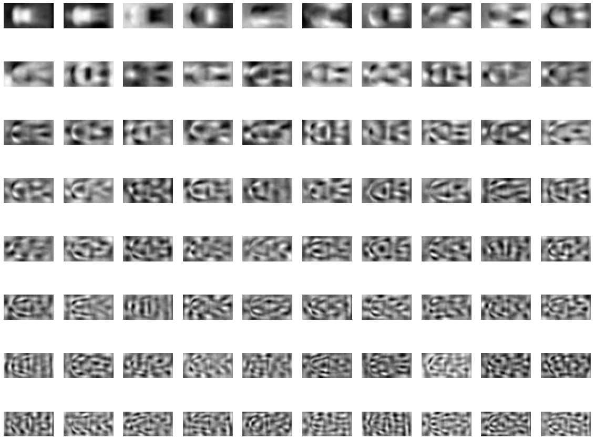

Above is the visualization of the first 80 principal components.

The first 4 principal components look like humans. They can be seen as the "main component" of the samples in our data. However, as we get further into the components, it becomes harder to interpret.

##### Cumulative Sum of PCA's Explained Variance

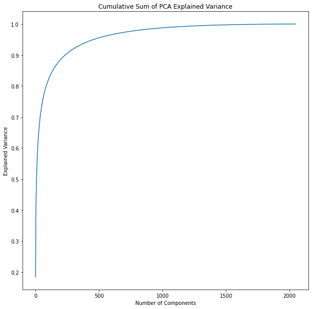

```bash
90% in 235 components
95% in 458 components
99% in 1079 components
```

235 components, 11% of the total dimensions, explain 90% of the variation. We can get 95% with just 458, and 99% with 1079. This indicates that last 1000 dimensions are not contributing much.

##### Reconstruct Image

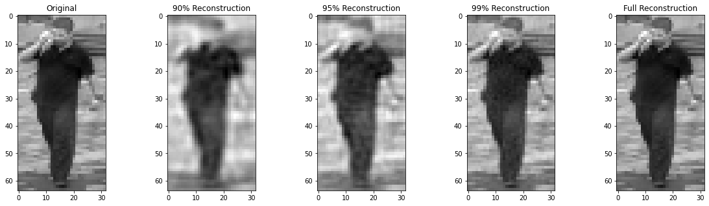

Using only the first 235 components (90% of the variance), we can see that we lose a lot of the information that can be used to identify a person such as face details. But it captures the main shape (height, cloth) of the person, which is helpful. As wee add more components, we add more details to the person's face, but it is still very blur.

##### CMC and Top-N Accuracy

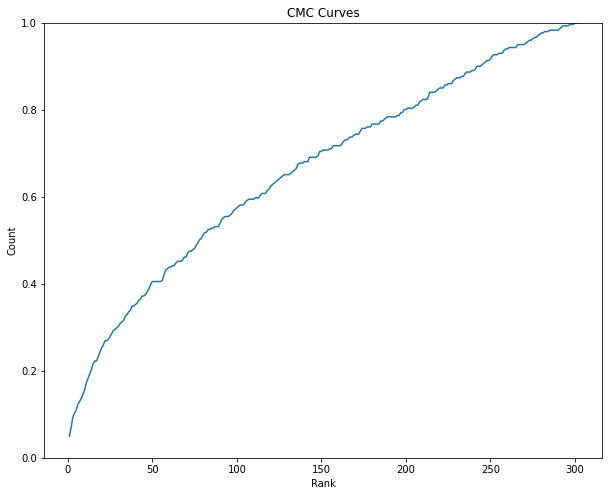

| Top-N  | Accuracy            |
| ------ | ------------------- |
| Top 1  | 0.04983388704318937 |
| Top 5  | 0.10963455149501661 |
| Top 10 | 0.15614617940199335 |

The performance is bad. Because the CMC curve took too long to reach 1 (not steep).

##### t-SNE

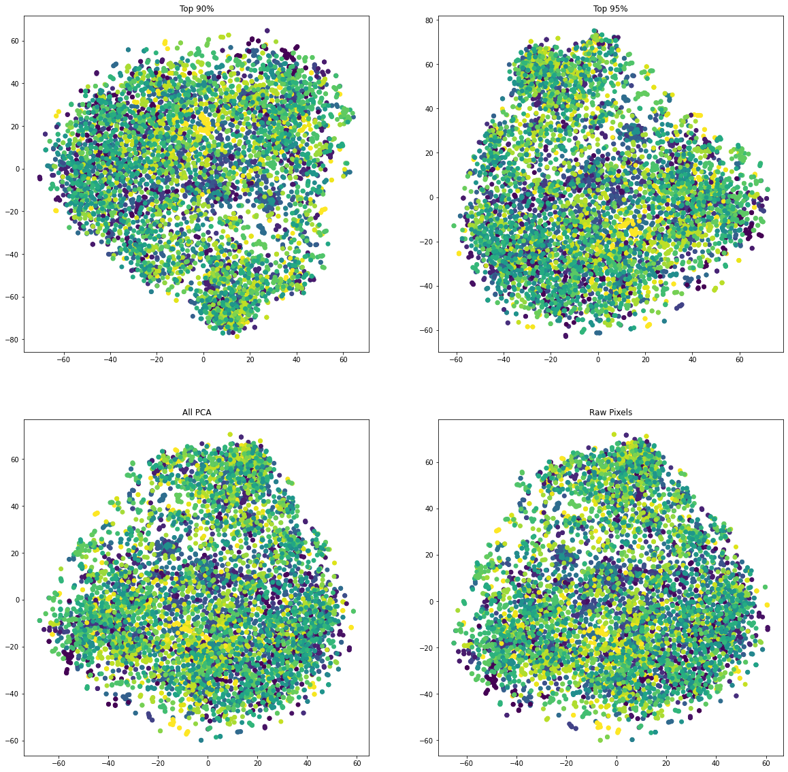

What I can see is that:

- Samples are not clustered nicely.
- There is a big difference between the 90% and 95% version. Because it dropped a lot of terms which impact the data distribution.
- The raw pixels and the full transformed data look similar.

#### Siamese Network

##### Network Design

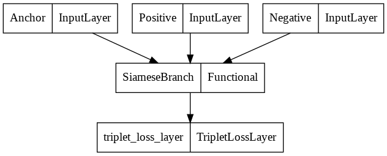

A Siamese Network with triplet loss is selected as the deep learning method. The siamese branch of the network is a simple VGG like network. The network is trained by taking an anchor image and comparing it with both a positive and a negative sample. The network will try to make the distance between the positive pair less than the negative pair by a specified distance.

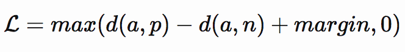

##### Results

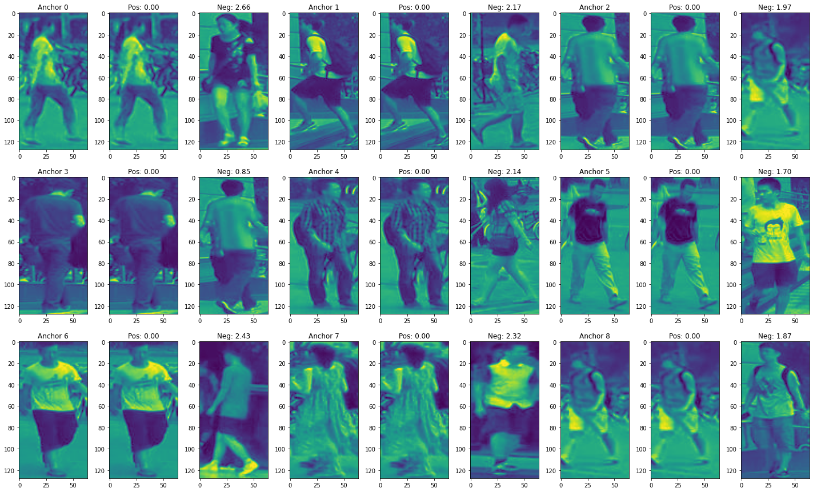

By examining the predictions made by the network above, it is clear that there is a bigger gap between positive and negative samples. The result of positive samples are pushed to 0 and the result of negative samples are pushed far away from 0.

The distributions below show a clear separation between the positive and negative samples.

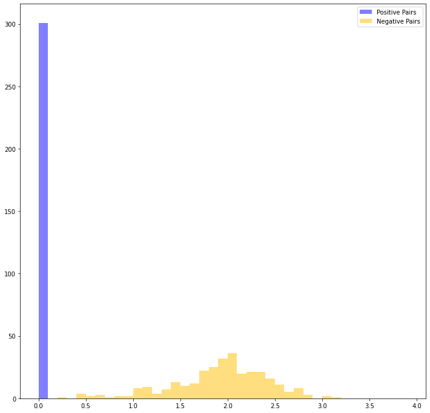

### Analysis of Results

<!-- An evaluation that compares the two methods, reporting Top-1, Top-5 and Top-10 accuracy, and a CMC curve.
Your evaluation should consider instances where performance differs between the two methods,
and comment on the respective strengths and weaknesses (including computational efficiency/runtime) of the two approaches.

Excellent and insightful analysis of results and performance, drawing on theoretical knowledge of the models and relevant
characteristics of the data. Analysis is supported and enhanced by appropriate metrics and/or figures. -->

**PCA** and **Siamese Network** Top-1, Top-5 and Top 10 accuracy

| Top-N  | PCA Accuracy        | Siamese Network     |
| ------ | ------------------- | ------------------- |
| Top-1  | 0.04983388704318937 | 0.20930232558139536 |
| Top-5  | 0.10963455149501661 | 0.46179401993355484 |
| Top-10 | 0.15614617940199335 | 0.5714285714285714  |

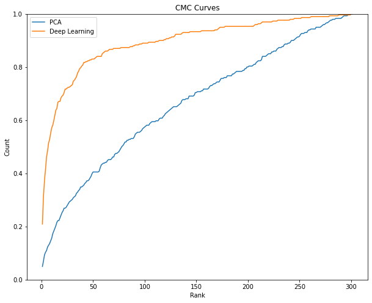

#### Performance

The above table and graph show that the Siamese network performs better than the PCA model. Because its Top-1, Top-5 and Top-10 accuracy are all grater than PCA's. Secondly, the Siamese network's CMC curve is steeper than PCA's CMC curve.

Here are some reasons why the Siamese network is better than PCA model.

##### Spatial Awareness

The Siamese network take in images as images and that means that the work gain some spatial awareness. This means that, the network can understand things like faces, hairs, cloths, rotations, and how they are located relative to each other and combined to form a person overall. While, the vectorized images, which are the input of PCA model, can still comprehend the relationship, but it is more challenging.

##### Different Camera Views

The images are captured in different camera views. This means that the data are not aligned, things like the head. face, foot, .etc, are not at the same place in each image. This makes it very hard for PCA.

#### Computational Efficiency/Runtime

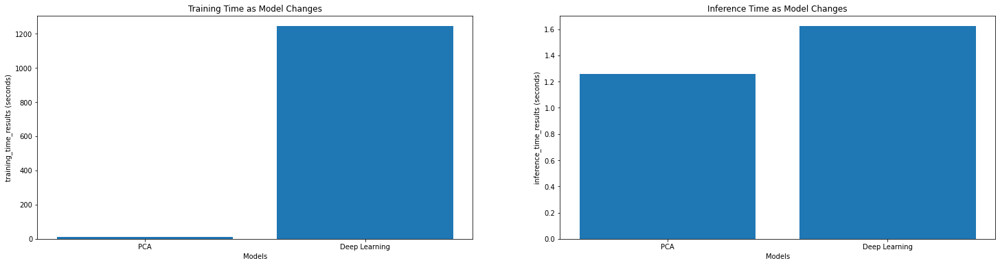

Above is the training and inference time taken by these two models.

What I can see is that:

- PCA model is **faster** than the Siamese network in both training and inference time. Especially in training time, it took 11 seconds for PCA but Siamese network took nearly 20 minutes (10 epochs).
  - During training, the Siamese network use `triplet_generator` to generate triplet images, which consumes time.
  - The Siamese branch of the network is a simple VGG like network. This is more computational expensive than PCA model. Since it contains a few convolutional and fully connected layers.
  - Three images (triplet) are passed into the network simultaneously. This means that for one triplet, the Siamese branch will be executed 3 times to obtain the embedding for each image and then compute the triplet loss.
  - The base network is built from scratch, the weights are initialized randomly. The time can be reduced by using a pre-train network as base network.
- The inference time for both methods is similar. They took 1.2 and 1.6 seconds to make an inference on the training data.
  - During inference, the Siamese network just need to compute the one embedding per sample rather than 3 embeddings for a triplet.

The strengths of the Siamese network:

- High accuracy. It has a Top-5 accuracy of 57%
- Quick inference time. The time took to make a inference is similar to PCA model.

The weakness of the Siamese network:

- Too long to train even with **GPU**. It took significantly longer time to train compare to PCA model.

The strength of PCA:

- The results can be visualized.
- Faster training and inference time. No GPU is required.

The weakness of PCA:

- The results are pretty inaccurate.
- Need more data if the dimension of each sample is high. Otherwise, downsampling is required, which might lose some important details. In this problem, the color of cloth is lost.

## Appendix

### Source Code

- [Q1 Jupyter Notebook](https://github.com/xiaohai-huang/cab420-workspace/blob/master/work/machine-learning/a1b/assignment1b-q1.ipynb)
- [Q2 Jupyter Notebook](https://github.com/xiaohai-huang/cab420-workspace/blob/master/work/machine-learning/a1b/assignment1b-q2.ipynb)

### Q1 Network Architecture

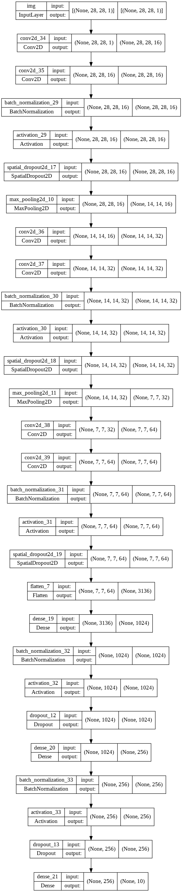
