# Assignment 1C

- Name: Baorong Huang
- Student Number: n10172912
- assignment extension request (**FORM-AEX-119078**)


## Problem 1. Clustering and Recommendations

Develop a method to cluster users based on their movie viewing preferences.

### Discussion of Clustering Method

<!-- Clear and concise discussion of the clustering method chosen, drawing on theoretical knowledge to justify the approach. Clear and well-reasoned discussion of any data manipulation. -->

#### Data to Cluster

<!-- Description and justification of the data that you chose to cluster; -->

**Description of the data**: I only use the data containing in `ratings.csv` and `movies.csv` files. Firstly, I compute the average rating of each movie using the `rating.csv` file because my goal is to cluster users rather than movies. Secondly, the `genres` column in `movies.csv` is split into multiple columns because this is easier to manipulate. Finally, I combined the `ratings.csv` and `movies.csv` tables, obtaining a combined table that contains average rating each user has reported for all genres.

The dataset contains 9742 movies and 100836 ratings.

<!-- You will have to decide how you treat genres that have an average rating of NaN -->

**Special treatments (Data manipulation)**:

- There are some average ratings that are `NaN`, which indicates that the user has not watched any movies from this genre. I replace the `NaN` with 0. Because `NaN` values suggest that the user does not like this genre and a 0 can be used to represent this dislike relation (they are not a fan of this genre).

- Remove the "(no genres listed)" column in the combined table. The average rating for movies that don't have genres listed cannot provide useful information when clustering users. Because a movie without genres listed cannot tell the cluster algorithm what movies the user prefers to watch or does not want to watch. For example, we would like to cluster users who like to watch "Musical-Children" rather than having a cluster of users who like "Musical-(no genres listed)" which does not make sense. Clustering users who like "(no genres listed)" is meaningless.

After these pre-processing, I plot the t-SNE graph for the dataset.

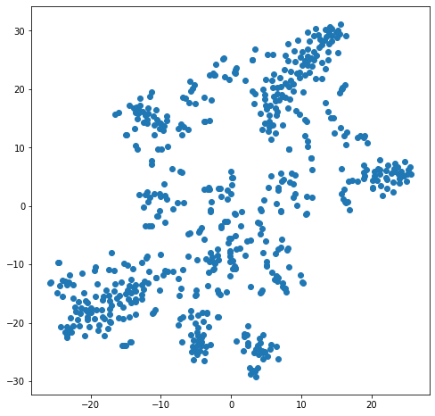

From the t-SNE we can see that: there are some groups of users who have distinct preferences.

#### Justification for the Selected Clustering Method

The selected clustering method is **Gaussian Mixture Model**.

The reasons are:

1. As a recommendation system, we might want to make recommendations for new users. If we use HAC or DBScan, it is difficult to add new points to clusters after clustering. Because new points can change the clustering results. Therefore, the clustering methods left are K-Means and GMMs as they allow us to make recommendations for new users.
2. Eliminate K-Means.
   - K-Means can only extracts spherical clusters because each point in a cluster should be near to the center of that cluster. The spherical shape clusters cannot capture user groups effectively as the shape of the cluster will be much more complex.
   - The clusters cannot **overlap**. By observing the data we can see that there will be a certain amount of overlap between user groups. For example, cluster "Musical-Children" might overlap with cluster "Animation-Musical".
3. The advantages of a GMM over K-Means is that we can get **soft assignment** and the **likelihood of each point** for each cluster. With these two properties we can get a better idea of where the user lies, and how close it is to other cluster centers and make use of that to make recommendations. For instance, if a user lies between two clusters according to the likelihood (e.g., [0.21, 0.4, 0.37, 0.02]), we can recommend popular movies from these two clusters (e.g., the second and third cluster) rather than relying on only one cluster.
4. With GMM we are able to avoid **hard decisions** for as long as possible. Because we can obtain a soft assignment, and carry the uncertainty about which cluster a user belongs to and finally make recommendations based on this information.

#### Selection of Hyper-Parameters

GMMs need us to specify a number of clusters. Because I don't have prior knowledge of the data. I will use the **Bayesian Information Criterion** to determine the number of clusters. BIC is combination of model complexity and error.

By the way, in order to overcome the impact of random variation in the clustering. I ran each clustering step a few times with different random seeds and average the resulting BIC.

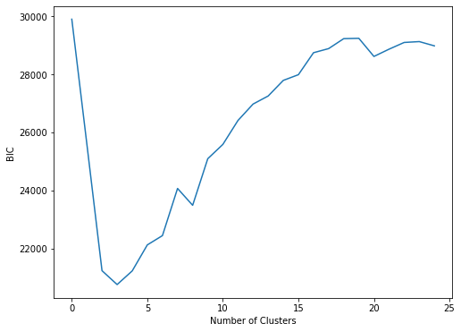

Considering our task, which is to group users into viewing habits, larger numbers of clusters will mean more fine-grained segmentation and more data to analyze. This not necessarily a bad thing (especially for this big user collection where a diverse viewing habits is possible), however for easy visualizing and analyzing we will pick 3. Because the minimum curve is the best value of $K$. According to the **BIC** graph above, we can see that the best number of clusters is 3.

### Analysis of Clustering

<!-- Excellent and insightful analysis of clustering results. Analysis is supported and enhanced by appropriate metrics and/or figures.  -->

<!-- A brief discussion and analysis of the results of the clustering, including interpretation of the resultant clusters (i.e. are clusters distinct, do they capture  different viewer habits? -->

We can think of each cluster being a type of viewing habit. As such, we can look at how each cluster (viewing habit) differs from each other to analyzing the clustering results. To achieve this, I drew bar charts for each cluster.

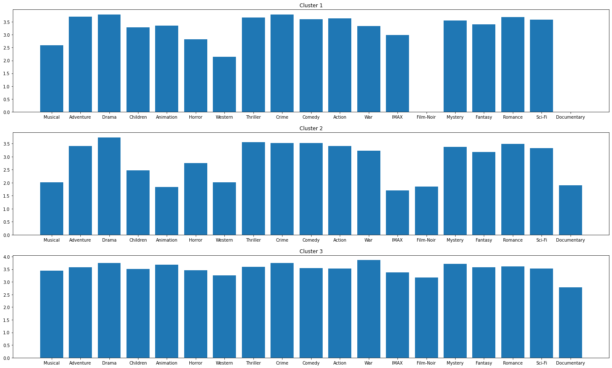

Considering the average rating for "IMAX", "Film-Noir", "Animation", and "Documentary", we can see a huge variation. These plots suggest that we can use ratings of genre to cluster users. For example, if the a user who has never watched movies from "Film-Noir" we should not recommend movies from "Documentary" because this type of user is assigned to cluster 1 and the user is expected to give a very low rating for "Documentary" movies or even ignore the recommendation.

Instead of manually inspecting these plots, I will compute the histogram intersection. For two histograms that are identical, the intersection will be1. For two that are totally different, the intersection will be 0.

| Clusters               | Intersection |
| ---------------------- | ------------ |
| Cluster 1 vs Cluster 2 | 0.5          |
| Cluster 1 vs Cluster 3 | 0.666        |
| Cluster 2 vs Cluster 3 | 0.5          |

The intersection values for these 3 clusters are fairly small, which suggests that the algorithm captures different viewer habits effectively.

Because we have high dimensional data, which is difficult to plot, we will visualize the result using t-SNE.

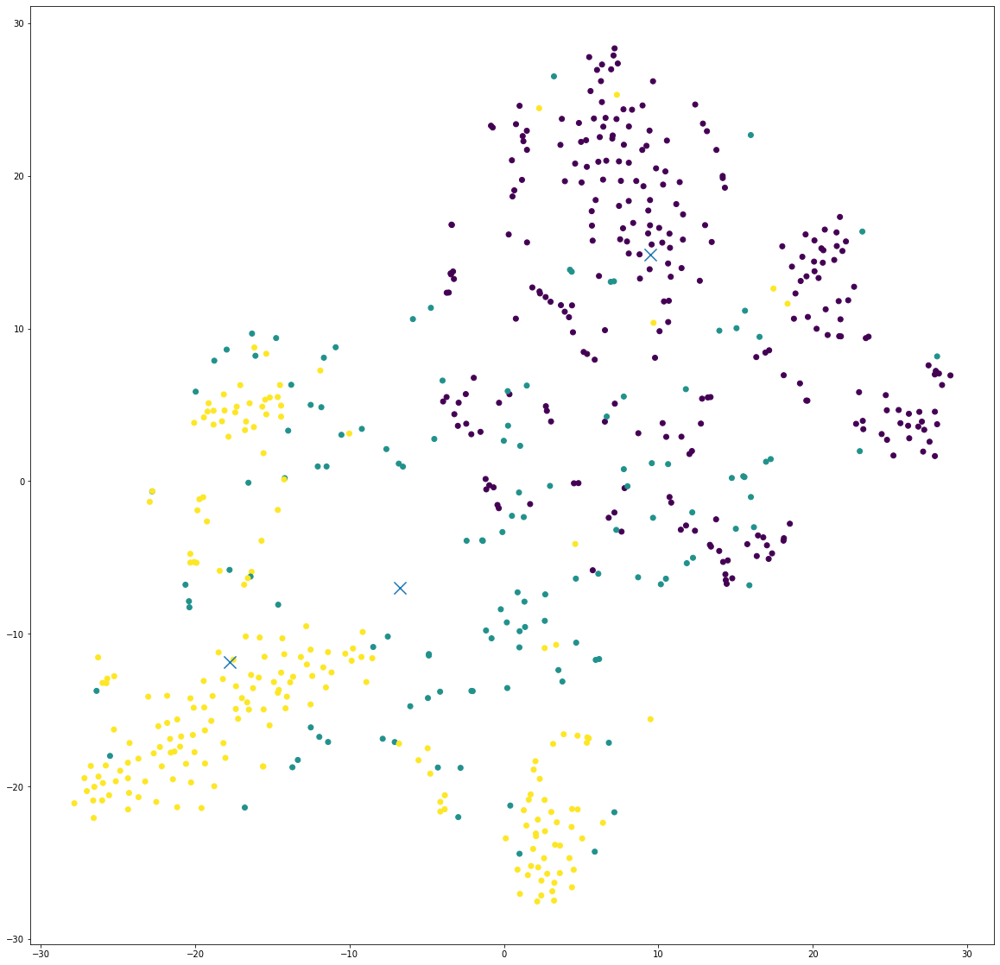

What we can see:

1. We have two types of viewing preferences that are significantly different from each other i.e., the yellow and purple clusters. This makes sense because we have clusters that have a intersection value of 0.5. And the difference is likely caused by the different preferences in "Film-Noir" and "Documentary" genre movies.
2. The yellow and green clusters are located relatively close. This two clusters might contain users who enjoy "Documentary" movies.

The t-SNE suggests that there are three different viewer habits in the dataset.

### Clustering Recommendations

<!-- 3-5 recommendations provided for each of the users. Clear and concise discussion that outlines and justifies how the recommendations were obtained and considers these recommendations in relation to the user’s previous viewing history -->

Below are the movies recommended for the three users with IDs: 4, 42, and 314;

| User | Cluster | Recommendations (movie id)  |
| ---- | :-----: | --------------------------- |
| 4    |    3    | [356, 318, 1210, 4993, 480] |
| 42   |    3    | [1198, 4993, 480, 2858, 1]  |
| 314  |    1    | [2571, 231, 4993, 292, 454] |

#### How to Obtain Recommendations

<!-- A brief description and justification for how recommendations were obtained; -->

Steps for obtaining recommendations for a user:

1. Cluster the data into different viewing habits.
2. Identify the cluster that the user belongs to.
3. Find the popular movies within the cluster. This is achieved by ordering the movie by the number of watches.
4. Find the movies that the user has already watched.
5. Find the set difference between the "Movies in the cluster" and "Movies watched by the user" to obtain a list of movies that the user have never seen.
6. Because the list has already been ordered by popularity, we can just slice the list to obtain the top-5 or top-3 movies to recommend.

**Note**: at the step 2 of the algorithm, because GMM give us the likelihoods of a user belongs to clusters. We can do further analysis on the likelihoods returned by the GMM (e.g., `gmm.predict_proba(user_4)`). For example. if the likelihoods of a user belongs to cluster 1 and cluster 2 are 37% and 42% respectively. We can then modify the algorithm a bit to obtain popular movies from these two clusters rather than obtaining movies from only one cluster.

#### Users Viewing History & Previous Ratings

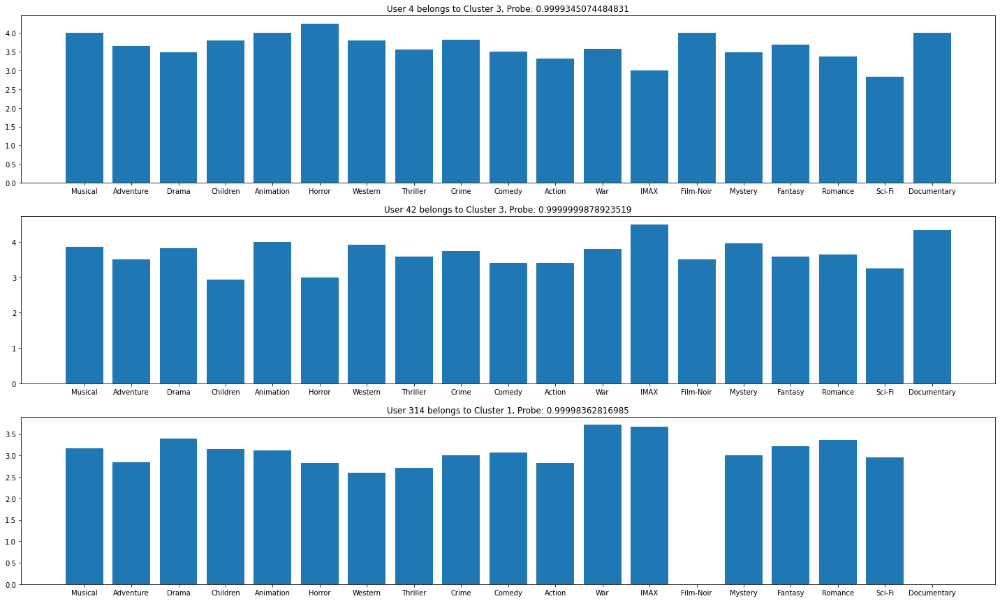

<!-- Q. For Q1, how can tell if my recommendations make sense?
A. One way would be to create some test subjects. Pick a few subjects at random, remove a bunch of the movies that they've seen, and then see if you're approach can recommend movies that they've enjoyed. Note that if you do this, I'd suggest that for your test subjects make sure you pick users who've watched lots of moves, and only remove a small number of films. This will help ensure that your changes to their viewing history don't change the cluster to which they are assigned. -->

In order to check if the recommendations make sense. I pick a few users at random, remove a bunch of the movies that they have seen. Then I find the **intersection** between the movies my system recommended and the movies removed. After that I calculate a metric called $Accuracy$ to evaluate the performance. And it is defined as follow:

$$
\begin{aligned}
A &= \text{Recommend Movies} \\
B &= \text{Removed Movies} \\
Accuracy &= \frac{|A \cap B|}{\text{|A|}}

\end{aligned}
$$

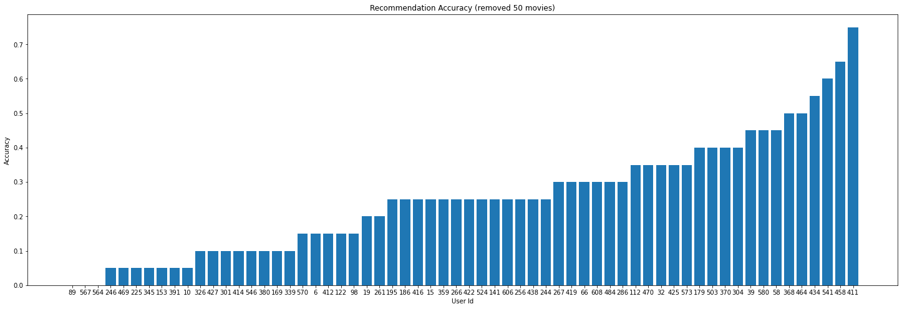

The graph above shows the $Accuracy$ values of the recommendations for 100 random users after removing 50 movies they already seen.

What we see is:

- The recommendation system did not do a good job for a few users. The accuracies of the recommendations are very low. For example, the accuracies for the users with the IDs 89, 567, and 564 are **0**. In order to further investigate on these low-accuracy users. I draw a bar chart below, we can see that these users' viewing habits are significantly different from other normal users. For instance, user 89 enjoys "Documentary" movies but he had never watched or dislike "Film-Noir" movies. The recommendation system is struggling at this situation.

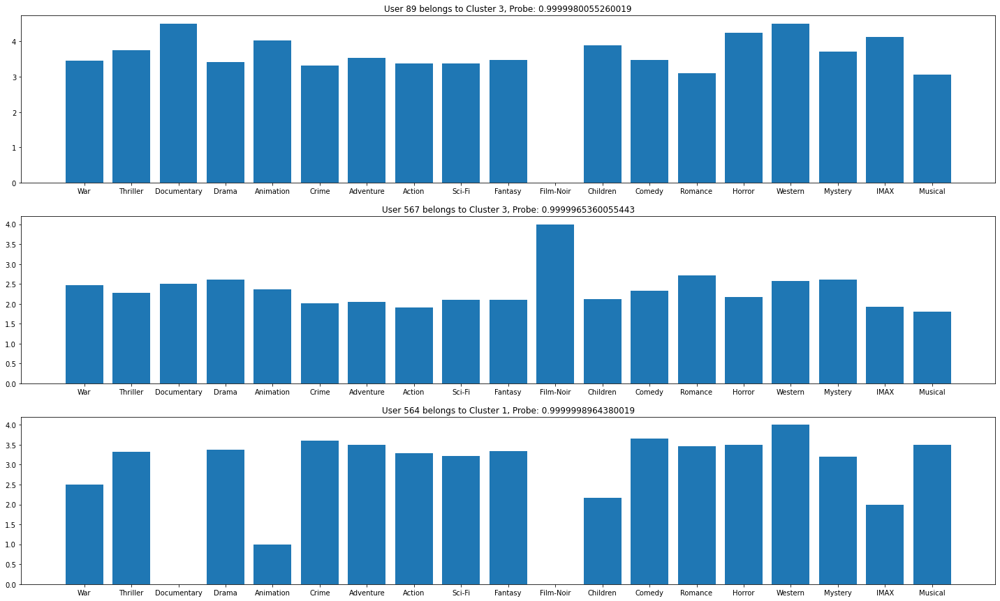

- However, the recommendation system did a good job overall. The recommendation accuracies for other users are fairly high. This is due to the fact that these users behave normally.

## Problem 2. Multi-Task Learning

Using the given data to implement a multi-task deep learning approach
that, given an input image, classifies the traits.

### Data Characteristics

#### Small Dataset

The training dataset contains `520x100x60` _colorful_ images. The size of the training set is very small and it is difficult to train a effective deep neural network by simply feeding these data.

#### Class Imbalance

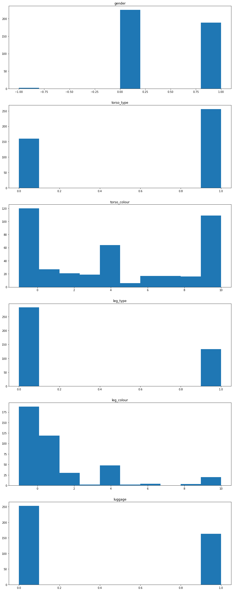

The dataset contains imbalanced class distribution. This is a situation where the number of observations which belong to a class is significantly large than those belonging to the other classes.

According to the class distribution graph above, we can see:

1. `torso_type`, the number of short torso clothing is significantly greater than short torso clothing.
2. `torso_colour`, yellow, grey and unknown torso colors are dominating the distribution. We have a lot of unknown labels for torso color.
3. `leg_type`, long leg clothing is dominating the distribution.
4. `leg_colour`, the number of examples for colors like green, orange, purple, and white is limited.

This imbalanced dataset will make it harder for the model to classify traits. Because DCNNs are usually aimed to improve accuracy by reducing the error so they do not take the class distribution/proportion into consideration.

#### Missing Data

Some labels have the value of $-1$. This indicates that the labels of these data are missing. Because we only have a very small amount of data to train, it is impractical to drop these _unknown_ data. The number of training examples will become even smaller if we drop samples with $-1$. My approach to deal with these $-1$ labels is semi-supervised learning.

We can treat this as a semi-supervised learning to enable us learn from labeled and unlabeled data.

This is achieved by defining a loss function which does the standard categorical cross entropy, but it will first find any elements that do not have labels and remove them, so it only calculate the loss on those that we have labels for. In order to make this work, we also need to convert the labels into one-hot encodings.

### Pre-processing

#### Split Data

The provided utils only split the data into training and testing set, which is insufficient to evaluate the model's performance during training. Therefore, I further split the training data into two sets. One is training the other one is the validation set. So that I can effectively tune the hyper-parameters during the training.

```python
validation_split = 0.1
train_x.shape # (468, 100, 60, 3)
val_x.shape   # (52, 100, 60, 3)
test_x.shape  # (196, 100, 60, 3)
```

#### One-Hot Encoding

As discussed in the [Data Characteristics](#missing-data) section, in order to implement a semi-supervised learning task, we need to convert `y` into one-hot encoding. During the transformation, when we encounter $-1$, the label will be replaced with a vector of $-1s$ to tell the loss function to ignore this example.

#### Data Augmentation

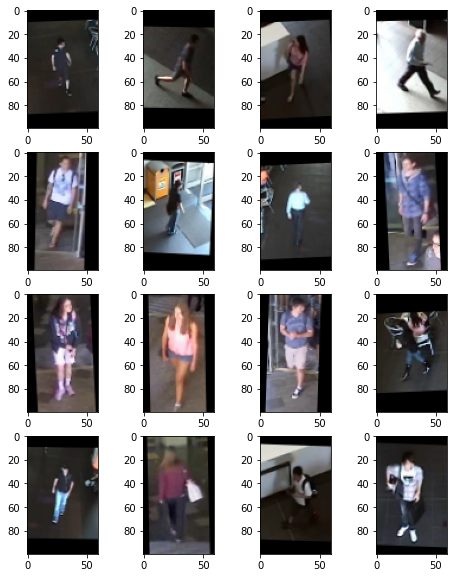

Because we only have a small amount of training data. I use data augmentation to generate images to help my model generalize for unseen data.

```python
ImageDataGenerator(
                  # rotate between -3, +3 degrees
                  rotation_range=3,
                  # horiziontal shift by +/- 1% of the image width
                  width_shift_range=0.01,
                  # vertical shift by +/- 1% of the image width
                  height_shift_range=0.01,
                  # range for zooming
                  zoom_range=0.01,
                  # allow horizontal flips of data
                  horizontal_flip=True,
                  )
```

The reason why I choose these parameters for data augmentation is that they can generate "new images" for the model to learn and the augmented images are still distinguishable according to the images above.

### Model Development and Hyper-parameter Selection

### Network Design

The full network architecture can be found in the [Appendix](#appendix).

Because we only have a small amount of training data, we can pick a pre-trained model and fine-tune the model using this small dataset. The pre-trained model should be a model that has been trained on image related task and original input image of the model should be colorful if possible.

The **ResNet** with `"imagenet"` weights is a good pre-trained model to fine-tune because it has been trained on image related task and they share the same type of input data. When the model is loaded, we firstly set the `trainable` property of the parameters of the pre-trained model to `False` and add a few Dense layers and finally output the results.

However, I decided to build a ResNet from scratch. It is a ResNet that has 3 stages, for each stage there are 3 residual blocks and 8,16,32 convolutional filters respectively.

Finally for each output label (e.g., gender, torso_colour) I create 3 Dense layers with $ReLU$ of sizes 64,32,16 and a output layer which has size of their one-hot encodings.

```python
outputs = []
for label in label_info:
   # 3 Dense layers
   x = Dense(64, name=f"pre-{label}-1", activation="relu")(base_model)
   x = Dense(32, name=f"pre-{label}-2", activation="relu")(x)
   x = Dense(16, name=f"pre-{label}-3", activation="relu")(x)
   # output layer which has the size of its one-hot encoding
   output = Dense(label_info[label], name=label)(x)
   outputs.append(output)
```

The **loss function** for each output is the **masked categorical cross entropy** which can ignore the missing data (the key component of the semi-supervised learning). One exception is the output for mask, I would use the **mean squared error** to compare the generated mask and the actual mask.

```python
# semi-supervised cateogorical cross entropy loss. This wil find any rows that have a -1 in the labels
# and remove them from consideration
def masked_cce(y_true, y_pred):
    y_true_masked = tf.boolean_mask(y_true, tf.reduce_any(tf.not_equal(y_true, -1), 1))
    y_pred_masked = tf.boolean_mask(y_pred, tf.reduce_any(tf.not_equal(y_true, -1), 1))
    return K.mean(K.categorical_crossentropy(y_true_masked, y_pred_masked, from_logits=True))
```

Because this is a multi-task learning, **loss weights** can be added to the model to help our network consider all tasks equally. We can just provide a dictionary of loss weights when we build the model. However, we are not given any information about which output should be optimized ,therefore, I didn't change the loss weights.

The training data also contain the information about **mask**, we can pick the output of the **ResNet**(`base_model`) as the **latent space representation** which contains all the important information needed to represent our original data point. And then attach a **decoder** to this layer to construct a **mask**(semantic segmentation) using the compressed representation. The hope is that the model can learn the spatial relationships between these traits. For example, if the model knows where the leg is then it can classify the leg type or leg clothing color more effectively. Because the model can ignore those irrelevant information by just focusing on the pixels that contain the leg. Due to time constraint, I didn't implement this.

### Analysis of Results

#### Gender

```bash
              precision    recall  f1-score   support

           0       0.60      0.67      0.63       106
           1       0.55      0.47      0.50        90

    accuracy                           0.58       196
   macro avg       0.57      0.57      0.57       196
weighted avg       0.57      0.58      0.57       196
```

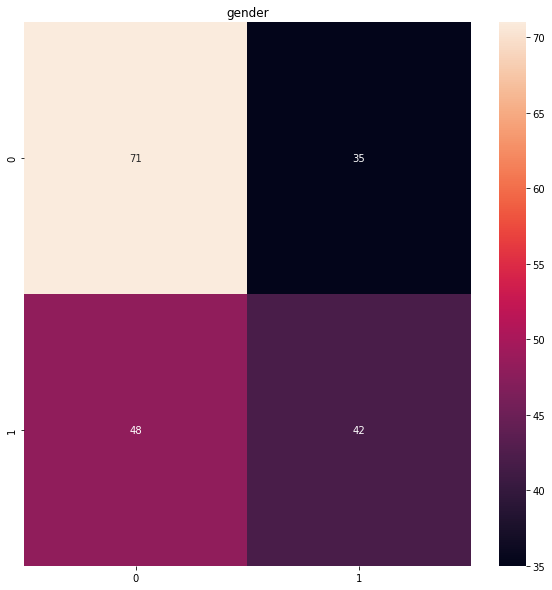

#### Torso Clothing Type

```bash
              precision    recall  f1-score   support

           0       0.40      0.45      0.43        75
           1       0.63      0.58      0.60       121

    accuracy                           0.53       196
   macro avg       0.52      0.52      0.51       196
weighted avg       0.54      0.53      0.54       196
```

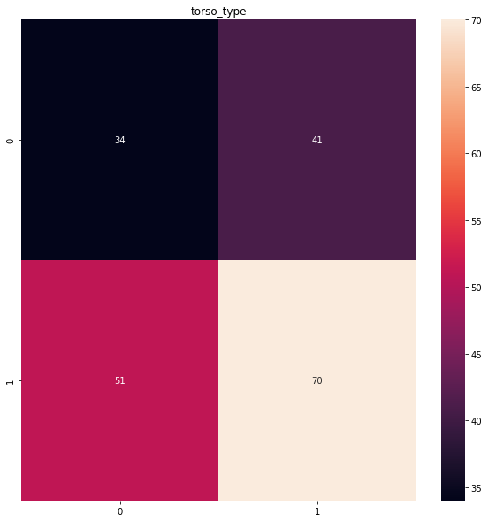

| Class        | Predicted | Actual   |
| ------------ | --------- | -------- |
| gender       | 0         | 0        |
| torso_type   | **short** | **long** |
| torso_colour | 0         | 0        |
| leg_type     | 1         | 0        |
| leg_colour   | 4         | 4        |
| luggage      | 1         | 0        |

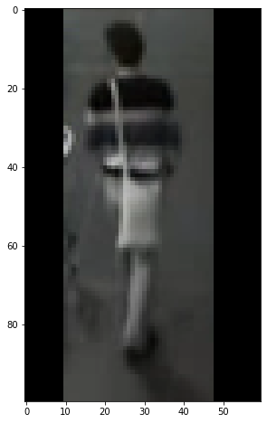

The model misclassifies a long torso clothing as short. One reason to this could be the person is not facing the camera and the person's hands is not entirely visible.

**Impact on semantic search**: the semantic search might not function well if the person to match is standing in an unexpected position or if the person's body parts are not entirely visible.

#### Torso Clothing Color

```bash
              precision    recall  f1-score   support

           0       0.53      0.78      0.63        51
           1       0.30      0.39      0.34        23
           2       0.18      0.17      0.17        12
           3       0.29      0.22      0.25         9
           4       0.11      0.19      0.14        21
           5       0.00      0.00      0.00         5
           6       0.38      0.43      0.40         7
           7       0.00      0.00      0.00         5
           8       0.67      0.21      0.32        19
           9       0.26      0.17      0.21        35
          10       0.00      0.00      0.00         9

    accuracy                           0.36       196
   macro avg       0.25      0.23      0.22       196
weighted avg       0.33      0.36      0.32       196
```

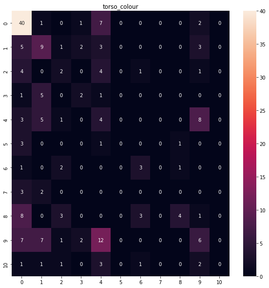

class imbalance

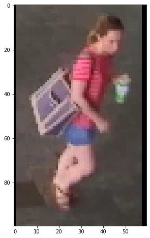

| Class        | Predicted | Actual  |
| ------------ | --------- | ------- |
| gender       | 1         | 1       |
| torso_type   | 1         | 1       |
| torso_colour | **pink**  | **red** |
| leg_type     | 1         | 1       |
| leg_colour   | 1         | 1       |
| luggage      | 0         | 0       |

The model misclassifies red as pink. The model cannot tell the subtle difference between red and pink effectively. One reason to this is ,**class imbalance**, the number of pink and red torso clothings is limited in the training set.

**Impact on semantic search**: if the query is looking for colors that are rare in the training data (e.g., green, orange, purple .etc), then the search will probably fail since the model cannot classify these colors effectively due to the limited amount of training data.

#### Leg Clothing Type

```bash
              precision    recall  f1-score   support

           0       0.72      0.90      0.80       114
           1       0.79      0.50      0.61        82

    accuracy                           0.73       196
   macro avg       0.75      0.70      0.71       196
weighted avg       0.75      0.73      0.72       196
```

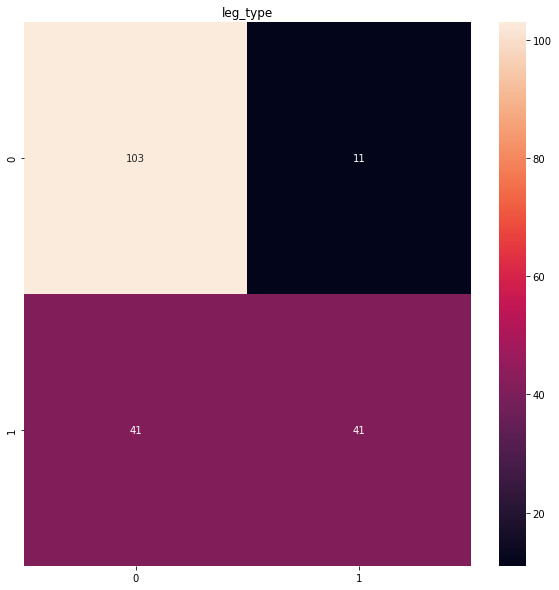

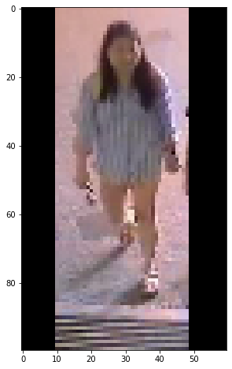

| Class        | Predicted | Actual    |
| ------------ | --------- | --------- |
| gender       | 0         | 1         |
| torso_type   | 0         | 0         |
| torso_colour | 4         | 4         |
| leg_type     | **long**  | **short** |
| leg_colour   | 4         | 4         |
| luggage      | 1         | 1         |

The model misclassifies the short leg clothing as long. One reason to this might be the person is wearing a very short leg clothing, and the model cannot see the short leg clothing, therefore, classify it as a long leg clothing.

**Impact on semantic search**: The model might work effectively for people who are wearing very short leg clothing.

#### Leg Clothing Color

```bash
              precision    recall  f1-score   support

           0       0.52      0.94      0.67        69
           1       0.57      0.48      0.52        63
           2       0.50      0.12      0.20         8
           3       0.00      0.00      0.00         7
           4       0.50      0.26      0.34        27
           6       0.00      0.00      0.00         6
           7       0.00      0.00      0.00         2
           8       0.00      0.00      0.00         0
           9       0.50      0.08      0.13        13
          10       0.00      0.00      0.00         1

    accuracy                           0.53       196
   macro avg       0.26      0.19      0.19       196
weighted avg       0.49      0.53      0.47       196
```

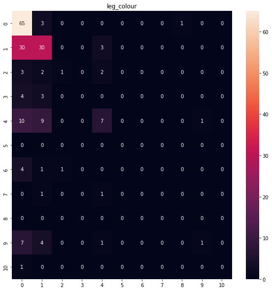

caused by class imbalance.

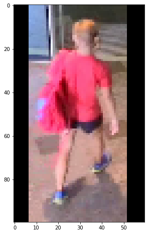

| Class        | Predicted | Actual    |
| ------------ | --------- | --------- |
| gender       | 1         | 1         |
| torso_type   | 1         | 1         |
| torso_colour | 8         | 8         |
| leg_type     | 1         | 1         |
| leg_colour   | **red**   | **black** |
| luggage      | 0         | 0         |

The leg color is classified as red but it should be black. The One reason could that the model cannot tell if the red pixels on the leg area is part of the leg or not. That small amount of red pixels is actually coming from the backpack. The second reason is that the person's torso clothing color is **red**, it seems like the model is unable to distinguish torso and leg clothings. The third reason is that this person's leg clothing is too short, the model cannot find the leg clothing.

**Impact on semantic search**: due to these limitations, we might not be able to match a person if the person is wearing a very short leg clothing or the person is dominant by a color (e.g., red).

#### Luggage

```bash
              precision    recall  f1-score   support

           0       0.68      0.73      0.70       135
           1       0.27      0.23      0.25        61

    accuracy                           0.57       196
   macro avg       0.48      0.48      0.48       196
weighted avg       0.55      0.57      0.56       196
```

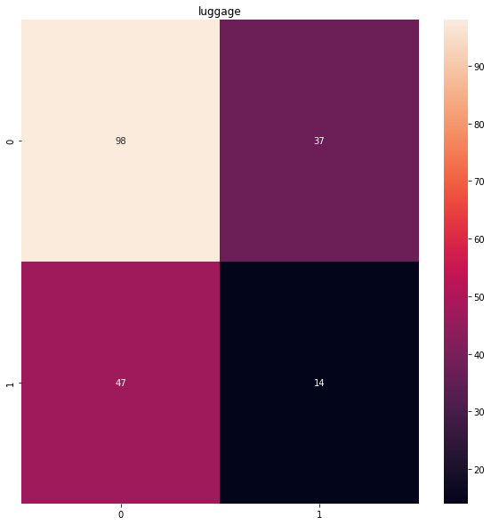

| Class        | Predicted | Actual |
| ------------ | --------- | ------ |
| gender       | 1         | 0      |
| torso_type   | 0         | 0      |
| torso_colour | 0         | 4      |
| leg_type     | 0         | 0      |
| leg_colour   | 0         | 0      |
| luggage      | 0         | 1      |

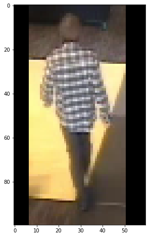

The model predicts the person is carrying a luggage but he is not.

Reasons why it made the mistake:

- The person's right is acting like he is carrying a luggage.
- The intersection between floors looks like a luggage.
- The person's hand is placing on top of the intersection.

**Impact on semantic search**: this bad case indicates that the model is likely to be affected by the environment. For example, it cannot tell the difference between a floor texture and a luggage. Secondly, it does not have the sense of depth, the floor is obviously far away from the person's right hand but the model cannot spot this.

## Jupyter Notebooks

- [Q1 notebook](https://github.com/xiaohai-huang/cab420-workspace/blob/master/work/machine-learning/a1c/Q1/Q1-solution.ipynb)
- [Q2 notebook](https://github.com/xiaohai-huang/cab420-workspace/blob/master/work/machine-learning/a1c/Q2/assignment1C_Q2.ipynb)
- [HTML version of this assignment](https://xiaohai.wiki/university/cab420-machine-learning/assignment-1C)

## Appendix

Question 2 Model Architecture

```bash
Model: "simple_resnet_v2"
__________________________________________________________________________________________________
 Layer (type)                   Output Shape         Param #     Connected to
==================================================================================================
 img (InputLayer)               [(None, 100, 60, 3)  0           []
                                ]

 conv2d_106 (Conv2D)            (None, 100, 60, 8)   224         ['img[0][0]']

 batch_normalization_94 (BatchN  (None, 100, 60, 8)  32          ['conv2d_106[0][0]']
 ormalization)

 activation_94 (Activation)     (None, 100, 60, 8)   0           ['batch_normalization_94[0][0]']

 conv2d_107 (Conv2D)            (None, 100, 60, 8)   72          ['activation_94[0][0]']

 batch_normalization_95 (BatchN  (None, 100, 60, 8)  32          ['conv2d_107[0][0]']
 ormalization)

 activation_95 (Activation)     (None, 100, 60, 8)   0           ['batch_normalization_95[0][0]']

 conv2d_108 (Conv2D)            (None, 100, 60, 8)   584         ['activation_95[0][0]']

 batch_normalization_96 (BatchN  (None, 100, 60, 8)  32          ['conv2d_108[0][0]']
 ormalization)

 activation_96 (Activation)     (None, 100, 60, 8)   0           ['batch_normalization_96[0][0]']

 conv2d_110 (Conv2D)            (None, 100, 60, 32)  288         ['activation_94[0][0]']

 conv2d_109 (Conv2D)            (None, 100, 60, 32)  288         ['activation_96[0][0]']

 add_30 (Add)                   (None, 100, 60, 32)  0           ['conv2d_110[0][0]',
                                                                  'conv2d_109[0][0]']

 batch_normalization_97 (BatchN  (None, 100, 60, 32)  128        ['add_30[0][0]']
 ormalization)

 activation_97 (Activation)     (None, 100, 60, 32)  0           ['batch_normalization_97[0][0]']

 conv2d_111 (Conv2D)            (None, 100, 60, 8)   264         ['activation_97[0][0]']

 batch_normalization_98 (BatchN  (None, 100, 60, 8)  32          ['conv2d_111[0][0]']
 ormalization)

 activation_98 (Activation)     (None, 100, 60, 8)   0           ['batch_normalization_98[0][0]']

 conv2d_112 (Conv2D)            (None, 100, 60, 8)   584         ['activation_98[0][0]']

 batch_normalization_99 (BatchN  (None, 100, 60, 8)  32          ['conv2d_112[0][0]']
 ormalization)

 activation_99 (Activation)     (None, 100, 60, 8)   0           ['batch_normalization_99[0][0]']

 conv2d_113 (Conv2D)            (None, 100, 60, 32)  288         ['activation_99[0][0]']

 add_31 (Add)                   (None, 100, 60, 32)  0           ['add_30[0][0]',
                                                                  'conv2d_113[0][0]']

 batch_normalization_100 (Batch  (None, 100, 60, 32)  128        ['add_31[0][0]']
 Normalization)

 activation_100 (Activation)    (None, 100, 60, 32)  0           ['batch_normalization_100[0][0]']

 conv2d_114 (Conv2D)            (None, 100, 60, 8)   264         ['activation_100[0][0]']

 batch_normalization_101 (Batch  (None, 100, 60, 8)  32          ['conv2d_114[0][0]']
 Normalization)

 activation_101 (Activation)    (None, 100, 60, 8)   0           ['batch_normalization_101[0][0]']

 conv2d_115 (Conv2D)            (None, 100, 60, 8)   584         ['activation_101[0][0]']

 batch_normalization_102 (Batch  (None, 100, 60, 8)  32          ['conv2d_115[0][0]']
 Normalization)

 activation_102 (Activation)    (None, 100, 60, 8)   0           ['batch_normalization_102[0][0]']

 conv2d_116 (Conv2D)            (None, 100, 60, 32)  288         ['activation_102[0][0]']

 add_32 (Add)                   (None, 100, 60, 32)  0           ['add_31[0][0]',
                                                                  'conv2d_116[0][0]']

 batch_normalization_103 (Batch  (None, 100, 60, 32)  128        ['add_32[0][0]']
 Normalization)

 activation_103 (Activation)    (None, 100, 60, 32)  0           ['batch_normalization_103[0][0]']

 conv2d_117 (Conv2D)            (None, 50, 30, 16)   528         ['activation_103[0][0]']

 batch_normalization_104 (Batch  (None, 50, 30, 16)  64          ['conv2d_117[0][0]']
 Normalization)

 activation_104 (Activation)    (None, 50, 30, 16)   0           ['batch_normalization_104[0][0]']

 conv2d_118 (Conv2D)            (None, 50, 30, 16)   2320        ['activation_104[0][0]']

 batch_normalization_105 (Batch  (None, 50, 30, 16)  64          ['conv2d_118[0][0]']
 Normalization)

 activation_105 (Activation)    (None, 50, 30, 16)   0           ['batch_normalization_105[0][0]']

 conv2d_120 (Conv2D)            (None, 50, 30, 32)   1056        ['add_32[0][0]']

 conv2d_119 (Conv2D)            (None, 50, 30, 32)   544         ['activation_105[0][0]']

 add_33 (Add)                   (None, 50, 30, 32)   0           ['conv2d_120[0][0]',
                                                                  'conv2d_119[0][0]']

 batch_normalization_106 (Batch  (None, 50, 30, 32)  128         ['add_33[0][0]']
 Normalization)

 activation_106 (Activation)    (None, 50, 30, 32)   0           ['batch_normalization_106[0][0]']

 conv2d_121 (Conv2D)            (None, 50, 30, 16)   528         ['activation_106[0][0]']

 batch_normalization_107 (Batch  (None, 50, 30, 16)  64          ['conv2d_121[0][0]']
 Normalization)

 activation_107 (Activation)    (None, 50, 30, 16)   0           ['batch_normalization_107[0][0]']

 conv2d_122 (Conv2D)            (None, 50, 30, 16)   2320        ['activation_107[0][0]']

 batch_normalization_108 (Batch  (None, 50, 30, 16)  64          ['conv2d_122[0][0]']
 Normalization)

 activation_108 (Activation)    (None, 50, 30, 16)   0           ['batch_normalization_108[0][0]']

 conv2d_123 (Conv2D)            (None, 50, 30, 32)   544         ['activation_108[0][0]']

 add_34 (Add)                   (None, 50, 30, 32)   0           ['add_33[0][0]',
                                                                  'conv2d_123[0][0]']

 batch_normalization_109 (Batch  (None, 50, 30, 32)  128         ['add_34[0][0]']
 Normalization)

 activation_109 (Activation)    (None, 50, 30, 32)   0           ['batch_normalization_109[0][0]']

 conv2d_124 (Conv2D)            (None, 50, 30, 16)   528         ['activation_109[0][0]']

 batch_normalization_110 (Batch  (None, 50, 30, 16)  64          ['conv2d_124[0][0]']
 Normalization)

 activation_110 (Activation)    (None, 50, 30, 16)   0           ['batch_normalization_110[0][0]']

 conv2d_125 (Conv2D)            (None, 50, 30, 16)   2320        ['activation_110[0][0]']

 batch_normalization_111 (Batch  (None, 50, 30, 16)  64          ['conv2d_125[0][0]']
 Normalization)

 activation_111 (Activation)    (None, 50, 30, 16)   0           ['batch_normalization_111[0][0]']

 conv2d_126 (Conv2D)            (None, 50, 30, 32)   544         ['activation_111[0][0]']

 add_35 (Add)                   (None, 50, 30, 32)   0           ['add_34[0][0]',
                                                                  'conv2d_126[0][0]']

 batch_normalization_112 (Batch  (None, 50, 30, 32)  128         ['add_35[0][0]']
 Normalization)

 activation_112 (Activation)    (None, 50, 30, 32)   0           ['batch_normalization_112[0][0]']

 conv2d_127 (Conv2D)            (None, 25, 15, 32)   1056        ['activation_112[0][0]']

 batch_normalization_113 (Batch  (None, 25, 15, 32)  128         ['conv2d_127[0][0]']
 Normalization)

 activation_113 (Activation)    (None, 25, 15, 32)   0           ['batch_normalization_113[0][0]']

 conv2d_128 (Conv2D)            (None, 25, 15, 32)   9248        ['activation_113[0][0]']

 batch_normalization_114 (Batch  (None, 25, 15, 32)  128         ['conv2d_128[0][0]']
 Normalization)

 activation_114 (Activation)    (None, 25, 15, 32)   0           ['batch_normalization_114[0][0]']

 conv2d_130 (Conv2D)            (None, 25, 15, 64)   2112        ['add_35[0][0]']

 conv2d_129 (Conv2D)            (None, 25, 15, 64)   2112        ['activation_114[0][0]']

 add_36 (Add)                   (None, 25, 15, 64)   0           ['conv2d_130[0][0]',
                                                                  'conv2d_129[0][0]']

 batch_normalization_115 (Batch  (None, 25, 15, 64)  256         ['add_36[0][0]']
 Normalization)

 activation_115 (Activation)    (None, 25, 15, 64)   0           ['batch_normalization_115[0][0]']

 conv2d_131 (Conv2D)            (None, 25, 15, 32)   2080        ['activation_115[0][0]']

 batch_normalization_116 (Batch  (None, 25, 15, 32)  128         ['conv2d_131[0][0]']
 Normalization)

 activation_116 (Activation)    (None, 25, 15, 32)   0           ['batch_normalization_116[0][0]']

 conv2d_132 (Conv2D)            (None, 25, 15, 32)   9248        ['activation_116[0][0]']

 batch_normalization_117 (Batch  (None, 25, 15, 32)  128         ['conv2d_132[0][0]']
 Normalization)

 activation_117 (Activation)    (None, 25, 15, 32)   0           ['batch_normalization_117[0][0]']

 conv2d_133 (Conv2D)            (None, 25, 15, 64)   2112        ['activation_117[0][0]']

 add_37 (Add)                   (None, 25, 15, 64)   0           ['add_36[0][0]',
                                                                  'conv2d_133[0][0]']

 batch_normalization_118 (Batch  (None, 25, 15, 64)  256         ['add_37[0][0]']
 Normalization)

 activation_118 (Activation)    (None, 25, 15, 64)   0           ['batch_normalization_118[0][0]']

 conv2d_134 (Conv2D)            (None, 25, 15, 32)   2080        ['activation_118[0][0]']

 batch_normalization_119 (Batch  (None, 25, 15, 32)  128         ['conv2d_134[0][0]']
 Normalization)

 activation_119 (Activation)    (None, 25, 15, 32)   0           ['batch_normalization_119[0][0]']

 conv2d_135 (Conv2D)            (None, 25, 15, 32)   9248        ['activation_119[0][0]']

 batch_normalization_120 (Batch  (None, 25, 15, 32)  128         ['conv2d_135[0][0]']
 Normalization)

 activation_120 (Activation)    (None, 25, 15, 32)   0           ['batch_normalization_120[0][0]']

 conv2d_136 (Conv2D)            (None, 25, 15, 64)   2112        ['activation_120[0][0]']

 add_38 (Add)                   (None, 25, 15, 64)   0           ['add_37[0][0]',
                                                                  'conv2d_136[0][0]']

 batch_normalization_121 (Batch  (None, 25, 15, 64)  256         ['add_38[0][0]']
 Normalization)

 activation_121 (Activation)    (None, 25, 15, 64)   0           ['batch_normalization_121[0][0]']

 average_pooling2d_4 (AveragePo  (None, 6, 3, 64)    0           ['activation_121[0][0]']
 oling2D)

 flatten_4 (Flatten)            (None, 1152)         0           ['average_pooling2d_4[0][0]']

 pre-gender-1 (Dense)           (None, 64)           73792       ['flatten_4[0][0]']

 pre-torso_type-1 (Dense)       (None, 64)           73792       ['flatten_4[0][0]']

 pre-torso_colour-1 (Dense)     (None, 64)           73792       ['flatten_4[0][0]']

 pre-leg_type-1 (Dense)         (None, 64)           73792       ['flatten_4[0][0]']

 pre-leg_colour-1 (Dense)       (None, 64)           73792       ['flatten_4[0][0]']

 pre-luggage-1 (Dense)          (None, 64)           73792       ['flatten_4[0][0]']

 pre-gender-2 (Dense)           (None, 32)           2080        ['pre-gender-1[0][0]']

 pre-torso_type-2 (Dense)       (None, 32)           2080        ['pre-torso_type-1[0][0]']

 pre-torso_colour-2 (Dense)     (None, 32)           2080        ['pre-torso_colour-1[0][0]']

 pre-leg_type-2 (Dense)         (None, 32)           2080        ['pre-leg_type-1[0][0]']

 pre-leg_colour-2 (Dense)       (None, 32)           2080        ['pre-leg_colour-1[0][0]']

 pre-luggage-2 (Dense)          (None, 32)           2080        ['pre-luggage-1[0][0]']

 pre-gender-3 (Dense)           (None, 16)           528         ['pre-gender-2[0][0]']

 pre-torso_type-3 (Dense)       (None, 16)           528         ['pre-torso_type-2[0][0]']

 pre-torso_colour-3 (Dense)     (None, 16)           528         ['pre-torso_colour-2[0][0]']

 pre-leg_type-3 (Dense)         (None, 16)           528         ['pre-leg_type-2[0][0]']

 pre-leg_colour-3 (Dense)       (None, 16)           528         ['pre-leg_colour-2[0][0]']

 pre-luggage-3 (Dense)          (None, 16)           528         ['pre-luggage-2[0][0]']

 gender (Dense)                 (None, 2)            34          ['pre-gender-3[0][0]']

 torso_type (Dense)             (None, 2)            34          ['pre-torso_type-3[0][0]']

 torso_colour (Dense)           (None, 11)           187         ['pre-torso_colour-3[0][0]']

 leg_type (Dense)               (None, 2)            34          ['pre-leg_type-3[0][0]']

 leg_colour (Dense)             (None, 11)           187         ['pre-leg_colour-3[0][0]']

 luggage (Dense)                (None, 2)            34          ['pre-luggage-3[0][0]']

==================================================================================================
Total params: 518,190
Trainable params: 516,734
Non-trainable params: 1,456
__________________________________________________________________________________________________
```
