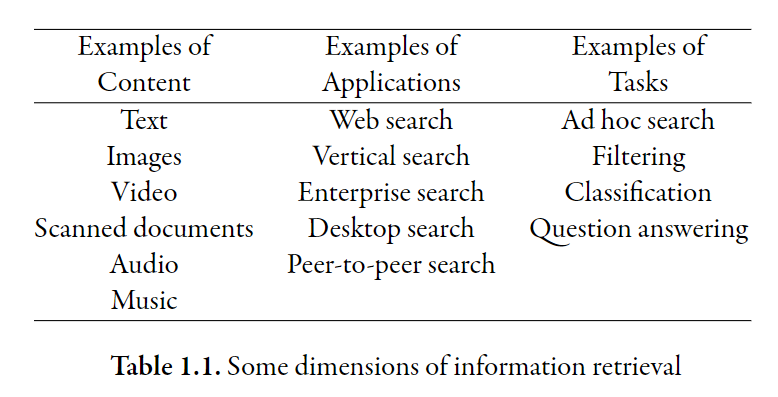
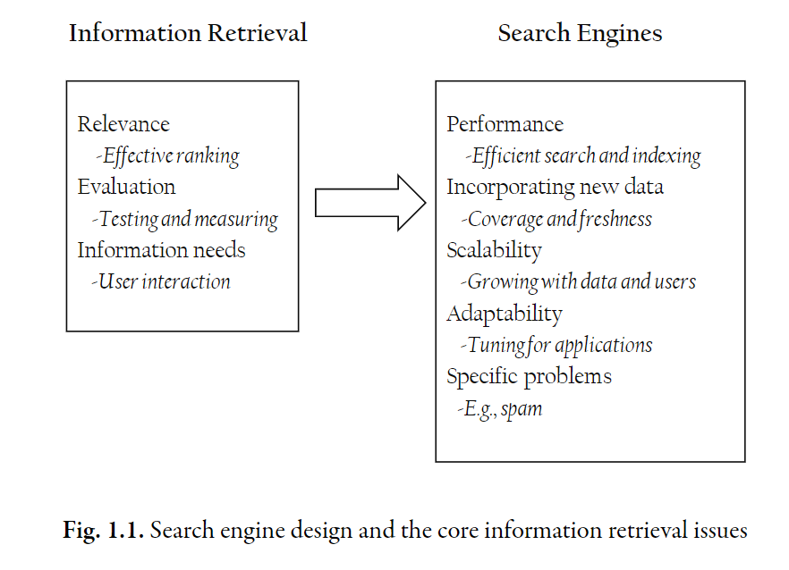

> _Definition_: **Information Retriveal** is a field concerned with the structure, analysis, organization, storage, searching, and retrieval of information.

The primary focus of the field is on **text** and **text documents**. Here are some examples of documents. Web pages, email, scholarly papers, books and news stories. These documents (unstructured) are quite different from a typical database record (structured).

## Structured Data

To illusrate the difference between **structured** and **unstructured**, consider the bank account example.

| Account Number | Balance |
| -------------- | ------- |
| n10172912      | 4500.00 |
| n10240187      | 4800.00 |

The attributes of this information are **well defined** and it is very easy to compare values of these attributes. As a result, it is straightforward to implement algorithms to identify the records that satisfy the queries such as

- "Find account with account number n10172912"
- "Find accounts with balances greater than $4600.00".

## Unstructured Data

Consider a news story. The story will have some attributes, such as headline, author of the story. However, the primary content is the story itself, and this crucial information is usually stored in **a single large attribute** with no internal structure.

When we submit queires to the search engine. Such as "Winter Olympics". In order to perform this search, we must design an algorithm that can compare "_the text of the query_" with "_the text of the story_" and decide whether the story contains the information that is being sought.

:::info

The core of **information retrieval** is to define the meaning of a word, a sentance, a paragraph, or a whole news story and finally comparing text.

:::

## Applications

### Web Search

Some one typing a query to a search engine and receiving a list of ranked documents. (e.g. Google Search, Baidu Search)

### Vertical Search

A specialized version of [web search](#web-search), the domain of the search is restricted to a particular topic.

### Enterprise Search

This refers to finding the required information in a huge variety of computer files scattered across a company's intranet. The sources go beyond web pages, which might include email, reports, presentations, and structured data in databases.

### Desktop Search

This is the personal version of [enterprise search](#enterprise-search), where the information sources are the files stored on an individual's computer, including email, files, software, and web pages.

## Tasks

### Ad hoc Search

It a search based on a user query. And it is a text-based task.

### Filtering

Decide what stories a person are interesting in.

**TODO**: need extra information

### Classification

Use a set of lables to automatically assign those lables to documents.

### Question Answering

This aims at more specific questions, such as "Who is the president of Australia?". The goal of this task is to return a specific answer found in the text, rather than a list of documents.

## Big Issues

### Relevance

Definition: Relevance is a fundamental concepts in information retrieval. A **relevant document** contains the information that a person was looking for when he submitted a query to the **search engine**.

#### Topic Relevance & User Relevance

A text document is topically relevant to a query if they are on the same topic (**topic relevance**). However, a user may not consider the document relevant (**user relevance**). Consider the example of "IT jobs" query.

:::note

Example: "IT jobs"

A job description of **CUDA** programmer is topically relevant to query "IT jobs". The user who sends the query may **not** consider the job description relevant. Because he is interested in web dev, or he has seen that job description before, or the job description is 3 years old, or the job description is in Japanse.

:::

#### Retrieval Model

Definition: A retrieval model is a formal representation of the process of matching a query to documents. A good retrieval model can find documents that are likely to be considered relevant by the person who submitted the query.

:::info

Retrieval models usually prefer to model **statistical** properties of text rather than **linguistic** structure.

For example, the ranking algorithms are more concerned with **the number of word occurrences** than whether the word is a _noun_ or an _adjective_.

:::

### Evaluation

Two measures are used to evaluate the quality of a document ranking (how well it matches the person's expectation).

- **precision**: the portion of retrieved documents that are relevant.
- **recall**: the portion of relevant documents that are retrieved.

:::warning

When measure **recall** is used, there is an _assumption_ that the number of relevant documents is known. It is impossible in real web. But it can be useful when dealing with _test collections_ of documents (e.g., competitions).

:::

Researchers currently focus on log data gathered from user interactions. Such as **clickthrough** data. Because they are strongly [correlated](/university/cab420-machine-learning/simple-linear-regression#correlation) with [relevance](#relevance).

### Information Needs

Definition: An information needs is the underlying cause of the query that a person submits to a search engine.

It is common for a user to submit one-word query like "cat". This user might want to buy a cat, or he might want to listen to the music of Doja Cat. We can use techniques such as _query suggestion_, _query expansion_, and _relevance feedback_ to refine the initial query in order to produce better ranked results.

[[relevance](#relevance), [evaluation](#evaluation), [information needs](#information-needs)] are issues associated with **information retrieval**. There are some additional challenges when deploying a search engine to large-scale environments.

### Performance

One of the crucial issue is **performance** and it has the following measures:

- **response time**: the delay between submitting a query and receiving the result list.
- **query throughout**: the number of queries that can be performed in a given time.
- **indexing speed**: the rate that text documents can be transformed into indexes for searching.

:::info

An **index** is a data structure that improves the speed of search.

:::

### Dynamic Data

Search engines usually deal with dynamic, constantly changing data. **Coverage** and **Freshness** are used to measure how well we are dealing with these information.

- **coverage**: it measures how much of existing information has been indexed and stored in the search engine.
- **freshness** or **recency**: the "age" of the stored information.

### Scalability

Seach engines can be used in many different scenarios which vary from "**data size**" and "**the number of users**" of the application. Therefore, we should design search engines that can continue to work as "**the amount of data**" and "**the number of users**" grow.

### Adaptability

Search engines can be used in many [applications](#applications) and for many [tasks](#tasks). To achieve this, search engines have to be **customizable** and **adaptable**. This means that the following aspects of search engines must be able to be tuned and adapted to the new requirements.

- ranking algorithm
- interface
- indexing strategy

## References

- [Chapter 1-Search Engines and Information Retrieval-TextBook](https://github.com/xiaohai-huang/resources/blob/5f2bd89222b9588b114962e4a118e22e2bcbf682/QUT/Search-Engine-Technology/SEIRiP.pdf)
