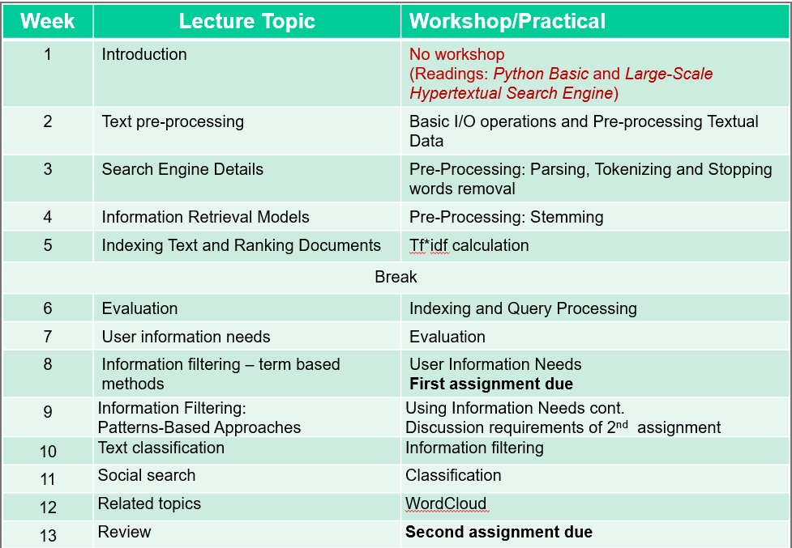

import WordCardList from "@src/components/WordCardList";

This unit is about Web Search & Text Analysis.

| Weeks      | Content                                                                                                  |
| ---------- | -------------------------------------------------------------------------------------------------------- |
| Weeks 1-6  | Basics concepts for Information Retrieval(IR) and Web Search.                                            |
| Weeks 7-12 | Text Analysis & NLP   <ul><li>Supervised text analysis</li><li>Un-supervised text analysis</li></ul> |

**[TextBook](https://github.com/xiaohai-huang/resources/blob/5f2bd89222b9588b114962e4a118e22e2bcbf682/QUT/Search-Engine-Technology/SEIRiP.pdf)**

## Part One: Web Search & IR

- Architecture of a search engine
- Basic concepts for text processing
- Information Retrieval
- Evaluate search results & IR models

## Part Two: Text Analysis

- Supervised methods:
  - Information filitering
  - Text classification
  - Relevant discovery
- Un-supervised methods:
  - Text feature selection
  - Topic modelling
  - Sentiment analysis
  - Document summarization

## Why Do We Care?

1. More than 80% of data that contain a large amount of knowledge is waitting for being extracted.
2. There are many different types of data. They extends beyond [structured data](011-information-retrieval.md#structured-data), including unstructured data:
   - text
   - audio
   - video
   - log files

## HTML vs. XML

[HTML](/docs/Web/HTML/overview) is a language for marking up text for **presentation**.

**XML**(eXtensible Markup Language) is a language for describing data/content. In other words, it does not describe how to present it.
Therefore it make Internet data machine-readable.

## Readings

- [TextBook](https://github.com/xiaohai-huang/resources/blob/5f2bd89222b9588b114962e4a118e22e2bcbf682/QUT/Search-Engine-Technology/SEIRiP.pdf)
- [Reprint-of--The-anatomy-of-a-large-scale-hypertextual-web_2012_Computer-Netw.pdf](https://github.com/xiaohai-huang/resources/blob/5f2bd89222b9588b114962e4a118e22e2bcbf682/QUT/Search-Engine-Technology/Reprint-of--The-anatomy-of-a-large-scale-hypertextual-web_2012_Computer-Netw.pdf)

## Appendix

### Weekly Schedule

### Vocabulary

<WordCardList words={["prong", "antler"]} />
