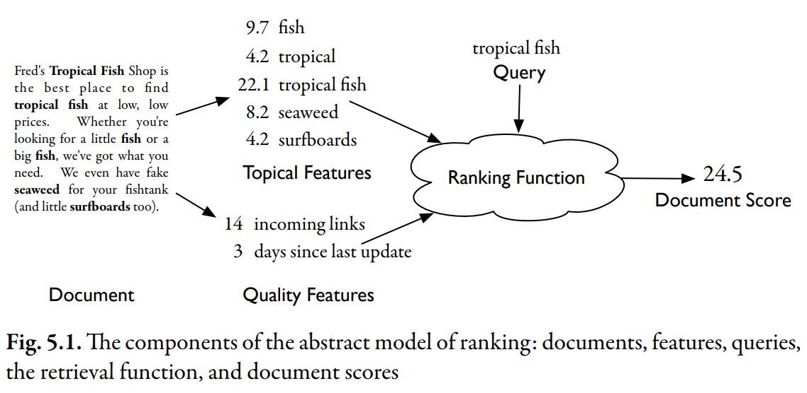

# Abstract Model of Ranking

## Document

Documents are written in natural human languages. Because they are difficult for computers to analyze directly, the text is transformed into _index terms_ or _document features_(is some attribute of the document we can express numerically).

## Topical Features

topical features estimate the degree to which the document is about a particular subject. (discussed in chapter 4)

## Quality Features

two possible document _quality_ features.

- One feature is the number of web pages that link to this document.
- Another is the number of days since this page was last updated.

:::info

These two quality features don't address whether the document is a good **topical match** for a query, but they do address it quality.

For instance, a page with **no incoming links** that hasn't been edited **in years** is probably a poor match for any query.

:::

## Feature Function

Each of these feature values is generated using a _feature function_, which is a mathematical expression that generates numbers from document text.

## Ranking Function

it takes data from document features combined with the query and produces a score.

:::info

Most reasonable **ranking functions** ignore many of the **document features**, and focus only on the small subset that relate to the query.

This fact makes the **inverted index** an appealing data structure for search.

:::

## Score

The final out of the **ranking function** is a score, which is a real number.

- **High** score means the system think the document is a good match for the query.
- **Lower** score means that the system thinks the document is a poor match for the query.

Search engines focus on identifying good features and scoring based on those features.
