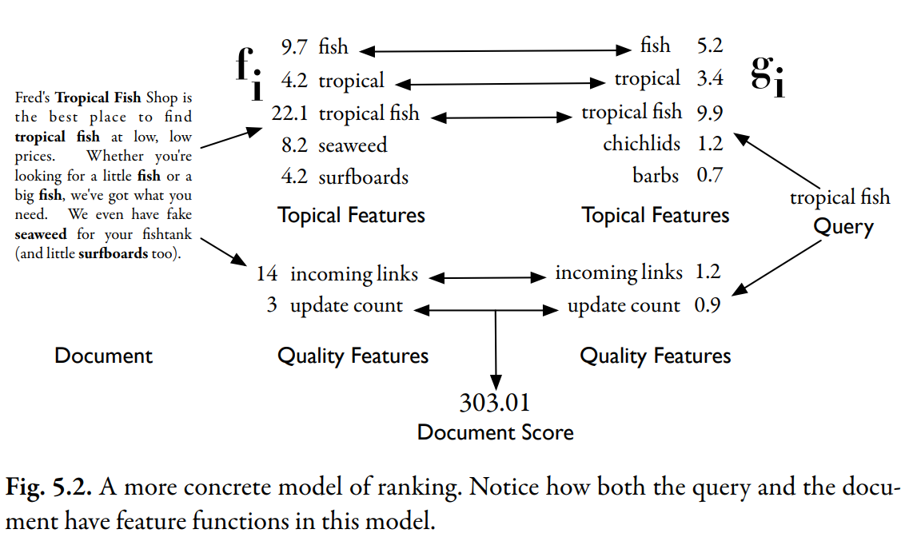

# A More Concrete Ranking Model

$$
R(Q, D) = \sum_i {g_i(Q) f_i(D)}
$$

$f_i$ is some feature function that extracts a number from the document text.

$g_i$ is a similar feature function that extract a value from the **query**.

These two functions form a pair of feature functions. Each pair of functions is multiplied together, and the results from all pairs are added to create a final document score.
