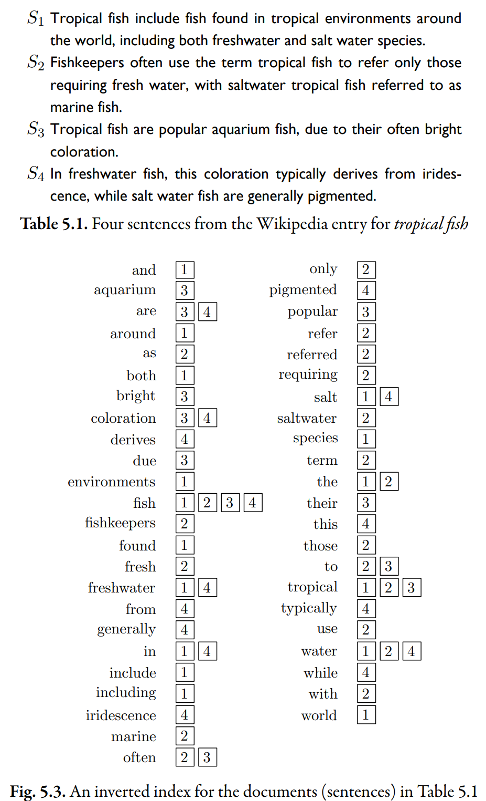

# Document-Based Index

> The simplest form of an inverted list stores just the documents that contain each word, and no additional information. (e.g., the index at the back of the textbook)



Above figures shows the inverted indexes built from four sentences (documents).

The index contains every word found in all 4 documents.

Next to each word, there are a list of boxes, and each one contains the **ID** of a document. Each one of these boxes is a [posting](index.md#posting-and-pointer) and because each box refers to a specific document, it can also be called [pointer](index.md#posting-and-pointer).

## Intersection

Suppose we want to find the sentence that contains the words "coloration" and "freshwater".

```js
const inverted_list =(
    {
        coloration: [3, 4];
        freshwater: [1, 4];
    }
)
```

According to the inverted list, we can quickly tell that only $S_4$ contains both "coloration" and "freshwater". Since each list is **sorted by document ID**, finding the intersection of these lists takes $O(\max{(m,n)})$, where $m$ and $n$ are the lengths of these two lists. The algorithm is the same as in merge sort.
