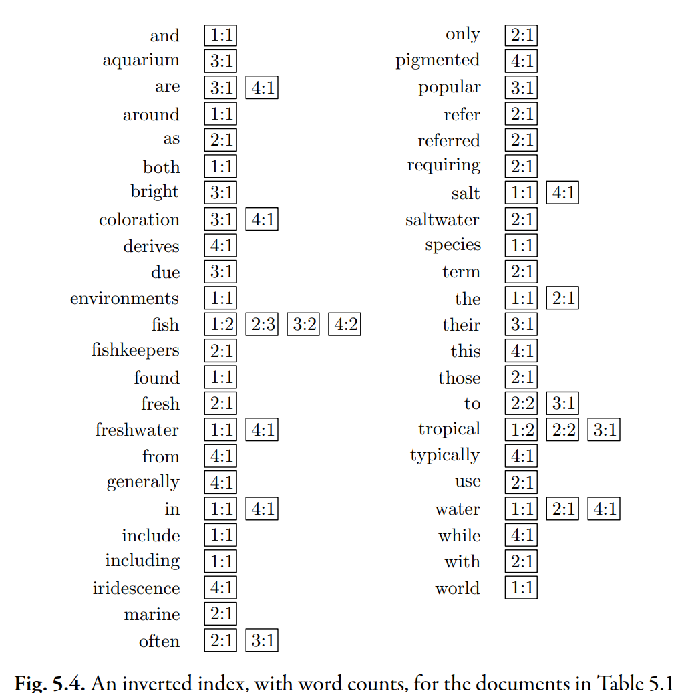

# Count-Based Index



`term: [{ docID: word_count }]`

## Motivation

In an inverted index that contains only document information ([previous page](0-document-based-index.md)), the features are binary (1 contains a term, 0 otherwise). This information is important, but it is too coarse to find the best few documents when there are a lot of possible matches.

For instance, consider teh query "tropical fish". Three documents match this query: $S_1, S_2, S_3$.

The data in the [document-based index](0-document-based-index.md) gives us no reason to prefer any of these documents over any other.

## Additional Data

Look at the index above. This index has the same words and the same number of [postings](index.md#posting-and-pointer), and the first number in each posting is the **document ID**, which is the same as in the [previous index](0-document-based-index.md).

However, each [posting](index.md#posting-and-pointer) now has a second number. This second number is the **number of times the word appears** in the document.

```js
{
  tropical: [{ 1: 2 }, { 2: 2 }, { 3: 1 }],
  fish:     [{ 1: 2 }, { 2: 3 }, { 3: 2 }, { 4: 2 }],
}
```

With this small amount of additional data, we are able to prefer $S_2$ over $S_1$ and $S_3$ for the query "tropical fish", since $S_2$ contains "tropical" twice and "fish" three times.

## Why Word Count

In general, word counts can be a powerful predictor of document relevance.

In particular, word counts can help distinguish documents that are about a **particular subject** from those that discuss that subject in passing.

:::note Example

Imagine two documents:

- doc about tropical fish.
- doc about tropical islands.

The doc about tropical islands would probably contain the word "fish", but only **a few times**. On the other hand, the doc about tropical fish would contain the word "fish" **many times**.

:::
