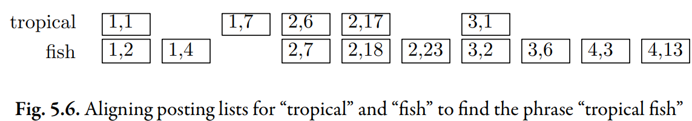

# Position-Based Index

## Motivation

When looking for matches for a query like "tropical fish", the location of the words in the document is an information predictor of relevance.

:::note

Imagine a doc about food that included a section on **tropical fruits** followed by a section on **saltwater fish**.

So far, none of the indexes we have considered contain enough information to tell us that this document is not relevant. We want to know if the document contains the **exact phrase** "tropical fish".

:::

## Different Postings

To overcome the problem, we can add position information to the index.

Each posting contains two numbers: a document ID, followed by a word position. Unlike previous indexes, now there is **one posting** per word occurrence.

Look at the inverted list for the term "fish". It contains 9 postings.

- `{"1":2}` and `{"1":4}` mean that the term "fish" is the second and fourth word in document 1.

## Intersection

Look at the graph above, we can see that two inverted lists are lined up next to each other.

In all, there are four occurrences of the phrase "tropical fish" in the four documents (twice in document 2).

:::tip

This technique can be extended to find longer phrases or more general proximity expressions, such as "find **tropical** within 5 words of **fish**"

> Suppose that
> the word “tropical” appears at position p. We can then look in the inverted list
> for “fish” for any occurrences between position p − 5 and p + 5. Any of those occurrences would constitute a match.

:::
