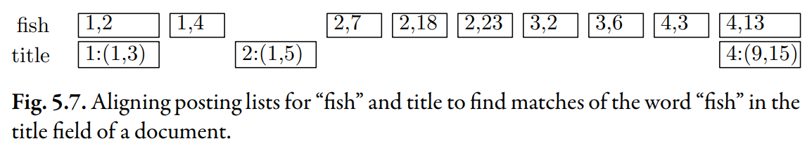

# Fields and Extents

## Document Fields

**Document fields**: They are sentences and paragraphs that separate concepts into logical units. They are sections of documents that carry some kind of semantic meaning.

- titles
- headings
- sender information and a subject line of an email

## Motivation

Why do we want to include information about **fields** in the index?

Reason 1: Search emails by sender name or email content.

Reason 2: Titles and headings tend to be good summaries of the rest of a document.

> Therefore, if a user searches for “tropical fish”,
> it makes sense to prefer documents with the title “Tropical Fish,”
> even if a document entitled “Mauritius” mentions the words “tropical” and “fish” more often.

:::info

This kind of preference for certain **document fields** can be integrated into the ranking function.

:::

## Extent Lists

An _extent_ is a contiguous region of a document.
We can represent these extents using word positions.

For example, if the title of a book started on the **fifth word** and ended just **before the ninth word**,
we could encode that as (5, 9). The word at position 9 is excluded.

The above graph shows that document 1 has a title which is the first two words (1, 3). We know that this title includes the word "fish", because the inverted list for "fish" tells us that "fish" is the second word in the document 1. If the user wants to find documents with the word "fish" in the title, document 1 is a match.

## Final Thought

This concept can be extended to all kinds of fields, such as headings, paragraphs, or sentences. It can be used to identify smaller pieces of text with specific meaning, such as addresses or names, or even just to record which words are verbs.
