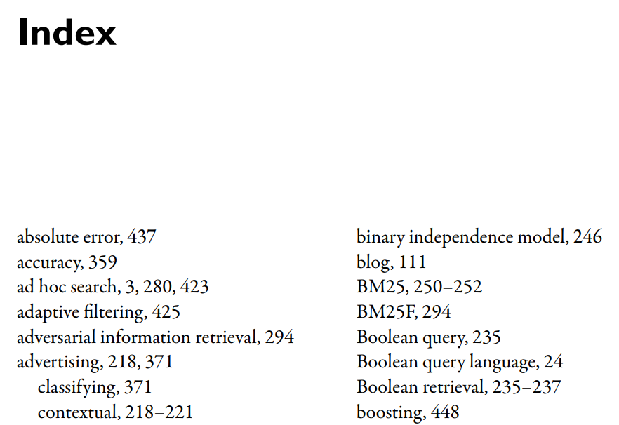

# Inverted Indexes

> All modern search engine indexes are based on **inverted indexes**. Other index structures have been used in the past, most notably **signature files**, but inverted indexes are considered the most efficient and flexible index structure.

Example: The book index is arranged in alphabetical order by _index term_. Each index term is followed by a list of page numbers about that word.

:::info

Why do we call it **inverted index**?

Ans: The index is _inverted_ because usually we think of words being a part of documents, but if we invert this idea, documents are associated with words.

:::

## Inverted List

Each index term has its own _inverted list_ that holds the relevant data for that term.

In an index for a book, the relevant data is a list of page numbers.

In a search engine, the data might be a list of documents or a list of word occurrences.

### Posting and Pointer

Each list entry is called a _posting_, and if the part of the posting that refers to a specific document or location is often called a _pointer_.

:::tip

Each document in the collections is given a unique number to make it efficient for storing document **pointers** in the inverted list.

:::

## Advantages

Alternatives to inverted files generally have one or more disadvantages.

The **signature file** represents each document in the collection as a small set of bits. To search a signature file, the query is converted to a signature and the bit patterns are compared. In general, all signatures must be scanned for every search.
Even if the index is encoded compactly, this is a lot of processing.

Also, matches in signature files are noisy, so a signature
match is not guaranteed to be a match in the document text.
Most importantly, it is difficult to generalize signature file techniques for ranked search.

The inverted file’s **advantage** is that only a small fraction of the index needs to be considered to process most queries.

What is a signature file?

A signature is a concise representation of a block of text (or document) as a sequence of bits, similar to the fingerprints discussed in Chapter 3.

A **hash function** is used for each word in the text block to set bits in specific positions in the signature to one.

