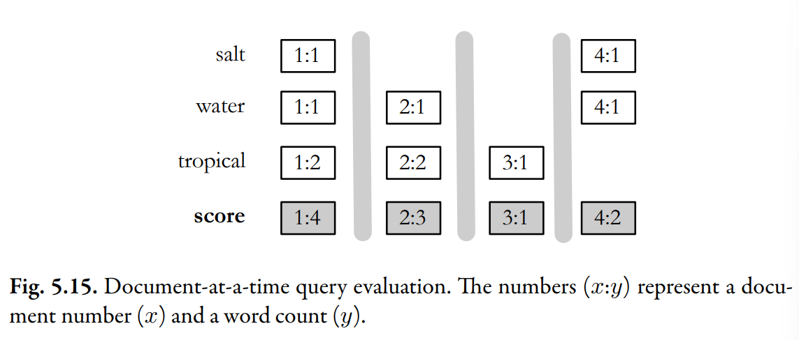
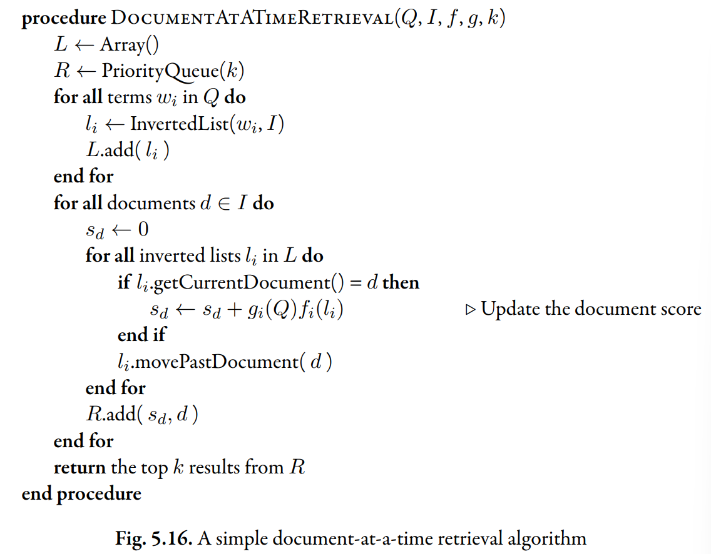
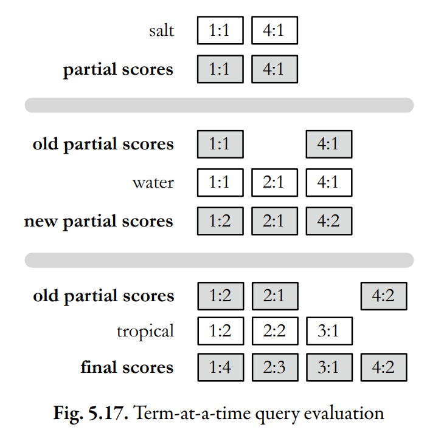

# Query Processing

Once an index is built, we need to process the data in it to produce query results.

Two simplest two query processing techniques:

- Document-at-a-time
- Term-at-a-time

## Document-at-a-time Query Evaluation

Above picture shows document-at-a-time retrieval for the query "salt water tropical".

The **inverted lists** are shown horizontally, and the postings have been aligned so that each column represents a different document. The **inverted lists** in this example hold word counts, and the score which is the sum of the word counts in each document.

The vertical _gray_ lines indicate the different steps of retrieval. In this first step, all the counts for the first document are added to produce the score for that document. Once the scoring for the first document has completed, the rest of the documents will then be processed one by one.

### Benefit

The primary benefit of this method is its frugal use of memory.
The only major use of memory comes from the priority queue, which only needs to store $k$ entries at a time.

## Term-at-a-time Query Evaluation

The gray lines indicate the boundaries between each step.

### Disadvantage

The primary disadvantage of the term-at-a-time algorithm is the memory usage required by the accumulator.

## Optimization Techniques

Two main classes of optimization for query processing.

1. Read less data from the index.
2. Process fewer documents.

### List Skipping

### Conjunctive Processing

### Threshold Methods

### MaxScore

### Early Termination

### List Ordering

## Structured Queries
