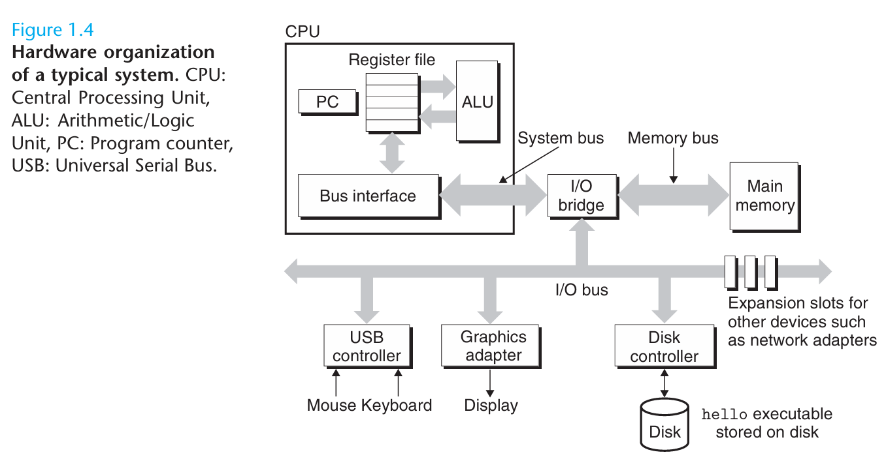
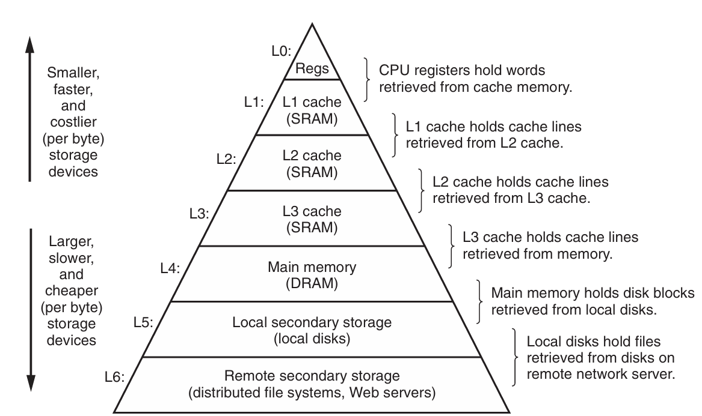

# A Tour of Computer Systems

## Hardware Organization of a System

### Buses

Running throughout the system is a collection of electrical conduits called **buses** that carrary bytes of information back and forth between components.

**Buses** are designed to transfer fixed-size chunks of bytes known as **words**. The number of bytes in a word (the _word size_) is a fundamental system parameter that varies across systems.

:::info

_word size_ determines the size of the data units that can be processed by the processor.

Word size is a fundamental concept in CPU architecture, and it refers to the number of bits that a CPU can process and manipulate as a single unit. It determines the size of the following:

- Processor registers
- Memory addresses
- Instruction operands
- Data types (e.g., integers, floating-point numbers)
- Internal data paths (e.g., ALU, load/store unit)

Common word sizes for CPU architectures include:

- 8-bit (e.g., Intel 8080)
- 16-bit (e.g., Intel 8086)
- 32-bit (e.g., Intel 80386)
- 64-bit (e.g., AMD Opteron, Intel Core i7)

:::

### I/O Devices

Input/Output devices are the system's connection to the external world.

Each I/O device is connected to the I/O bus by either a _controller_ or _adapter_. The purpose of _controller_ and _adapter_ is to transfer information between the I/O bus and an I/O device.

### Main Memory

**Main Memory** also known as **Random Access Memory (RAM)** is a temporary storage device that holds data and applications while a computer is running.

:::caution

It is a **volatile** memory techonology, meaning that its contents are lost when the computer is powered off.

:::

### Processor

The _central processing unit_ (CPU) is the engine that interprets (or _executes_) instructions stored in [main memory](#main-memory).

#### Program Counter

The core of a CPU is a word-sized storage device (or _register_) called _program counter_ (PC). It contains the memory address of the next instruction to be executed. The **PC** is incremented each an instruction is fetched, so it always points to the address of the next instruction in memory.

#### Register

Is a small amount of storage that is easily accessible to the processor. It is used to hold data and instructions temporarily.

## Caches

A system spends a lot of time moving information from one place to another.

To improve the performance, system designers include smaller faster storage devices called _cache memories_ that serve as temporary staging areas for information that the processor is likely to need in the near future.

The **L1** and **L2** caches are implemented with a hardware techonology known as _static random access memory_ (SRAM).

## Storage Devices From a Hierarchy

The main idea of a memory hierarchy is that storage at one level serves as a cache for storage at the next lower level.

- The register file is a cache for the L1 cache.
- Caches L1 and L2 are caches for L2 and L3 respectively.
- The L3 cache is a cache for the main memory, which is a cache for the disk.
- The local disk serves as a cache for data stored on the disks of other systems. (S3 buckets)
