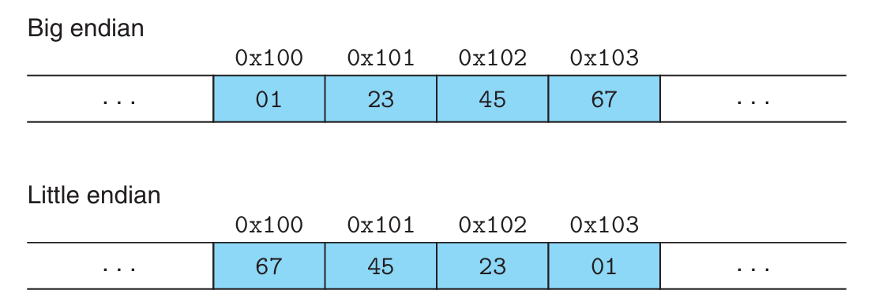

# Representing and Manipulating Information

Modern computers store and process information in binary. In isolation, a single bit is not very useful. When we group bits together and apply some _interpretation_ that gives meaning to different possible bit patterns (but we can only represent a finite number of elements).

- 0010 -> 2
- 1000 -> -8
- ASCII encoding for representing characters

## Information Storage

Most computers use blocks of 8 bits, or _bytes_, as the smallest unit of memory.

A machine-level program views memory as a very large array of bytes, referred to as _virtual memory_. Every byte of memory is identified by a unique number, known as its _address_, and the set of all possible addresses is known as _virtual address space_.

:::info

The actual implementation uses a combination of dynamic random access memory (DRAM), disk storage, special hardware, and operating system software to provide the program with what appears to be a monolithic byte array.

:::

The value of a pointer in C is the virtual address of the **first byte** of some block of storage. The C compiler associates _type_ information with each pointer, so that it can generate different machine-level code to access the stored value.

:::note

Although the C compiler maintains this type information, the actual machine-level program it generates has no information about data types. It simply treats each program object as a block of bytes and the program itself as a sequence of bytes.

:::

### Addressing and Byte Ordering

For **program objects** that span multiple bytes, we need to figure out how to express the address of the object, and how we will order the bytes in memory.

1. A multi-byte object is stored as a contiguous sequence of bytes.
2. The address of the object is the **smallest** address of the bytes used.

Examples:

- A 32-bit `int` has the address `0x100`, then the 4 bytes of the `int` will be stored in the memory locations [`0x100`, `0x101`, `0x102`, `0x103`].

There are 2 conventions for **ordering** the bytes representing an object.

- _little endian_ - the **least** significant bytes comes first
- _big endian_ - the **most** significant bytes comes first

:::info

- The leftmost bit is the **most significant** bit
- The rightmost bit is the **least significant** bit

Tip: Just like normal numbers, numbers on the right is less important.

:::

Example: the variable `x` of type `int` located at address `0x100` has a hexadecimal value of `0x1234567`. The **ordering** of the bytes within the address range `0x100` through `0x103` depends on the type of the ordering conventions (_little_ or _big_).



```c
#include <stdio.h>

typedef unsigned char *byte_pointer;

void show_bytes(byte_pointer start, size_t len)
{
    int i;
    for (i = 0; i < len; i++)
        printf("%.2x", start[i]);
    printf("\n");
}

void show_int(int x)
{
    show_bytes((byte_pointer)&x, sizeof(int));
}

void show_float(float x)
{
    show_bytes((byte_pointer)&x, sizeof(float));
}

void show_pointer(void *x)
{
    show_bytes((byte_pointer)&x, sizeof(void *));
}
```

Functions `show_int`, `show_float`, and `show_pointer` demonstrate how to use the function `show_bytes` to print the byte representation of C program objects of type `int`, `float` and `void *` respectively.

Casting the pointer to be of type `unsigned char *` tells the compiler that the program should consider the pointer to be **a sequence of bytes** rather than an object of the original data type. This pointer will then be the lowest byte address occupied by the object.

:::info

- "address of" operator `&` creates a pointer.
  - `&x` creates a pointer to the location holding the object indicated by variable `x`.

:::
