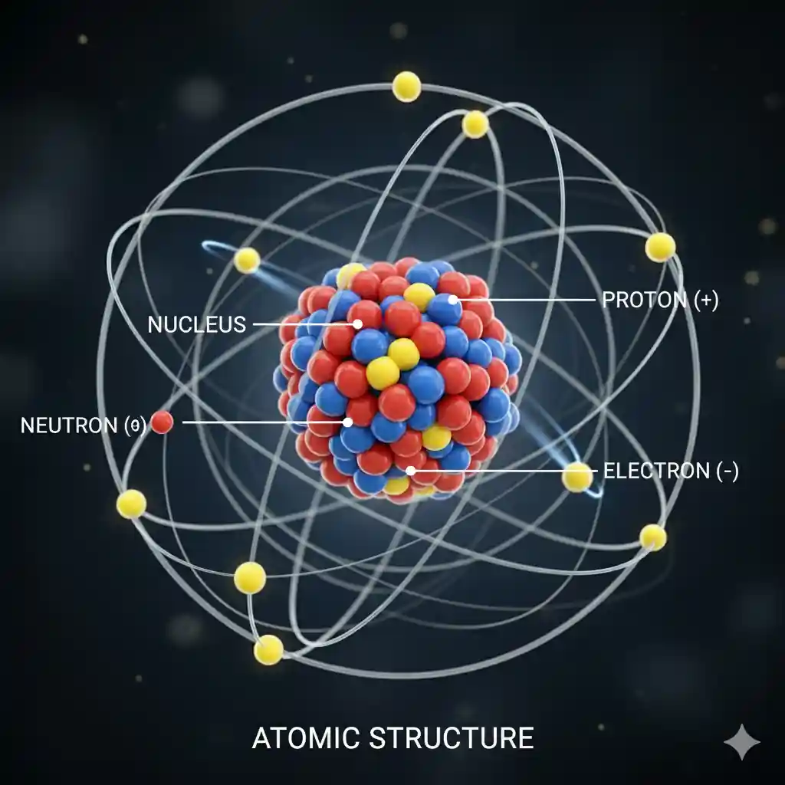

## Objectives

- Define matter, element, and molecule.
- List the parts of an atom.
- Define the valence shell of an atom.
- Identify the unit for measuring current.
- Draw the symbol used to represent current in a circuit.
- Describe the difference between conductors and insulators and semiconductors.
- Define difference of potential, electromotive force, and voltage.
- Draw the symbol used to represent voltage.
- Identify the unit used to measure voltage.
- Define resistance.
- Identify characteristics of resistance i na circuit.
- Identify the unit for measuring resistance.
- Draw the symbol used to represent resistance in a circuit.

## Matter

Matter is anything that occupies **space** and has **weight**.

- Matter is made up of **atoms** and **particles** like protons, neutrons, and electrons.
- It exists in different **states**:
  - solid,
  - liquid
  - gas
  - plasma
  - more exotic states (like Bose-Einstein condensates)

## Atom

- The basic building block of matter. (Each element is made up of only one kind of atom)
- A single atom is defined by teh **number of protons** in its nucleus.
- The number of protons determines the **type of atom**.
  - Example: An atom with 6 protons is a **carbon atom**.
  - Example: An atom with 8 protons is an **oxygen atom**.

### Structure of an Atom

An atom has three main subatomic particles:

1. **Protons ($P^+$)**
   - Positively charged particles
   - Found in the **nucleus** (center of the atom - an area)
   - Determines the **element** (e.g., Hydrogen has 1 proton, Carbon has 6)
2. **Neutrons ($n^0$)**
   - Uncharged particles
   - Found in the **nucleus**
   - Adds **mass** and stabilizes the nucleus
3. **Electrons ($e^-$)**
   - ⚡Negatively charged particles
   - 💫Orbit the nucleus in the **electron shells** or energy levels
   - Responsible for **chemical reactions** and bonding

### Key Properties

- 🔢Atomic number (Z): Number of **protons** in the nucleus. It determines the element.
- ⚖️Atomic weight (Mass number) (A): Total protons + neutrons. The mass of an atom. (just count the number)
- Isotopes: Atoms of the same element with different numbers of neutrons. (???)

### Electron Arrangement

Electrons occupy **electron shells** around the nucleus. Shells are filled in sequence.

- 1st shell: up to 2 electrons
- 2nd shell: up to 8 electrons
- 3rd shell: up to 18 electrons

This arrangement explains chemical properties and how atoms **bound**.

:::success

- **Valence Shell**: The **outermost** shell.
- **Valence**: The number of electrons contained in the valence shell.

:::

## Element

An **element** is a _pure substance_ made of only one type of atom.

- Each element is made up of **ONLY ONE** kind of atom.
- Defined by the **atomic number** (number of protons)
- Example:
  - Carbon (C) $\to$ all atoms have 6 protons.
  - Oxygen (O) $\to$ all atoms have 8 protons.
  - Gold (Au) $\to$ all atoms have 79 protons.

:::success

Element could have **one atom** or **trillions of atoms**, but all of them are the **same type**.

Example 1: Gold jewelry 🪙

- One gold atom $\to$ a single particle with 79 protons.
- The element gold $\to$ your entire gold ring/necklace is made of **trillions** of gold atoms, all the same type.

Example 2: Diamond 💎

- One carbon atom $\to$ a single particle with 6 protons.
- The element carbon $\to$ a diamond is a pure carbon, but built from \_billions\_\_ of carbon atoms linked together in a crystal structure.

:::

## Molecule

- A group of two or more atoms bounded together.
- The atoms may be of the **same** element or **different** elements.
- Examples:
  - $O_2 \to$ a molecule of oxygen (two oxygen atoms, same element).
  - $H_{2}O \to$ a molecule of water (two hydrogen atoms + one oxygen atom, different elements).

## Compound

- A **compound** is a **molecule** made of atoms of different elements.
- Examples:
  - $H_{2}O \to$ hydrogen + oxygen $\to$ compound
  - $CO_2 \to$ carbon + oxygen $\to$ compound

:::danger

Every compound is a molecule, but not every molecule is a compound.

:::

## Conductors

Materials that contain a large number of **free** electrons.

If an element has 3 or less electrons in the valence shell, it might be a good conductor.

| Material 🧪          | Conductivity (S/m) ⚡ |
| -------------------- | --------------------- |
| Silver 🥈            | 6.30 × 10⁷            |
| Copper 🟠            | 5.96 × 10⁷            |
| Gold 🥇              | 4.10 × 10⁷            |
| Aluminum ⚪          | 3.77 × 10⁷            |
| Tungsten ⚫          | 1.79 × 10⁷            |
| Iron 🛠️              | 1.00 × 10⁷            |
| Lead ⚙️              | 4.55 × 10⁶            |
| Carbon (Graphite) 🖤 | 1.00 × 10⁵            |
| Silicon (doped) 💻   | 1.00 × 10⁴            |
| Glass 🔮             | 10⁻¹² – 10⁻¹⁰         |
| Rubber 🟢            | 10⁻¹⁴ – 10⁻¹²         |

## Insulators

Prevent the flow of electricity. Stabilized by absorbing valence electrons.

5 or more electrons in the valence shell.

## Semiconductors

Can be altered to function as either as a conductor or insulator.
Made out of materials with 4 electrons in the valence shell.

- Negative Ion: A negatively charged atom.
- Positive Ion: A positively charged atom.

## Current

Movement of electrons from negatively charged atoms to positively charged atoms. Represented as $I$.

## Coulomb

- $6.24 \times 10^{18}$ electrons.
- Represented as $C$.

## Ampere

- One coulomb moving past a single point in one **second** ($S$). Represented by $A$.

## Potential

The ability of the source to perform electrical work.

:::note

Difference of potential causes electrons to move or flow in a circuit.

:::

## Voltage

The force that moves the electrons in the circuit. Represented by $V$. Unit of measure is volt.

## Resistance

- Opposition to the flow of electrons. (reduce current)
- Measured in Homs.
- Represented by $\Omega$

## References

- Basic Electronics Part 1 https://www.youtube.com/watch?v=nb4ovfwqup8
