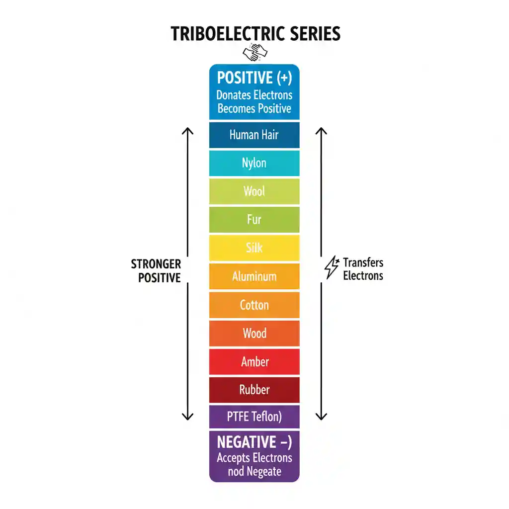

Objectives:

- Identify the six most common voltage sources.
- Describe six different methods of producing electricity.
- Define a _cell_ and a _battery_.
- Describe the difference between primary and secondary cells.
- Describe how cells and batteries are rated.
- Identify ways to connect cells or batteries to increase **current** or **voltage** output or both.
- Define _voltage rise_ and _voltage drop_.
- Identify the **two** types of **grounds** associated with electrical circuits.

## Voltage Sources

- Friction
- Magnetism
- Chemicals
- Light
- Heat
- Pressure

### Friction

The **triboelectric effect** is the phenomenon where certain materials become **electrically charged** after they come into **frictional contact** with a different material.

How it works step by step:

1. **Contact** - When two different materials touch, some electrons may be transferred from one material to the other.
2. **Separation** - When the materials are pulled apart, one material ends up with **extra electrons** (negatively charged), and the other ends up with **too few electrons** (positively charged).
3. **Static charge** - This difference in charge creates **static electricity**, which can **remain** until the charges either discharge or slowly leak away.

:::note

Rubbing a balloon on your hair.

- Hair loses electrons and becomes positively charged.
- the balloon gains the electrons and becomes negatively charged.
- When you bring the negatively charged balloon close to the wall, the negative charges on the balloon **repel** the free-moving electrons on the surface of the wall.
- The side of the wall closest to the balloon is now left with a slight excess of positively charged protons. Even though the wall as a whole is **still neutral**.
- Finally, the negatively charged ballon is now attracted to the newly created positively charged surface on the wall.

:::

#### Triboelectric Series

- Some materials "like" to give away electrons (becoming positive).
- Others "like" to take electrons (becoming negative).

**Triboelectric series** is a list of materials ranked by their tendency to gain or lose electrons.

### Magnetism

- The most common method of producing electrical energy.
- Produced using generator powered by steam from nuclear power or coal, water, wind, or gasoline...

### Chemical

- The second most popular method of producing electrical energy.

### Light

- Photovoltaic cell
- A single cell can produce a small voltage.
- Many cells must be linked to produce a usable voltage and current.
